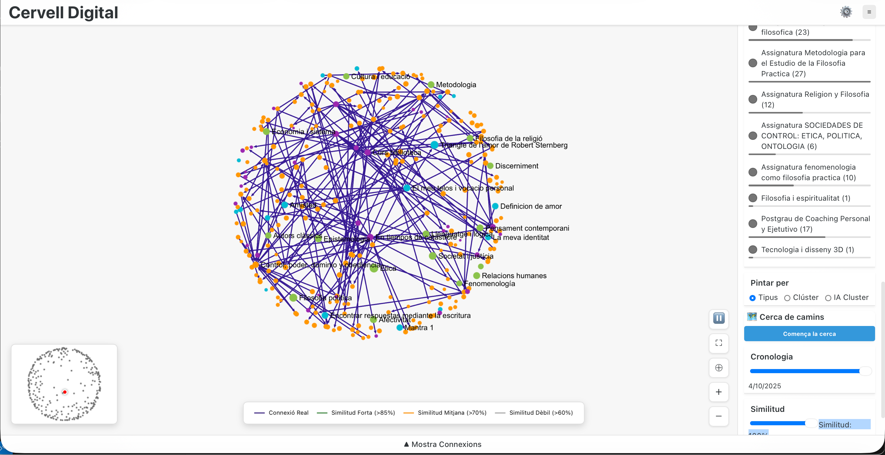

# Digital Brain 🧠



Digital Brain is a powerful visualization tool that connects your Notion notes into an interactive knowledge graph. It uses a hybrid approach combining **tag-based analysis** and **AI semantic analysis** to discover and visualize connections between your permanent notes, reading notes, and indexes.

## ✨ Features

-   **Hybrid Analysis**:
    -   **Tag-based**: Instantly connects notes that share common tags.
    -   **AI-based**: Uses a local AI model (e.g., Ollama with qwen2.5) to find deep semantic connections between note contents.
-   **Interactive Graph**: Visualizes your knowledge base using a high-performance graph renderer (Sigma.js).
-   **Notion Integration**: Directly fetches data from your Notion database and can update relations back to Notion.
-   **Automated Pipeline**: A Python pipeline that processes your notes and generates a graph structure.
-   **Modern UI**: A clean React + Vite frontend to explore your digital brain.
-   **Agentic Workflows**: A multi-agent system (Supervisor, Coder, Brain) that can autonomously execute tasks, manage files, and interact with Notion/n8n.

## 🤖 Agentic Architecture

The Digital Brain now powers a multi-agent system built with **LangGraph**:

1.  **Supervisor**: The orchestrator (powered by GPT-4o) that plans tasks and delegates them to specialized workers.
2.  **Coder Agent**: An expert engineer capable of manipulating the local filesystem, running git commands, and executing code edits.
3.  **Brain Agent**: The knowledge manager. It connects to **Notion**, executes **n8n** workflows, and manages long-term memory (RAG).
4.  **MCP Integration**: Uses the Model Context Protocol to standardize tool usage across services.

## 🧠 Notion Template

For the viewer to work correctly, you need a Notion database with a specific structure. You can duplicate the official template that includes the complete knowledge management system and the necessary "Digital Brain" configuration:

👉 **[Knowledge Management System (Notion Template)](https://www.notion.com/templates/sistema-de-gesti-n-del-conocimiento)**.

## 🚀 Prerequisites

-   **Python 3.10+**
-   **Node.js** & **npm**
-   **Notion Integration**: You need a Notion Integration Token and the ID of the database you want to visualize.
-   **(Optional) Local AI**: [Ollama](https://ollama.com/) or any OpenAI-compatible API for semantic analysis.

## 🛠️ Installation

1.  **Clone the repository:**
    ```bash
    git clone <repository-url>
    cd digital-brain
    ```

2.  **Install Backend Dependencies:**
    It is recommended to create a virtual environment first:
    ```bash
    python3 -m venv .venv
    source .venv/bin/activate  # On Windows: .venv\Scripts\activate
    ```
    Then install the requirements:
    ```bash
    pip install -r requirements.txt
    ```

3.  **Install Frontend Dependencies:**
    ```bash
    cd frontend
    npm install
    cd ..
    ```

## ⚙️ Configuration

### Credentials Management

Credentials (API keys, tokens, passwords) are stored securely using the system Keychain:

- **macOS**: Uses macOS Keychain
- **Docker/Linux**: Falls back to environment variables from `.env_shared`

#### Migration from .env_shared

If you have credentials in `.env_shared`, you can migrate them to Keychain:

```bash
cd monorepo/apps/gnosi
python migrate_to_keychain.py --dry-run  # Preview what will be migrated
python migrate_to_keychain.py            # Execute migration
```

#### Using the Web Interface

1. Open the app and go to **Settings** (⚙️)
2. Click on the **Credentials** tab
3. Add or update your API keys
4. Keys are stored securely in your system's Keychain

#### Adding Credentials Manually

Create a `.env` file in the root directory (copy from a template if available, or set the following):

    ```env
    # Notion Configuration
    NOTION_TOKEN=secret_...
    NOTION_DATABASE=...

    # AI Configuration (Example for Ollama)
    AI_MODEL_URL=http://localhost:11434/v1/chat/completions
    AI_MODEL_NAME=qwen2.5
    AI_TIMEOUT=120

    # Paths
    OUT_GRAPH=./frontend/public/graph.json
    OUT_JSON=./output/suggestions.json
    LOG_DIR=./logs

    # Server
    SERVER_HOST=0.0.0.0
    SERVER_PORT=5002
    ```

2.  Ensure your Notion database has the expected properties (e.g., "Tags", "Note type", "Projects").

3.  **Understanding the Similarity Filter**: The graph viewer includes a similarity filter (default: 70%) that controls which AI-inferred connections are displayed. You can adjust this in the sidebar:
    - **70-100%**: Only strong AI connections (recommended for beginners).
    - **30-70%**: Include moderate AI connections.
    - **0-30%**: Show all AI connections (may include noise).

## 🐳 Run with Docker (Recommended)

Running with Docker isolates the application and avoids installing dependencies on your machine.

1.  **Start the services:**
    ```bash
    docker-compose up -d --build
    ```
    This will start both Backend (port 5001) and Frontend (port 5173).

2.  **Access the application:**
    - Frontend: `http://localhost:5173`
    - Backend API: `http://localhost:5001`

3.  **Stop services:**
    ```bash
    docker-compose down
    ```

> [!NOTE]
> When running with Docker, node modules differ from your local ones. Docker builds its own `node_modules` inside the container volume.

## 🏃 Runs Locally (Alternative)

### 1. Run the Analysis Pipeline
This script fetches data from Notion, runs the AI/Tag analysis, and generates the graph JSON.

```bash
python pipeline/suggest_connections_digital_brain.py
```

### 2. Start the Application (Recommended)
The easiest way to run both the backend and frontend is using the provided helper script:

```bash
./sh/run_brain.sh
```

This will:
- Check for open ports and clear them if necessary.
- Start the Flask backend.
- Start the Vite frontend.
- Provide you with the local URLs.

### 3. Manual Start (Alternative)

**Backend:**
```bash
uvicorn backend.server:app --host 0.0.0.0 --port 5002 --reload
```

**Frontend:**
```bash
cd frontend
npm run dev
```

Access your Digital Brain at `http://localhost:5002` (or the port shown in the console).

## 📦 Backup to Markdown

You can create a local backup of your Notion notes as Markdown files. This pipeline convers your notes to standard Markdown, resolves internal Notion links to relative file links, and adds frontmatter metadata.

```bash
python3 -m pipeline.backup_to_markdown
```

The backup files will be generated in `out/markdown_backup/`. This process utilizes the shared cache, so subsequent runs are incremental and fast.

## 📂 Project Structure

-   `backend/`: Flask server application.
-   `frontend/`: React + Vite frontend application.
-   `pipeline/`: Python scripts for data fetching, AI analysis, and graph generation.
    -   `suggest_connections_digital_brain.py`: Main pipeline script.
    -   `ai_client.py`: AI model interaction.
    -   `notion_api.py`: Notion API client.
-   `config/`: Configuration files and schemas.

## 🤝 Contributing

Contributions are welcome! Please feel free to submit a Pull Request.

If you find this project useful, you can buy me a coffee:
[](https://ko-fi.com/ismaelgarciafernandez)


## 📄 License

Distributed under the Creative Commons Attribution-NonCommercial-ShareAlike 4.0 International Public License. See `LICENSE` for more information.
