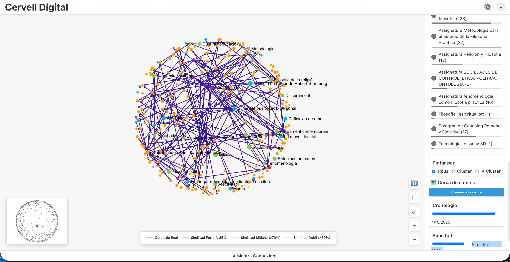

# Gnosi: El Teu Graf de Coneixement Sobirà 🧠



**Gnosi** és una potent eina de visualització i gestió del coneixement que transforma les teves notes en un graf interactiu. Dissenyat per ser totalment independent, Gnosi permet connectar idees, projectes i recursos de manera local i privada, utilitzant un enfocament híbrid d'**anàlisi per etiquetes** i **anàlisi semàntica amb IA**.

## ✨ Característiques Principals

-   **Graf Interactiu**: Visualitza la teva base de coneixement amb un motor d'alt rendiment (Sigma.js).
-   **Anàlisi Híbrid**:
    -   **Etiquetes**: Connecta notes que comparteixen conceptes comuns instantàniament.
    -   **IA Local**: Utilitza models d'IA (e.g., Ollama amb qwen2.5) per descobrir connexions semàntiques profundes entre els continguts.
-   **Sobirania de Dades**: El teu "Vault" es basa en fitxers Markdown locals, sense dependències de núvols externs per al seu funcionament diari.
-   **Migració des de Notion**: Inclou una funcionalitat robusta per importar bases de dades i notes de Notion per facilitar la transició cap a un sistema flexible i obert.
-   **Workflows Agentics**: Un sistema multi-agent (Supervisor, Coder, Brain) que pot executar tasques, gestionar fitxers i interactuar amb n8n de manera autònoma.

## 🤖 Arquitectura Agentica

Gnosi integra un sistema d'agents construït amb **LangGraph**:

1.  **Supervisor**: L'orquestrador que planifica tasques i les delega.
2.  **Coder Agent**: Expert en manipulació del sistema de fitxers i execució de codi.
3.  **Brain Agent**: Gestor del coneixement. Connecta amb n8n, gestiona la memòria a llarg termini (RAG) i facilita la migració des de fonts externes com **Notion**.
4.  **MCP Integration**: Estàndard Model Context Protocol per integrar eines de manera uniforme.

## 🚀 Instal·lació

### 🐳 Amb Docker (Recomanat)
Docker aïlla l'aplicació i evita la instal·lació manual de dependències.
```bash
docker-compose up -d --build
```
- Frontend: `http://localhost:5173`
- Backend API: `http://localhost:5001`

### 🏃 Execució Local (Alternativa)
1.  **Backend**: `pip install -r requirements.txt` i `python3 backend/server.py`.
2.  **Frontend**: `cd frontend && npm install && npm run dev`.
3.  **Pipeline**: `python3 pipeline/suggest_connections_digital_brain.py`.

## 📂 Estructura del Projecte

-   `backend/`: Servidor FastAPI/Flask per a la gestió del Vault.
-   `frontend/`: Aplicació React + Vite per a l'exploració del graf.
-   `pipeline/`: Scripts de processament de dades i anàlisi d'IA.
-   `docs/dev_memory/directives/`: Memòria del sistema i guies de funcionament.

## 🤝 Migració des de Notion

Si vens de Notion, pots utilitzar el nostre importador per portar les teves dades al Vault de Gnosi:
```bash
python3 -m pipeline.skills.notion_migration.scripts.notion_to_gnosi_full_import
```

---

## 📄 Llicència

Distribuït sota la llicència Creative Commons Attribution-NonCommercial-ShareAlike 4.0 International.
