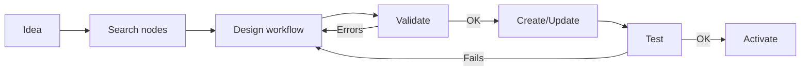

# Directive: n8n Workflows

## Objective
A guide for creating and modifying n8n workflows via MCP.

## Available Tools (MCP)

| Tool | Purpose | Risk |
|------|---------|------|
| `n8n_list_workflows` | List workflows | 🟢 READ |
| `n8n_get_workflow` | Get details | 🟢 READ |
| `n8n_validate_workflow` | Validate workflow | 🟢 READ |
| `search_nodes` | Search available nodes | 🟢 READ |
| `n8n_create_workflow` | Create new workflow | 🔴 WRITE |
| `n8n_update_full_workflow` | Modify workflow | 🔴 WRITE |
| `n8n_delete_workflow` | Delete workflow | 🔴 WRITE |

---

## Workflow Structure

```json
{
  "name": "Workflow Name",
  "nodes": [
    {
      "id": "unique-uuid",
      "name": "Readable Name",
      "type": "n8n-nodes-base.webhook",
      "typeVersion": 1,
      "position": [250, 300],
      "parameters": {}
    }
  ],
  "connections": {
    "Trigger Node": {
      "main": [[{"node": "Next Node", "type": "main", "index": 0}]]
    }
  }
}
```

---

## Mandatory Steps

1. **List** existing workflows before creating.
2. **Validate** the workflow with `n8n_validate_workflow` before saving.
3. **Test** with `n8n_test_workflow` if it has a webhook.

---

## Recommended Patterns

### Basic Nodes
```python
# Webhook trigger
webhook_node = {
    "type": "n8n-nodes-base.webhook",
    "typeVersion": 1,
    "parameters": {"path": "my-webhook"}
}

# HTTP Request
http_node = {
    "type": "n8n-nodes-base.httpRequest",
    "typeVersion": 4,
    "parameters": {"url": "https://api.example.com"}
}
```

### Connections
```python
connections = {
    "Webhook": {
        "main": [[{"node": "HTTP Request", "type": "main", "index": 0}]]
    }
}
```

---

## Known Restrictions

- ❌ **DO NOT** activate workflows without testing first.
- ❌ **DO NOT** modify active production workflows directly.
- ⚠️ Node IDs must be unique UUIDs.

---

## Discovered Traps

| Date | Trap | Solution |
|------|------|----------|
| 2026-01-18 | Incorrect typeVersion causes silent errors | Always use `search_nodes` to get the correct version |
| 2026-01-18 | Expressions must start with `=` | Format: `={{ $json.field }}` |

---

## Recommended Workflow Flow



---
*Last Update: 2026-04-08*
