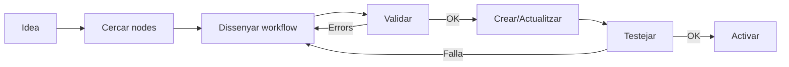

# Directiva: Workflows n8n

## Objectiu
Guia per crear i modificar workflows n8n via MCP.

## Eines Disponibles (MCP)

| Eina | Propòsit | Risc |
|------|----------|------|
| `n8n_list_workflows` | Llistar workflows | 🟢 READ |
| `n8n_get_workflow` | Obtenir detalls | 🟢 READ |
| `n8n_validate_workflow` | Validar workflow | 🟢 READ |
| `search_nodes` | Cercar nodes disponibles | 🟢 READ |
| `n8n_create_workflow` | Crear workflow nou | 🔴 WRITE |
| `n8n_update_full_workflow` | Modificar workflow | 🔴 WRITE |
| `n8n_delete_workflow` | Eliminar workflow | 🔴 WRITE |

## Estructura d'un Workflow

```json
{
  "name": "Nom del Workflow",
  "nodes": [
    {
      "id": "uuid-unic",
      "name": "Nom llegible",
      "type": "n8n-nodes-base.webhook",
      "typeVersion": 1,
      "position": [250, 300],
      "parameters": {}
    }
  ],
  "connections": {
    "Trigger Node": {
      "main": [[{"node": "Next Node", "type": "main", "index": 0}]]
    }
  }
}
```

## Passos Obligatoris

1. **Llistar** workflows existents abans de crear
2. **Validar** el workflow amb `n8n_validate_workflow` abans de desar
3. **Testejar** amb `n8n_test_workflow` si té webhook

## Patrons Recomanats

### Nodes bàsics
```python
# Webhook trigger
webhook_node = {
    "type": "n8n-nodes-base.webhook",
    "typeVersion": 1,
    "parameters": {"path": "mon-webhook"}
}

# HTTP Request
http_node = {
    "type": "n8n-nodes-base.httpRequest",
    "typeVersion": 4,
    "parameters": {"url": "https://api.exemple.com"}
}
```

### Connexions
```python
connections = {
    "Webhook": {
        "main": [[{"node": "HTTP Request", "type": "main", "index": 0}]]
    }
}
```

## Restriccions Conegudes

- ❌ **NO** activar workflows sense testejar primer
- ❌ **NO** modificar workflows actius en producció directament
- ⚠️ Els IDs de nodes han de ser UUIDs únics

## Trampes Descobertes

| Data | Trampa | Solució |
|------|--------|---------|
| 2026-01-18 | typeVersion incorrecte causa errors silenciosos | Sempre usar `search_nodes` per obtenir versió correcta |
| 2026-01-18 | Expressions han de començar amb `=` | Format: `={{ $json.field }}` |

## Flux de Treball Recomanat



---
*Última actualització: 2026-01-18*
