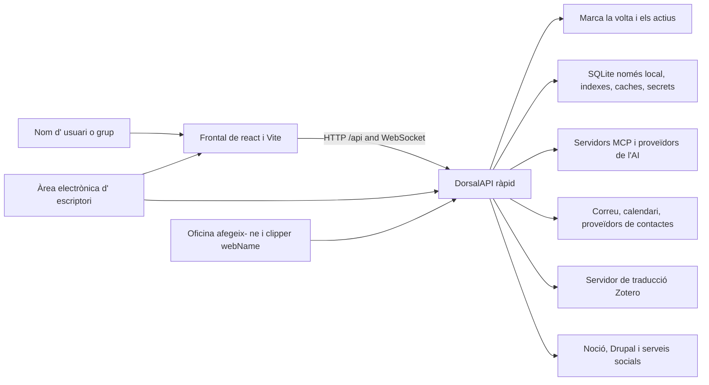

# Context del sistema

## Vista de contenidor

## Límit del Frontal

El frontal és una aplicació de pàgina única en React. `App.jsx` pertanyen les rutes del navegador de nivell superior, la porta d' autenticació, la càrrega de l' intèrpret global, la ruta mandrosa, les torrades, la paleta d' ordres, la gravadora, els recordatoris i l' actualització de l' escriptori. intermediaris intermediarisName `/api` i tràfic webSocket al dorsal durant el desenvolupament natiu.

Les pàgines compondre components resuperables; components cridaran el dorsal a través de ajuda compartida o cridacions directes. El frontal no és de confiança per a autoritzar un espai de treball, volta, usuari o operacions destructives. Els identificadors de client són senyals que el dorsal resol i validi.

## Límit del dorsal

`backend/server.py` Crea l' aplicacióAPI ràpida i registra els encaminadors de domini. Els mòduls de ruta tradueixen contractes HTTP en crides al servei. La lògica professional pertany a `backend/services/`; persisteixva les entitats relacionals en què viuen `backend/models/`; L' IAtractoral viu en `backend/agent/`; Funciona programada en `backend/scheduler/` i habilitats en temps d'esbarjo.

L' aplicació comença a compartir infraestructures, construccions d' agent, índexs de seguretat calents, inicien els treballadors IDLE de correu i després tanca aquests recursos. Opcionals 'startup' està aïllada per a que un proveïdor no disponible no avortarà tot el servidor.

## Límits d' emmagatzematge

Les dades voltes i locals tenen propietats deliberadament diferents de la durera i de sincronització:

- Culta: contingut d' usuari portàtil; pot viure en un disc local o en un fitxer " cdR."
proveïdor.
- Dades locals: SQLite, índexs, caches, secrets, registres, punts de comprovació i sortides;
Mai no s'hi resisteix al núvol.
- Configuració: fusionat per omissió de l' aplicació, paràmetres per omissió o de la volta,
L'entorn sobreescriu, i les botigues de confiança locals.

Veure [dades i emmagatzematge](data-and-storage.md) Per a la propietat i reconstruir les normes.

## Sistemes externs

Tots els serveis externs són dependències opcionals de domini. Les credencials i les credencials estan gestionades localment. Adaptadors s' inclouen comportaments normals per al proveïdor de Google, Microsoft, IMAP/ STP, CalDAV, Noon, Drupal, AAD, proveïdors, xarxes socials, proveïdors de fitxers i traduccions Zotero.

## Navegació a la implementació

- [Catàleg d' API](../generated/api-catalog.md)
- [Catàleg de Frontal](../generated/frontend-catalog.md)
- [Catàleg de mòduls del dorsal](../generated/backend-modules.md)
- [Catàleg de configuració](../generated/configuration.md)
