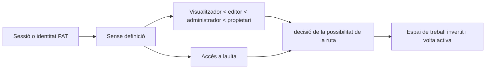

# Autenticació, espais de treball i compartició

## Modes operatius

`personal` El mode és l' experiència local d' un usuari. L' autenticació es evita a menys que la política efectiva la requereixi. `org` El mode requereix la identitat i l' afiliació de l' espai de treball. Els desplegaments ocults poden forçar l' autenticació independentment de l' etiqueta de mode amigable.

La porta del frontal selecciona la connexió o l'UI d' aplicació, però totes les autoritzacions estan obligades a dependències i serveis de dorsal.

## Autenticació de sessió i mostra

L' accés per correu/ contrasenya aclareix una marca de contrasenya i emet un compte signat a JWT en un Htp Només, Sate=Lax. Accepta els clients API també poden enviar- ne una `Authorization` Testimoni d' adorador. L' accés personal Tokens usa un format opac diferent, només es desen les dades SHA- 256 i es desa el prefix en pantalla.

El secret de signatura ha de ser fort en el desplegament. El dorsal refusa començar amb la alternativa del desenvolupament públic quan el desplegament requereix protecció.

## Model d' autorització

Els rols proporcionen capacitats de base de referència ordenades. Els diversos nivells s' access o concedeixen accés a una volta registrada. Un espai de treball que es proporciona, usuari o ID de la càmera mai no es basa en la resolució de la identitat i les no resoltes.

Les botes d' espai de treball són d' acord amb seguretat tan simultaniment les primeres peticions no creen espais de treball duplicats per omissió, usuaris o autoadhesió. Els comptes de substitució i els comptes automàtics seran marcats explícitament; el registre no pot reclamar- los per correu electrònic com a prova d' identitat feble.

## Compartició pública

Un enllaç compartit és una fila opaca que vincula la pàgina, espai de treball, volta, creador, permís de caducitat i revocació. `/s/:token` intencionadament està fora de l' intèrpret d' ordres autenticat. El sistema de resolució del dorsal públic usa la identitat de la volta desada perquè una sol· licitud anònima no té ni galeta activa ni capçalera.

La revocació és suau per tal que el sistema mantingui un registre d'auditori. Els enllaços caducats o revocat revelin cap contingut de pàgina. La resolució d' actiu pública hereti el mateix àmbit de compartició en comptes d' acceptar un camí arbitrari.

## API pública

Les rutes de ruta referenciades apliquen els llocs de fitxes i l' autorització normal de l' espai de treball/vult. Es mostra el text pla només a la creació. La revocació evita l' ús futur sense necessitat d' esborrar la seva fila d'auditoria.

## Invariants

- Identitat, membre de l' espai de treball, rol, accés de càmera i operació demanada
Totes participen en autorització.
- Les galetes són Htp Només, el frontal no necessita llegir el JWT.
- La contrasenya i la fitxa tenen valors d' una sola forma.
- Un client proporcionat `X-User-ID` no es pot convertir en una creació de comptes o privilegis
El camí augmenta.
- El contingut de la compartició pública està limitat a l' àmbit de pàgina/vult.
- La conveniència personal del mode no pot debilitar un desplegament multiusuari.

## Concentrat de verificació

Executa la interfície central, l' execució de les forces, el compte, el marcador, el cas de correu, la contrasenya, la superfície pública, la cadena de treball, l' afiliació de l' espai de treball, i la compartició de proves. Navegador de comprovacions de comprovació de preguntes d' accés/lologout, actualitzacions de comptes, canvi de l' espai de treball, i accés anònim de compartició en una sessió neta.
