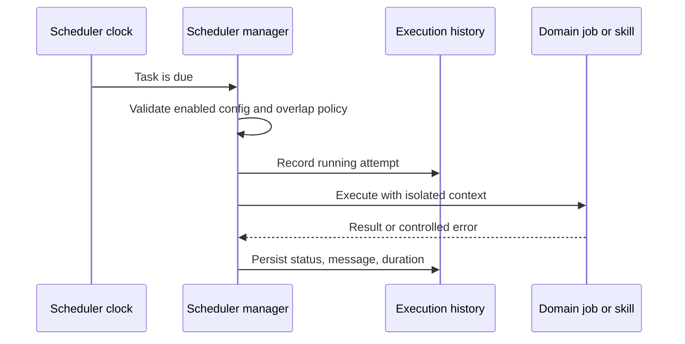

# automatització i planificació

## Reversió

El planificador executa tasques recurrents i úniques, registres historial, exposen les tasques operatives, i les coordenades de domini, com ara la sincronització, la publicació, la ingestió, el manteniment i la planificació de refresc.

## Model de tasca

Una definició de tasca té una identitat estable, l' estat habilitat, la planificació, l' operació, la política d' execució i la política d' execució. Els registres de la història de la tasca comencen, la compleció, l' estat, el missatge i la durada. Els paràmetres de definició i la connexió s' alinearan abans d' executar per tant un treball no pot usar una integració eliminada o diferent.

## Flux d' execució

Les funcions de tasques han de ser impotents on es pot fer la repetició. Els guàrdies de gestió s' sobreposen d' instàncies d' acord amb la política de tasques i usen contexts de bases de dades o proveïdors. Un procés es torna a iniciar les planificacions des de la configuració persisteixda en lloc de confiança només en estat d' amamictor.

## Sincronització de l'Adecamic i les actualitzacions de revisió

`academic_repository_sync` és un treball durable, resuperable per als índexs locals OAI. El cursor, compta, error, estat de cancel· lació, i l' última sincronització correcta es persisteix fora del procés de sol· licitud. Un administrador s' inicia explícitament la primera collita, després que finalitzi, la planificació diària rep un seguiment del darrer punt de comprovació complet del repositori i s' aplica OAJes.

Les estratègies de revisió desades també poden planificar- se `academic_review_update` Tasques. Una execució de repetició fa la funcionalitat de l' estratègia versió, registre exacta d' activitat per font i errors parcials, i només registra els candidats que determinen la identitat determinanta és nova per a aquesta revisió. La següent execució es persisteix amb la configuració de revisió enlloc de tenir només per el procés del planificador.

## Automulació

Les regles d' automulació combinades, les condicions i accions. Les fórmules de camp derivats i les ràfiques són una avaluació determinant, no l' execució de codi arbitrari. Les accions externes o destructives usen les mateixes accions d' autorització i límits de confirmació que són accions interactius.

## Treball de qualitat autònoma

Els cicles de manteniment i qualitat estan lligats a tasques operatives. Poden diagnosticar, generar informes, aplicar canvis en el seu àmbit declarat. No guanyen un sistema de fitxers més ampli, secret, Git, o publicar l' autoritat perquè estan programats.

## Invariants

- Les tasques deshabilitades o no vàlides no s' executen.
- Una tasca que s' executa té un resultat d' historial durable.
- Les reintents no duplicades efectes externs sense una estratègia d' idiempotència.
- S' estan eliminant o reassignant les actualitzacions dependents de la connexió.
- La planificació utilitza la semàntica horària explícita.
- Les excepcions de treball estan aïllats del bucle del planificador.
- El treball de fons no torna a usar sessions de base de dades de sol· licitudscopades.
- Una collita cancel· lar l' OAI manté el seu cursor dur i es pot continuar.
- Les actualitzacions de revisió planificades són idipotents per al mateix treball desproporcionat.

## Concentrat de verificació

Comprova la resistència de la configuració, l' alineació de la connexió, la planificació, la història de la tasca, la prevenció de la brillantor, les zones horàries, la reempaquetació i la cancel· lació, les glepes i la detecció de noves, i el escolta automàtic de la Playwright. Una integració processada hauria d' executar- se per acabar amb una seguretat de resolució o un compte de proves.
