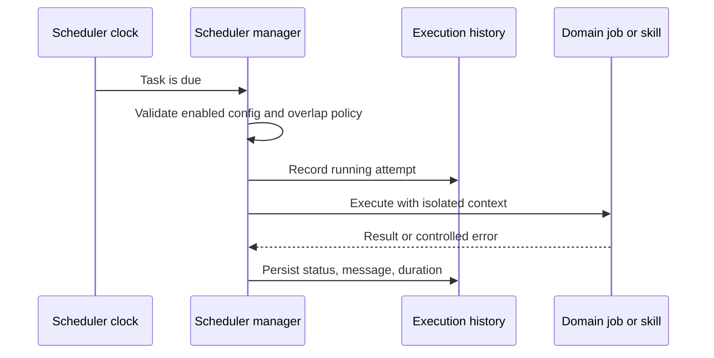

# automatització i planificació

## Reversió

El planificador executa tasques recurrents i úniques, registres historial, exposen les tasques operatives, i les coordenades de domini, com ara la sincronització, la publicació, la ingestió, el manteniment i la planificació de refresc.

## Model de tasca

Una definició de tasca té una identitat estable, l' estat habilitat, la planificació, l' operació, la política d' execució i la política d' execució. Els registres de la història de la tasca comencen, la compleció, l' estat, el missatge i la durada. Els paràmetres de definició i la connexió s' alinearan abans d' executar per tant un treball no pot usar una integració eliminada o diferent.

## Flux d' execució

Les funcions de tasques han de ser impotents on es pot fer la repetició. Els guàrdies de gestió s' sobreposen d' instàncies d' acord amb la política de tasques i usen contexts de bases de dades o proveïdors. Un procés es torna a iniciar les planificacions des de la configuració persisteixda en lloc de confiança només en estat d' amamictor.

## Automulació

Les regles d' automulació combinades, les condicions i accions. Les fórmules de camp derivats i les ràfiques són una avaluació determinant, no l' execució de codi arbitrari. Les accions externes o destructives usen les mateixes accions d' autorització i límits de confirmació que són accions interactius.

## Treball de qualitat autònoma

Els cicles de manteniment i qualitat estan lligats a tasques operatives. Poden diagnosticar, generar informes, aplicar canvis en el seu àmbit declarat. No guanyen un sistema de fitxers més ampli, secret, Git, o publicar l' autoritat perquè estan programats.

## Invariants

- Les tasques deshabilitades o no vàlides no s' executen.
- Una tasca que s' executa té un resultat d' historial durable.
- Les reintents no duplicades efectes externs sense una estratègia d' idiempotència.
- S' estan eliminant o reassignant les actualitzacions dependents de la connexió.
- La planificació utilitza la semàntica horària explícita.
- Les excepcions de treball estan aïllats del bucle del planificador.
- El treball de fons no torna a usar sessions de base de dades de sol· licitudscopades.

## Concentrat de verificació

Comprova la resistència de la configuració, l' alineació de connexió, les planificacions, la història de la tasca, la prevenció de les zones horàries, la reembència de la prova i l' escolta automàtic de reproducció. Una integració planificada hauria d' executar- se per acabar amb un compte de seguretat i segur.
