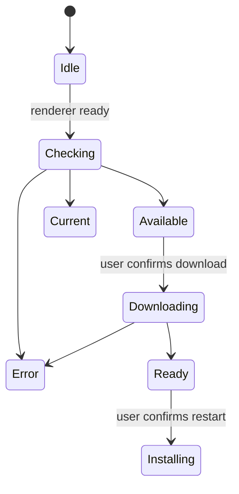

# Clients d'escriptori i company

## Escriptori electrònica

Paquets electrònica Gnosi com a aplicació d' escriptori. El procés principal propietari del dorsal en engegar, s' està netejant, ferm, rutes de vida de finestra, paquetd- font, actualitzacions de comprovacions, descàrregues, instal· lació i accions d' escriptori privilegiades. El renderitzador rep un API estret en comptes de l' accés directe al node.js.

El dorsal per al Python embalat ha d' estar llest abans que el renderitzador tracta l' aplicació com usable. Els errors d' inici estan en superfície amb diagnòstics i la neteja impedeixen processos de dorsal orfes després de sortir de la finestra.

## Actualitza la màquina d' estat

Les comprovacions estan deshabilitades en el desenvolupament. Les baixades mai comencen simplement perquè existeix un alliberament. El procés principal desa l' estat d' actualització, de manera que un renderitzador que subscripti fins tard es pot recuperar a través del PCPC.

Els artefactes de llançament inclouen instal· lats i metadades actualitzadores per a MacOS, Windows i Linux. La versió de preparació manté la Frontal i els manifests electrònica alineats; les etiquetes només es creen des de revisades. `main` Comencions.

El workflow privat de release empaqueta macOS Intel i Apple Silicon en jobs
separats d'una matriu. Cada job s'executa sobre l'arquitectura corresponent de
macOS 15 i construeix un únic backend natiu amb PyInstaller abans d'invocar
electron-builder per al mateix objectiu. Això evita copiar un executable Python
natiu del host dins l'aplicació de l'altra arquitectura. Els runners de release
estan fixats en comptes d'usar `macos-latest`, perquè la seva migració a macOS 26
va canviar la creació del DMG a APFS i va trencar la fase de muntatge i
personalització d'electron-builder.
Cada job de release també passa explícitament al constructor del backend el
comandament Python proporcionat per `actions/setup-python`. Això manté les
extensions binàries i les biblioteques OpenSSL recopilades sobre un únic ABI
d'intèrpret i evita que un Python més nou del runner substitueixi l'entorn de
release.
Com que `cryptography` 49 i posteriors ja no publiquen wheels macOS x86_64, el
paquet Intel usa l'última línia universal2 compatible (`48.0.1`) i la resta de
plataformes mantenen el requisit actual. L'instal·lador del backend congelat
exigeix una distribució binària de `cryptography`: ha de fallar en comptes de
compilar contra un OpenSSL del runner que pugui col·lidir amb la biblioteca
recopilada per PyInstaller.

La llista de fitxers del constructor d'Electron és un límit explícit del runtime.
El hook multiplataforma `afterPack` inspecciona l'`app.asar` final i rebutja un
paquet que ometi el procés principal, el preload, el mòdul del menú natiu,
l'iniciador del backend o la política d'actualització. Aquesta comprovació de l'artefacte instal·lat
complementa les proves de codi font i evita que un arbre de fonts vàlid produeixi
una aplicació que falla abans d'obrir la primera finestra.

El camí del backend empaquetat resol l'executable de PyInstaller mateix a macOS
i Linux, i el seu equivalent `.exe` a Windows. El procés principal executa
directament aquest fitxer resolt i no el tracta com un nivell de directori més.
La construcció neta instal·la els requisits canònics del runtime E2E, incloses
les dependències de proveïdors i API, i inicia l'executable congelat com a prova
de fum multiplataforma abans de continuar amb el paquet d'escriptori.

El procés d'escriptori instal·lat defineix `GNOSI_LOCAL_DATA` dins la carpeta de
dades d'aplicació de l'usuari que proporciona Electron, tret que hi hagi una
sobreescriptura explícita. Això evita que els paquets natius utilitzin el camí
exclusiu de Docker `/app/data`. La comprovació d'arrencada consulta el punt
públic `/api/health` i no queda bloquejada per un punt protegit de l'aplicació.
El backend congelat desactiva el vigilant de recàrrega de fitxers d'Uvicorn; el
desenvolupament natiu des del codi font conserva la recàrrega.

## Preparació de versions

`frontend/src/content/releases.json` és l'historial canònic de versions inclòs
al paquet. El sincronitzador manté idèntiques les versions del manifest del
frontend, del manifest d'Electron i de l'entrada del frontend al lockfile del
monorepo. Una entrada estable preparada abans de publicar-se omet expressament
`downloadUrl`; aquest camp només s'afegeix quan existeixen l'etiqueta immutable
i els artefactes de cada plataforma.
Com que la versió del manifest del frontend és un límit d'escriptori d'alt
impacte, cada pull request de preparació d'una release també actualitza aquest
contracte revisat i els seus miralls localitzats, encara que el patch no canviï
el comportament en temps d'execució.
La validació del changelog normalitza els finals de línia abans de comparar-los,
de manera que un checkout Windows amb CRLF equivalent no faci fallar el gate
d'empaquetatge multiplataforma.

Abans de crear l'etiqueta, la PR de release ha de superar la validació del
frontend, els tests backend, la QA nativa al navegador i la porta de
documentació d'enginyeria. Després del merge, el workflow de sincronització ha
de portar el commit revisat al repositori públic, on ha de superar el release
readiness. El workflow del repositori privat és l'únic propietari de les
etiquetes oficials, els artefactes multiplataforma, els catàlegs signats, les
notes i l'esborrany del repositori públic. El workflow d'escriptori sincronitzat
al repositori públic només s'executa manualment, de manera que pot validar
l'empaquetatge sense competir amb un build oficial. Els artefactes de macOS,
Windows i Linux es revisen abans de publicar-los.

La preparació de la v2.0.0 segueix aquest límit: les notes localitzades
incloses i el changelog generat es publiquen amb els manifests sincronitzats,
mentre que l'etiqueta immutable i l'enllaç de descàrrega de cada plataforma
només s'afegeixen després que el commit revisat de main superi el workflow
oficial de release.

El patch v2.0.1 manté completes les dependències canòniques del backend
congelat i envia els tags oficials a la matriu de runners locals configurada.
Així el workflow valida els mateixos entorns que generen els artefactes.

La preparació de la v2.0.5 afegeix una comprovació obligatòria de metadades
abans de l'empaquetatge per plataforma. Rebutja un tag si els manifests
d'Electron i del frontend, el lockfile del monorepo, els quatre catàlegs de
release localitzats i el changelog generat no descriuen la mateixa versió.

## clipper web

L' extensió del navegador extraieu el títol de la pàgina actual, URL, seleccionat o llegibles, i les metadades acceptades, després envia una sol· licitud limitada a l' API del Gnosi. El dorsal realitza autenticació, sanitització, desuplicació i Vault escriu. L' extensió no rep accés a sistema de fitxers arbitraris.

## Clients de citació de LibreOffice i Words

L' extensió LibreOffice registra un gestor de protocol i crida als punts finals de citació del Gnosi del procés d' oficina. El Word helper manté el paginador de tasques i l' estat requerit per accedir al mateix servei local. Ambdós clients tracten la inserció de cita i la bibliografia com a mutacions explícites del document.

Les API específiques de l' oficina estan aïllats darrere dels traverals i les seves transversions per tal que les proves puguin simular el límit de l'ONU o afegir-ne sense necessitat de l'aplicació completa de cada prova d'unitat.

## Invariants

- El codi Render no té cap capacitat de nocicle.js o sistema de fitxers.
- El PCP expos les operacions amb entrades validades.
- Actualitza les baixades i instal·lacions requereix accions explícites d' usuari.
- Els camins de recursos empaquetats difereixen dels camins del desenvolupament i es resolen a
Temps d' espera.
- Autenticació de clients de composició per al dorsal i segueixen- lo en el seu estret
Captura o àmbit de citació.
- Els esborranys de llançament estan inspeccionats abans de publicar-los.

## Concentrat de verificació

Executa les comprovacions de sintaxi electrònica/build, proves de fum de dorsal empaquetades, proves d' estat actualitzats, validació de l' extensió, proves de citació i plataforma CI. local de MacOS no poden provar defectes de Windows o Linux.
