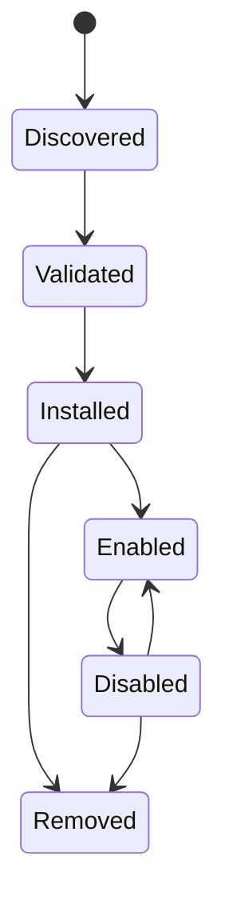

# Integració i connectors

## Reversió

Les Integració connecten els comptes d' usuari i sistemes externs. Els connectors s' expandeixen Gnosi amb contribucions Declatives i amb comportament executables declarats. Els servidors MC contribueixen eines agent a través d' un límit de protocol separat.

## Integració persisteix

El gestor d' integració desa la configuració de comptes no secret i referències a secrets sota dades locals. Cada màquina reconnecta els comptes independentment. Arranjament Les API llistaven l' estat de connexió emmascarada, validant la configuració, trieu la connexió per omissió, i desconnecteu proveïdors sense mostrar fitxes en brut.

Google i Microsoft OAuth Callbacks crea o actualitza registres de proveïdors. IMAP, SMTP, CalDAV, Drupal, Noion, i els adaptadors similars s' apliquen les seves pròpies opcions en el registre d' integració comú on és possible.

## Ciccle de vida d' endollat

Els paquets de connectors declaren la identitat, la versió, la compatibilitat, els permisos, les contribucions i la informació de la integritat. La instal· lació valida camins, estructura de manifest, signatures on es sol· liciten, i els efectes declarats. Activant els arranjaments gestionats, els perfils de l' IA, les habilitats o eines impoten. S' ignoren les contribucions gestionades mentre es preservaven les anul· lacions d' usuari.

El comportament dels connectors executables executa un límit de proves amb un entorn i temps constret. Els connectors no reben l' entorn complet d' ordinador o accés secret arbitrari.

## Límit MCP

Els servidors MCP són processos independents o punts remots finals. L' inici descobreix els seus esquemes d' eina i les normalitza en el catàleg de l' agent. Torneu a provar i `Retry-After` S' ha vinculat la gestió. Un servidor ha fallat es registra sense descartar eines des de servidors sans.

## Exemple i integració de company

El repositori inclou un exemple de paquets de connectors, un intermediari de Drupal MCP, l' extensió de citació LibreOffice, i un auxiliar de cita de paraules. Aquests són clients separats amb contractes de dorsal estrets; no comparteixen automàticament el sistema de fitxers de dorsal o l' accés de " credencial."

## Invariants

- Els secrets d'integració viuen fora de la Git i la caixa sincronitzada.
- Desconnectar l' eliminació o redefineix la referència de credent local i seleccionada
Per omissió és consistent.
- Els valors de connectors i edat d' usuari continuen sent indistingibles.
- No es poden escapar de l' administrador de la instal· lació d' arxiu i de rutes de connectors.
- La validació de la tecnologia i els permisos succeeix abans d'activació.
- L' origen i l' efecte MCP romanen visibles després de la normalització del catàleg.

## Concentrat de verificació

Executeu manifest, signat, proves de proves de proves, accions de l' estat, contribució a l' IA, ECP rout, reintentar i connectors. Una prova d' integració en directe usa un compte de prova dedicat i no ha de mutar les dades de producció sense voler.
