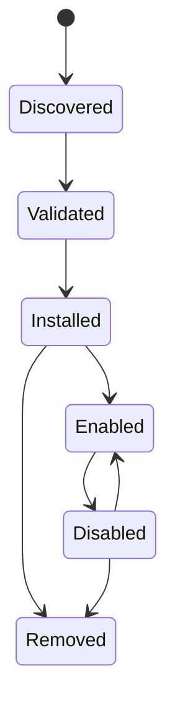

# Integració i connectors

## Reversió

Les Integració connecten els comptes d' usuari i sistemes externs. Els connectors s' expandeixen Gnosi amb contribucions Declatives i amb comportament executables declarats. Els servidors MC contribueixen eines agent a través d' un límit de protocol separat.

## Integració persisteix

El gestor d' integració desa la configuració de comptes no secret i referències a secrets sota dades locals. Cada màquina reconnecta els comptes independentment. Arranjament Les API llistaven l' estat de connexió emmascarada, validant la configuració, trieu la connexió per omissió, i desconnecteu proveïdors sense mostrar fitxes en brut.

Google i Microsoft OAuth Callbacks crea o actualitza registres de proveïdors. IMAP, SMTP, CalDAV, Drupal, Noion, i els adaptadors similars s' apliquen les seves pròpies opcions en el registre d' integració comú on és possible.

## Ciccle de vida d' endollat

Els paquets de connectors declaren la identitat, la versió, la compatibilitat, els permisos, les contribucions i la informació de la integritat. La instal· lació valida camins, estructura de manifest, signatures on es sol· liciten, i els efectes declarats. Activant els arranjaments gestionats, els perfils de l' IA, les habilitats o eines impoten. S' ignoren les contribucions gestionades mentre es preservaven les anul· lacions d' usuari.

El comportament dels connectors executables executa un límit de proves amb un entorn i temps constret. Els connectors no reben l' entorn complet d' ordinador o accés secret arbitrari.

Els connectors API v2 poden declarar `contributes.academicRepositories` per proporcionar un adaptador de cerca acadèmic complex. La contribució requereix la `network` permís, executa en la carpeta local existent i retorna la normalitzada `AcademicWork` contracte. Les definicions de repositori integrats i personalitzades usen la mateixa superfície de catàleg, per a cercar activació, provinance, i els errors parcials no depenen de l' origen del connector.

Els administradors també poden definir repositoris HTTPS OAI-PMH o declarar- lo en els repositoris REST. OAI també poden definir- ne, asumpcions, recol· loques incrementals i en les sal· lides. Les definicions REST han lligat a la pàgina, desplaçament, cursor o `Link` La paginació més explícita sobre el mapa de camp JSON. No s' accepten mètodes d' arbitari i codi de mapatge d' executable.

La xarxa directa es continua deshabilitada en ambdós temps d' execució dels connectors. Un fet `network` La possibilitat només indica la màquina RPC, que rebutja els destins i els mètodes de destí privats, redireccionats, temps i mida de resposta. Els marcs de la IU segueixen `connect-src 'none'`; el pare crida al mateix límit de dorsal després de comprovar el connector ha declarat i amb permisos concedits.

## distribució de mercat

L' índex oficial del connector i la seva signatura separada es publica com a actius de llançament de GitHub. La instal· lació del catàleg remot requereix un índex signat de confiança i cada paquet seleccionat requereix la integritat SHA- 256 i una signatura de confiança separada per Ed 25519. Instal· lant la provació de l' URL de la font, suma de verificació i editor verificat. La instal· lació local de ZIP continua disponible per al desenvolupament, però comença amb sense concedir.

Els connectors instal· lats es poden exportar com a ZIPs determinants. La submissió pública és una operació d' administrador enviada a un mode de conversió explícitament configurat; Gnosi mai s' encastarà a un testimoni d' escriptura de GtHub. El sistema d' errors en quarantena el paquet i el publica només després de la revisió de CI i humana.

## Límit MCP

Els servidors MCP són processos independents o punts remots finals. L' inici descobreix els seus esquemes d' eina i les normalitza en el catàleg de l' agent. Torneu a provar i `Retry-After` S' ha vinculat la gestió. Un servidor ha fallat es registra sense descartar eines des de servidors sans.

## Exemple i integració de company

El repositori inclou un exemple de paquets de connectors, un intermediari de Drupal MCP, l' extensió de citació LibreOffice, i un auxiliar de cita de paraules. Aquests són clients separats amb contractes de dorsal estrets; no comparteixen automàticament el sistema de fitxers de dorsal o l' accés de " credencial."

## Invariants

- Els secrets d'integració viuen fora de la Git i la caixa sincronitzada.
- Desconnectar l' eliminació o redefineix la referència de credent local i seleccionada
Per omissió és consistent.
- Els valors de connectors i edat d' usuari continuen sent indistingibles.
- No es poden escapar de l' administrador de la instal· lació d' arxiu i de rutes de connectors.
- La validació de la tecnologia i els permisos succeeix abans d'activació.
- Els índexs oficials i els paquets remots no s' han tancat quan falten les metadades d'integritat.
- Sockets de connectors directes i connexions de navegador mai eviten l' ordinador RPC.
- URL dels dipòsits cademic passen HTTPS, DNS/IP, redirecció, temps d' expiració, mida de resposta,
i una validació XML segura abans que les dades arribin a un connector.
- Els serveis de només lectura externa mai es mostren com connectors automatitzats.
- L' origen i l' efecte MCP romanen visibles després de la normalització del catàleg.

## Concentrat de verificació

Executeu un manifest, signatura, proves de proves de proves, de l' estat, contribució a l' IA, ECP, reintentar, permisos acadèmics, SSRF, XML, paginació i connectors. Una prova d' integració en directe usa un compte de prova dedicat, una pàgina de resultat limitada, i no ha de mutar dades sense voler.
