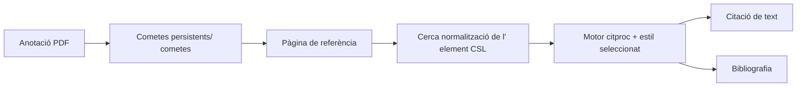

# Lector, referències i citacions

## Reversió

Aquest domini combina la lectura de fonts/news lletres amb un gestor de referències compatible amb el Zotero, renderitzat de citació CSL, identificador i importació web, lectura PDF/EPUB i anotacions que poden convertir-se en proves citables.

## Referència d' ingestió

Les referències entren a través del DOI, ISBN, arXiv, PMID, BibTeX, RIS, fitxers o URL web. Els identificadors i el servidor de traducció Zo- servidor produeixen metadades específiques del proveïdor. Normalitza els mapes a l' esquema de referència configurat, genera una clau de citació estable, candidats de desuplicats, i escriu un registre de continguts.

El servidor de traducció és un port opcional. L' operació nativa pot executar- se sense ell; els resoldors específics d' identificador i les referències existents continuen treballant. Els errors de traducció web retornen errors no vàlids en lloc d' un registre buit.

## Camí de la Citació

Els valors CSL es derivaen de la matèria de referència usant mapes de camp explícits. Llista de noms, dates, tipus d' element, escapat de BibTeX/LaTeX, i Zotero `extra` Les metadades requereixen normalització. L' esquema adversat protegeix els tipus d' element compatibles i camps des de la deriva de dalt a baix.

## Lector i anotacions

El lector de Zotero mostra el contingut PDF i EPUB. Gnosi és propietari del pont que localitza fitxers, serveix intervals de bytes segurs, rep anotacions i enllaços marcats de nou als registres Vulta. Les files d' anotacions inclouen URI de codi font, pàgina, tipus, geometria, text, etiquetes, claus estables, clau i marques horàries.

Els punts finals de fitxer validen la contenció i gestionen la hidratació en núvol. Els identificadors d' anotacions persistents impedeixen que una cita generada de duplicació cada vegada que es reoberta un document.

## Fonts i comentaris

Els models del lector emmagatzemen fonts, articles, estat de lectura, extrets de contingut complet i un compte de butlletí informatiu. La font d' agestió usa punts de desat de transacció per tant una entrada mal formatada no pot tornar a rodar tot el lot. Els excers i l' extracció de text complet són separats; la truncació no ha de recuperar permanentment el contingut recuperat.

## Invariants

- Les claus de Citació segueixen estables a menys que l' usuari canviï explícitament les dades d' identitat.
- La importació està desordenada per identificadors autoritativa i metadades normalitzades.
- Les rutes dels fitxers del lector no poden escapar arrels permeses.
- Una identitat del document i geometria de pàgina sobreviuen a les reinicis.
- Els lectors interns de venedor són tractats com a codi de transmissió; integració local
Les modificacions són explícites i reprosionables.
- Les contrasenyes de la configuració del butlletí de diari antic es tracten com a secrets fins i tot
Quan un model antic encara expos un camp de compatibilitat.

## Concentrat de verificació

Executeu la clau de citació, PubMed, element- tipus, estil CSL, escapent de l' estil BibTeX, referència I/O, anotació, ruta- subvenció, importació de desengany, i proves de desat de punts. El navegador ha d' obrir un document de correcció i exercit una citació o un viatge de notes al voltant del viatge.
