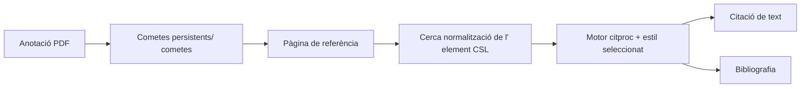

# Lector, referències i citacions

## Reversió

Aquest domini combina la lectura de fonts/news lletres amb un gestor de referències compatible amb el Zotero, renderitzat de citació CSL, identificador i importació web, lectura PDF/EPUB i anotacions que poden convertir-se en proves citables.

## Referència d' ingestió

Les referències entren a través del DOI, ISBN, arXiv, PMID, BibTeX, RIS, fitxers o URL web. Els identificadors i el servidor de traducció Zo- servidor produeixen metadades específiques del proveïdor. Normalitza els mapes a l' esquema de referència configurat, genera una clau de citació estable, candidats de desuplicats, i escriu un registre de continguts.

El servidor de traducció és un port opcional. L' operació nativa pot executar- se sense ell; els resoldors específics d' identificador i les referències existents continuen treballant. Els errors de traducció web retornen errors no vàlids en lloc d' un registre buit.

## Un descobriment acadèmic Federed

La configuració del repositori dels connectors de recursos integrats mentre que `/api/vault/reference-table` Encara queda l'única font de veritat per a la taula de recursos de destí. `/literature` Executa cada connector seleccionat de forma independent i els resultats parcials de fluxos; una fallada de quota o proveïdor està connectada a aquesta font sense descartar resultats sans.

`AcademicWork` és el connector canònica. Les unió de connectors. Les unions de desterministes usen, per ordre, normalitzat DOI, PMID o PMCID, l' identificador arXiv, ISBN- 13, i el títol normalitzat més d' any i cognom del primer autor. Un títol bot només és un avís. Fusionat funciona mantenint totes les ocurrències de codi font, localització, subtitulació específica, nombre de paquets provat i variants contradicades.

La vista prèvia és de només lectura. L' adjunt complet de text és una acció de manual diferent i s' ofereix només per a una ubicació anomenada oberta. Importa mapes que funcionen entre el mapa de recursos compatible amb el Zotero i repeteix la identitat que coincideix dins d' un bloc atòmic. Quan existeix un registre de recursos, l' API retorna el registre en comptes de crear un duplicat.

## Comentaris de literatura

L'estat de revisió del sistema és emmagatzemat en quatre taules de la idepotència gestionades Vult: `Literature Reviews`, `Literature Activities`, `Literature Candidates`, i afegeix només- hi `Literature Decisions`. The Search phone Search Search Search phones, errors parcials, operacions de IA, decisions de projecció i exportacions, per tant, continuen sent auditives i sincronitzats amb la volta principal.

Un únic visor i doble punts de projecció comparteixen el mateix model de fase. En mode cec, s' oculta una decisió de revisor fins que ambdós revisors es dirigeixen a consens explícit. L' IA també pot proposar consultes editables, tornar a fer la pantalla, la pantalla o la sintetitzen metadades, però no pot excloure un candidat o una declaració més enllà del títol, abstracte, o el text proporcionat en realitat.

Els índexs OAI i l'estat de cerca temporals es reconstrueixen i viuen a sota `LOCAL_DATA`; protocols, històries, candidats, decisions i artefactes d'auditories segueixen en la caixa principal. Les credencials del repositori usen les claus natives Cocadena o l' entorn desplegament i mai s' escriuen a la volta o a l' estat del connector.

## Camí de la Citació

Els valors CSL es derivaen de la matèria de referència usant mapes de camp explícits. Llista de noms, dates, tipus d' element, escapat de BibTeX/LaTeX, i Zotero `extra` Les metadades requereixen normalització. L' esquema adversat protegeix els tipus d' element compatibles i camps des de la deriva de dalt a baix.

## Lector i anotacions

El lector de Zotero mostra el contingut PDF i EPUB. Gnosi és propietari del pont que localitza fitxers, serveix intervals de bytes segurs, rep anotacions i enllaços marcats de nou als registres Vulta. Les files d' anotacions inclouen URI de codi font, pàgina, tipus, geometria, text, etiquetes, claus estables, clau i marques horàries.

Els punts finals de fitxer validen la contenció i gestionen la hidratació en núvol. Els identificadors d' anotacions persistents impedeixen que una cita generada de duplicació cada vegada que es reoberta un document.

## Fonts i comentaris

Els models del lector emmagatzemen fonts, articles, estat de lectura, extrets de contingut complet i un compte de butlletí informatiu. La font d' agestió usa punts de desat de transacció per tant una entrada mal formatada no pot tornar a rodar tot el lot. Els excers i l' extracció de text complet són separats; la truncació no ha de recuperar permanentment el contingut recuperat.

## Invariants

- Les claus de Citació segueixen estables a menys que l' usuari canviï explícitament les dades d' identitat.
- La importació està desordenada per identificadors autoritativa i metadades normalitzades.
- Un fracàs d' origen alimentat no pot tornar amb resultats no vàlids.
- La semblança aproximada mai fusionar l' acadèmic funciona automàticament.
- Les mètriques de la Citització segueixen separades pel proveïdor i mai s'han afegit juntes.
- Els suggeriments de la IA mai es converteixen en decisions finals de projecció sense una acció humana.
- Les rutes dels fitxers del lector no poden escapar arrels permeses.
- Una identitat del document i geometria de pàgina sobreviuen a les reinicis.
- Els lectors interns de venedor són tractats com a codi de transmissió; integració local
Les modificacions són explícites i reprosionables.
- Les contrasenyes de la configuració del butlletí de diari antic es tracten com a secrets fins i tot
Quan un model antic encara expos un camp de compatibilitat.

## Concentrat de verificació

Executeu la clau de citació, PubMed, el tipus d' element, l' estil CSL, l' execució de referència i/O, l' anotació, la resolució de rutes, la importació de desenganys, i les proves de salvament. Afegiu connectors normalització, OAI tokens i la làpida, SSRF/XML, Retització parcial, revisió de dalton- error, la resolució actual, importació i proves PRISMA. El navegador ha d' obrir un document de fix i exercit d' anotacions, després executeu una literatura progressista, examinació, provada i un resultat d' importació desupida.
