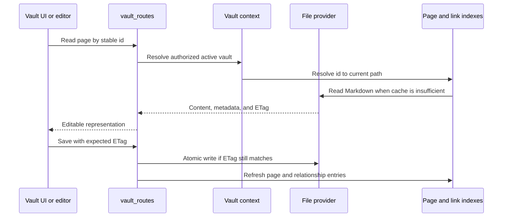

# Aprofita i fitxers

## Reversió

Els mapes de domini Vulta portàtils Markdown i actius a les pàgines, carpetes, adjunts, recerques, esquemes, històries, escombraries, exports, citacions i selecció multi-vulta. És el domini més gran i el propietari principal de la sobirania de dades.

## cicle de vida de pàgina

La identitat de pàgina està separada del títol i del camí. La matèria frontal està normalitzada en la recerca d' escriptura mentre que les claus de l' usuari- author són preservades. L' estat intern només pertany a `.gnosi` Els llocs secundaris quan l'exposassin al tema d'entrada contaminarien o contaminarien contingut portàtil.

## Índexs i registres

L' índex de pàgina accelera el llistat, resolució d' identificador, accés frontal- minatter i cerca. La resolució d' índex del wikilink resol els enllaços que s' enganxen per tal que la pàgina reanomena referències. Els cossos i els registres analitzats no es repeteixen. Cada cau es deriva i ha de tolerar una refució freda.

Primer s' inicia un carrega les instantànies de disc vàlides, després comença a refrescar el treball. Es marca un escàner parcial de fitxer i no es pot reemplaçar un cau complet. Els errors de fitxer s' aïllaran de manera que un únic espai de substitució en línia o orfe no elimina la resta de la caixa volta d' una resposta.

## Proveïdors de fitxers

L' abstracció del proveïdor selecciona el local, OneDritiu, iCloud Drive, Google Drive, o el comportament de la consciència de Nextclou. El codi de domini normal encara funciona amb `Path`; l' adaptador afegeix detecció de marcadors de posició, hidratació, disponibilitat i mapa de rutes.

Operació nativa Onevariva delegar a una sessió gràfica d'usuari `open` L' acció quan l' agent de llançament no pot materialitzar un fitxer en línia. El desplegament Dockers pot usar un punt d' escalfament de la màquina perquè el recipient llegeix el límit creuat d' un altre.

## Propietats dels adjunts i de fitxer amb valor

Escriu un objectiu permès sota la caixa de seguretat activa, normalitza els noms, evita col· lisions i retorna les metadades portàtils. Els enllaços de fitxer es rerooten en temps de lectura per a la màquina actual. Puja i esborra operacions validades per a la contenció; un camí que no és prou apable.

## Operacions Paperera i destructiu

L' eliminació normal es recuperable: pàgines i actius relacionats es mouen a través del model de brossa Vulta. La freqüència és diferent i elimina contingut més metadades derivades i relacions inverses. L' eliminació del registre elimina la fila de registre lògica per omissió; l' eliminació física requereix un senyal explícit i comprovacions de contenció més fortes.

## Conculència envaris

- Modifica els sobreescriure de Stale ETag Type
- Recepta i creació diària de notes utilitza les comprovacions de carreres.
- Pàgina, registre, captura d' enllaços i actualitzacions del dipòsit lateral segueixen consistents després d'un
Un nom o supressió.
- S' han rebut camins absoluts d' un client sota arrels aprovades.
- Els enllaços de Symlinks i el camí del traversal no poden escapar del límit de la volta seleccionada.
- Marca els viatges rodó conservant contingut sensible a l'escapament i la sintaxi wikilink.

## Frontal

`VaultDashboard` la seva història de navegació i selecciona la pàgina, taula, dibuix, galeria, tauler, calendari, cronologia, fonts o superfícies lectores. `VaultShell` proveeix del marc; components especialitzats que implementen editors i vistes. L' estat d' interacció frontal de la memòria cau però tracta el contingut de la pàgina de dorsal i els ETags com autoritiu.

## Concentrat de verificació

Executeu ETagDigention, contenidor de rutes, raça segura d' E/O, registre, reanomenant, paperera/purge, numeració, relació amb l' índex, refresc de Playwright Vultigce. Els incidents de núvol també requereixen un primer cop de substitució perquè el local d' arranjar les proves no pot reproduir el comportament del proveïdor de fitxers.
