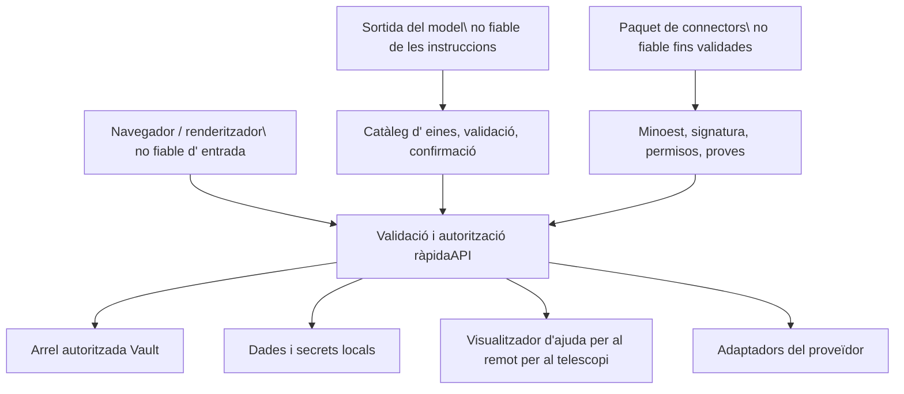

# Model de confiança

## Protegit dels actius

- Pàgina Vulta, adjunts, metadades internes, històries i escombraries.
- Identitats d'usuari, accions, rols, subvencions de cambres, PAT téhes i accions.
- Outh refresh fitxes, credencials de correu, claus de l'AI, claus de signatura i connectors
secrets.
- Base de dades local, índexs, punts de comprovació de l' agent, registres i accions planificades.
- El sistema de fitxers i aplicacions d' escriptori de la màquina abasten les API de l' auxiliar.
- comptes externs capaços d' enviar, publicar, esborrar o modificar
Dades remotes.

## Límits de confiança

Entrada del navegador, la sortida de model, fitxers importats, HTML remot, respostes de proveïdor, paquets de connectors i descripcions de l' aplicació MCP no són de confiança. Un usuari no fa rutes, HTML, arguments d' eina, o identificadors de l' espai de treball segurs.

## Autenticació i autorització

Les sessions JWT usen una galeta Htp Només, els mecanismes de suport als clients API. La seguretat secreta de la signatura es comprova en iniciar- se per a desplegaments. Les contrasenyes són resumides; el text pla mai es persisteix.

L' autorització combina una identitat efectiva, l' afiliació de l' espai de treball, el rol ordenat, la volta i l' operació. Les dependències de ruta fan que els requisits amples; els serveis repetien el contenidor i les comprovacions de propietat on el recurs determina l' àmbit.

## Contenidor del sistema de fitxers

Els camins es resolen abans de comparar i comprovar- se contra les arrels permeses. Pujades, importacions, peticions de lector, accés al fitxer generat, accés de fitxer obert, de cerca nativa i operacions de brossa usen límits dedicats. Symlinks, `..`, URL de fitxer, mapatges de camins en núvol, i la codificació del percentatge no ha d' escapar de l' arrel autoritzada.

L' eliminació de la recuperació és preferida. Es purga i elimina permanentment de la caixa forta són operacions explícites separades.

## Seguretat de la xarxa

URL ingestió i una recuperació de context externa usa un guàrdia SSRF. Resolu les màquines, redireccionats, esquemes i mides de resposta es constren; els objectius privats o locals d' enllaç es rebutja a menys que una integració específica posseeix el punt final. L' HTML remot és saquititzada abans de renderitzar o convertir- se.

Els clients del proveïdor usen temps d' espera i reintents lligats. Les respostes d' error mostrades a les credencials del navegador exclouen i detalles rutes internes.

## Seguretat de l'AI i l' eina

La sortida del model és de dades fins que s' accepta una eina validada en la provocació. L' origen d' eina, l' esquema, la compatibilitat de l' habilitat i la política de confirmació es catalogen. Genera eines que passen font i no poden accedir als valors d' entorn, les importacions arbitràries, els sistema de fitxers amb restriccions, escriu o la introspectició perillosa.

Un registre de confirmació es vincula a arguments exactes i expiren. El sistema no reutilitza cap confirmació després de la mutació, desaparellat per l' usuari/session, o el temps d' espera.

## cicle de vida secreta

Els secrets es desen en el directori de secrets de l' OSM credential o local de dades. Les variables d' entorn estan implementades per a desplegament les botes i la migració heretata. Les respostes de l' API emetències de l' estat secret; catàlegs de documentació i consumidors però per omissió redacts.

Els secrets no han de viure a la G., la caixa de seguretat de Markdown, documentació generada, instantànies, registres, fixtures, o paquets de connectors compartits.

## Controls d' amenaça primària

| Amenaç | Controls primaris |
| --- | --- |
| Accés a dades a l' espai de treball Cross- workspace | dependència d' autorització, cerca d' afiliació, context de la caixa forta, comprovacions de propietat del servei. |
| escape dels traversals de camins o de l' enllaç simbòlic | Resolució canonònica, arrels permeses, mapatge de proveïdors, proves de contenció. |
| XSS des del contingut del correu/web/ importat | El statitzador HTML, react escapar, recursos lector baixos. |
| SSRF | Esquema/ validació de màquina/IP, comprovacions redireccionats, límits de mida/ hora. |
| Diferential revelació | Emmagatzematge local d' un secret, màscara, errors genèrics, disciplina de registre. |
| L' agent realitza acció no volguda | Eina de permet llista, classificació d' efecte, validació d' arguments, confirmació. |
| Connector de MaliciósName | Comprovacions de mifest/signatura, permisos, instal· lació de root, carpeta local, temps d' espera. |
| Sobreescriu l' Stale | ETags, revisions d' esquema, com a atòmics, respostes de conflicte. |
| corrupció SQLite | Emmagatzematge local de només fitxers; sense sincronització en núvol. |

## Verificació de seguretat

Els canvis sensibles a la seguretat executen una autorització central, espai de treball, PAT, share, contenidor de ruta, XS, SSRF, l' eina generada, la carpeta local dels connectors i les proves d' ortografia. El navegador QA usa una sessió autenticat i un context anònim net quan les superfícies públiques canvien.
