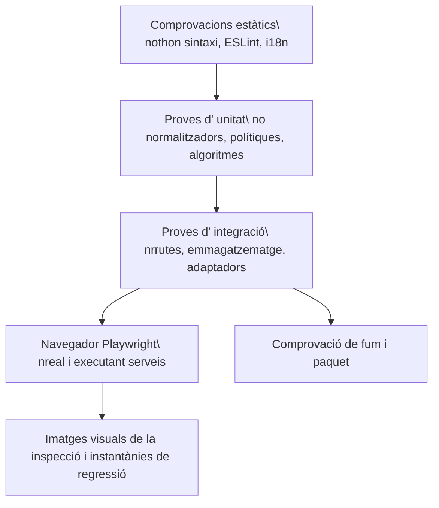

# Eina de proves

## capes de qualitat

No hi ha cap sola capa suficient. Un frontal construeix captura les importacions i la sintaxi però no una interacció incorrecta. Una prova d' unitat de ruta no prova la integració del navegador. Una instantània no prova persisteix o l' autorització.

## Comprovacions del dorsal

Pytest cobreix serveis, dependències de ruta, magatzem, seguretat, probabilitat de tenir característiques i casos de regressió. Les proves usen directoris de volta temporal i local- data. Els proveïdors externs s' han quedat lligats a menys que una prova està marcada explícitament com a " emissió/ E2E2E."

Hi ha suites importants que inclouen:

- Autentifica, PAT, Hock Hock, rols i superfícies públiques.
- Un contenidor de camins, un senyal segur, ETS, curses, registre i comportament dels laterals.
- fórmules, flexions, filtres escrits, relacions, planificació i planificació.
- Mail MIME/CID, contactes fusionats/vCard, contenidor de calendari i recordatoris.
- IAterbuent, habilitats, resistència MCP, confirmació i eines generades.
- Connectors, importacions, citacions, lectors normalització, XSS, i SSRF.

## Comprovacions de la Frontal

Vitest cobreix components, ganxos, registes, utilitats de format, lògica de vista i comportament estatal. ESLint i la construcció de producció de Vite són obligatoris. `check:i18n` versifica que les claus referenciades a l' usuari existeixen en cada lloc local.

La construcció ha d' acabar amb errors zeros. Els avisos existents no són permís per afegir nous avisos sense revisar.

## Comprovacions visuals final a fi

Playwright s' executa com a un projecte de nivell remot contra l' aplicació nativa. Un arranjament anònim cobreix l' arrencada i el comportament públic; autenticat cobreix funcionalitats de l' espai de treball. Les proves de domini executen Vulta, tauler, correu, contactes, dibuixos, automatació, xat d' agent i navegació.

Les instantànies de cobertura visual cobreix el representant d' escriptori i pàgines mòbils. Per a un canvi de IU, inspeccioneu la pàgina de renderitzat real, cliqueu el control canviat, mireu la consola i feu una instantània. Confirmau aquesta instantània, retorzes, torrades i menús usen el sistema de fitxers i no auto interacció.

## Porta d’accessibilitat

El projecte `accessibility` de Playwright és una porta bloquejant de WCAG 2.2
AA. Executa axe sobre una ruta representativa de cada domini principal en els
temes clar i fosc, incloent-hi contrast de color, etiquetes, regions i relacions
ARIA. El marcatge propi de l’aplicació sempre queda dins l’auditoria. La dada
de prova determinista activa els mòduls opcionals de la matriu de rutes, i cada
ruta també falla si el navegador genera un error de pàgina no gestionat; una
superfície trencada no pot superar axe.

Les proves d’interacció complementen axe amb navegació de salt, focus visible i
ordenat, teclat complet, focus roving de les pestanyes mòbils, Escape als
diàlegs cancel·lables, focus trap i retorn del focus, noms accessibles i anuncis
de canvi de ruta.

L’estil global de focus utilitza l’atribut `data-focus-modality` a l’arrel del
document. L’activació amb punter elimina els contorns genèrics; amb teclat
s’apliquen indicadors contextuals: la vora existent als camps, subratllat als
enllaços i contorn als controls sense vora. Els títols editables del Vault
conserven només el cursor d’escriptura. Les proves unitàries cobreixen els
canvis de modalitat i les proves de navegador, el focus amb punter i teclat en
els temes clar i fosc.

## Comprovacions de desplegament

En Docker CI construeix el dorsal i les imatges de la interfície, validen el Compup, i exercicis de salut amb l' emmagatzematge local. El llançament electrònica CI és propietari de la plataforma creuada. Una construcció local de macOS no pot validar defectes Windows i Linux.

## Mapatge de canvi a prova

| Canvia | Prova mínima |
| --- | --- |
| Documentació de revisada pura | Comprovador del generador, validador, mestres estrictes, documentació de navegador. |
| lògica de catàleg generat | Proves de generadors, dos vegades determinant, validador, Docs estrictes construeixen. |
| Comportament del dorsal | Una regressió inversa de pytest més afectat del paquet d'integració. |
| Comportament del Frontal | Vitest on factible, i18n, construeix, acció del navegador i captura de pantalla. |
| Accessibilitat o token compartit d’interfície | Vitest de la primitiva, paritat dels quatre idiomes, matriu axe en clar i fosc, proves de teclat i captura del navegador. |
| Comportament d' autorització/ seguretat/path | Proves i intents de creu negatiu, no només pel camí daurat. |
| Difuminat/dependència | Verificació nativa més amarrada o paquet CI com a aplicable. |

## Catàleg de proves

El generat [catàleg de proves](../generated/tests.md) llista els fitxers de proves i els senyals de navegació. La col· lecció del llançador continua autoritzada per als comptadors de proves executables.
