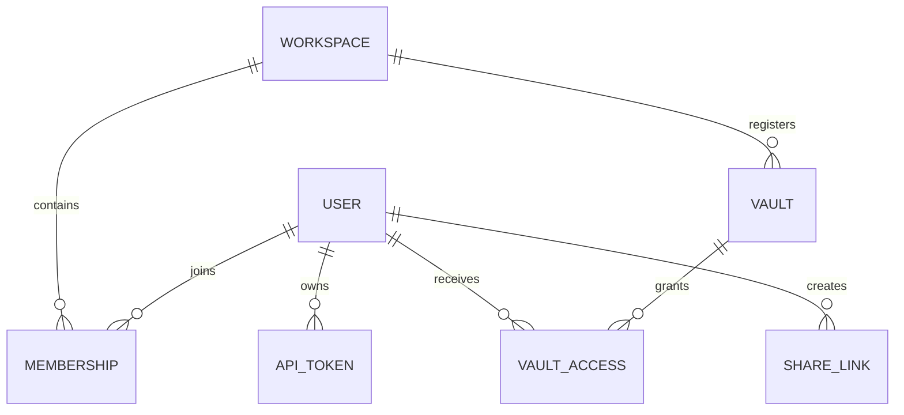

# Datos y almacenamiento

## Mapa de propiedad

| Datos | Dueño duradero | Regla de reconstrucción o recuperación |
| --- | --- | --- |
| Contenido de la página y material de portada | Cápsula de marcado | Copia de seguridad y versión como archivos ordinarios. |
| Archivos adjuntos y archivos de biblioteca | Cápsula activa | Preservar referencias relativas o portátiles. |
| Metadatos internos de páginas | Bóveda `.gnosi` sidecars | Migrar con la página; ocultar los campos de implementación únicamente del contenido de autor. |
| Índices de páginas y enlaces wiki | Cachés de datos locales | Reconstruir desde la bóveda; los escaneos parciales no deben sobrescribir cachés completos. |
| Usuarios, espacios de trabajo, membresías, acceso a bóvedas, PATs, acciones | SQLite de gestión | Hacer copias de seguridad como estado de aplicación local; nunca sincronice la base de datos en vivo. |
| Índices de correo, lector, notificación, anotación e ejecución | SQLite local | Dominio dependiente; recuperar de proveedores o datos de origen cuando sea posible. |
| Tokens OAuth y secretos de integración | Secretos de datos locales o almacén de credenciales del sistema operativo | Reconectar por máquina si se pierde; nunca copiar a una bóveda compartida. |
| Puestos de control de agentes | Datos locales | Memoria de ejecución por instance, no contenido de bóveda. |

## Formato de la bóveda

Una página es un archivo Markdown con YAML front matter. Los identificadores estables de páginas permiten que los enlaces y las relaciones sobrevivan a los cambios de título. Los enlaces visibles para humanos usan sintaxis wikilink; los archivos adjuntos y las propiedades valoradas utilizan rutas portátiles o metadatos estructurados en lugar de rutas absolutas específicas de la máquina.

Las vistas de tipo base de datos son proyecciones sobre páginas y registros. No reemplazan Markdown por un almacén relacional opaco. Ver definiciones, metadatos de esquemas, fórmulas, rollups, relaciones y estado de presentación se resuelven mediante la capa de servicio de bóveda.

## Escribir moneda

Página lee exponer un Etag derivado de la representación actual. Mutar clientes devuelven el Etag esperado; desajustes rechazan escrituras rancios en lugar de sobrescribir silenciosamente un cambio concurrente. Ayudantes de escritura atómica reemplazan archivos sólo después de que la nueva representación está completa.

Las operaciones de cambio de nombre dependen del índice wikilink para reescribir los enlaces entrantes. Por lo tanto, un cambio de nombre cruza la identidad de página, nombre de archivo, metadatos de registro, sidecars e índices de enlace y debe ser tratado como una operación coordinada.

## Base de datos de gestión

Los modelos SQLAlchemy representan:

El motor se inicializa perezosamente y se protege contra el primer acceso concurrente. `Base.metadata.create_all` crea tablas faltantes. No hay un marco general de migración: un pequeño pase de inicio idempotente añade columnas explícitamente registradas y aplica rellenos de alcance estrecho. La evolución de nuevos esquemas no additivos necesita un diseño de migración dedicado.

Sólo se mantienen los hashes PAT y un prefijo reconocible. Los tokens de acciones públicas son identificadores opacos cuyas filas conservan el estado creador, bóveda, permiso, caducidad y revocación.

## Aislamiento de datos locales

`GNOSI_LOCAL_DATA` apunta a la raíz por instance. El solucionador de rutas crea caché, sistema, punto de control, registro, audio, salida, respaldo y directorios secretos. Docker asigna esto a `/app/data`; el tiempo de ejecución nativo utiliza `monorepo/apps/gnosi/local_data`.

Los archivos SQLite no deben colocarse en OneDrive, iCloud Drive, Dropbox u otra capa de sincronización de archivos. La sincronización de archivos no proporciona semántica de bloqueo SQLite y puede dañar o bifurcar la base de datos.

## Cápsulas con respaldo de nubes

Los adaptadores de proveedores de archivos separan el comportamiento ordinario del sistema de archivos de la hidratación y la disponibilidad. Lee los errores transitorios por archivo y continúan cuando una respuesta parcial es significativa. Se marca un escaneo parcial y nunca debe guardarse como una caché completa. Native OneDrive hidratation utiliza un ayudante de la GUI porque un proceso de LaunchAgent puede recibir `EDEADLK` para contenido en línea.

## Propiedad de la configuración

La configuración se fusiona a partir de parámetros de base y el usuario o la válvula activa aplicable `.gnosi/params.yaml`. Los valores ambientales anulan las rutas de implementación y un pequeño conjunto de comportamiento bootstrap. Las credenciales son referencias al almacenamiento secreto local, no valores brutos incrustados en la configuración de la bóveda.
