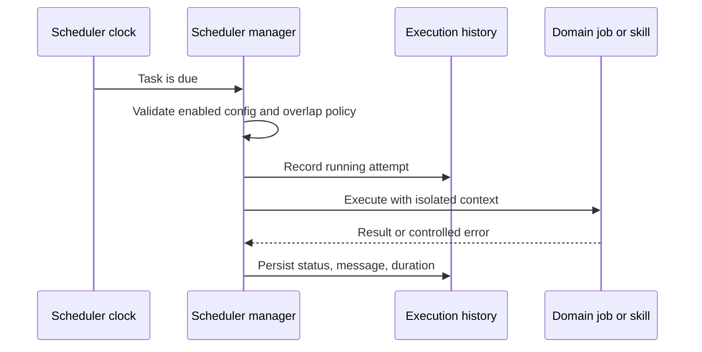

# Automatización y programación

## Responsabilidad

El planificador ejecuta tareas recurrentes y de una sola toma configuradas, registra el historial, expone el estado operativo y coordina trabajos de dominio como sincronización, publicación, ingestión, mantenimiento y actualización de planificación.

## Modelo de tareas

Una definición de tarea tiene identidad estable, estado, programación, operación, configuración y política de ejecución habilitados. Los registros de historial de tareas comienzan, completan, estado, mensaje y duración. Las definiciones y configuraciones de conexión se alinean antes de la ejecución, por lo que un trabajo no puede usar accidentalmente una integración eliminada o diferente.

## Flujo de ejecución

Las funciones de tareas deben ser idempotentes cuando sea posible la repetición. El administrador protege las instancias superpuestas de acuerdo a la política de tareas y utiliza nuevos contextos de base de datos o proveedores.

## Automatización de bóvedas

Las reglas de automatización de saltos combinan disparadores, condiciones y acciones. Las fórmulas de campo derivadas y las rollups son una evaluación determinista, no una ejecución arbitraria de código. Las acciones externas o destructivas utilizan los mismos límites de autorización y confirmación como acciones interactivas.

## Trabajo de calidad autónomo

Los bucles de mantenimiento y calidad son tareas operativas limitadas. Pueden diagnosticar, generar informes o aplicar cambios dentro de su ámbito declarado. No obtienen un sistema de archivos más amplio, secreto, Git o autoridad editorial porque están programados.

## Invariantes

- Las tareas deshabilitadas o inválidas no se ejecutan.
- Una tarea tiene un resultado histórico duradero.
- Los reintentos no duplican los efectos externos sin una estrategia de idempotencia.
- La eliminación o reasignación de conexiones actualiza los horarios dependientes.
- La programación utiliza semántica explícita de zona horaria.
- Las excepciones de trabajo están aisladas del bucle de programadores.
- La labor de fondo no reutiliza las sesiones de base de datos con alcance de solicitud.

## Enfoque de verificación

Prueba la resiliencia de configuración, alineación de conexiones, planificación de horarios, historial de tareas, prevención de solapamientos, zonas horarias, reintento/idempotencia y el explorador de automatización de Playwright. Una integración programada representativa debe terminar de una vez por todas contra una cuenta de prueba o de un dispositivo seguro.
