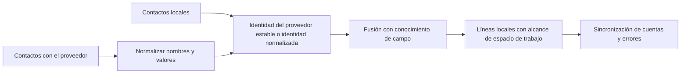

# Contactos

## Responsabilidad

Contactos proporciona una libreta de direcciones normalizada local sobre registros manuales y conexiones de Google, CardDAV, y fuentes compatibles. Proporciona búsqueda y destinatario / attendee autocompletado a Correo y Calendario.

## Modelo de datos

Un contacto tiene identidad local estable, espacio de trabajo, tipo, nombre de pantalla, correo electrónico y teléfono primario, campos de organización, notas, correos electrónicos estructurados de valor múltiple, teléfonos y direcciones, identificadores del proveedor, fuente, foto, etiquetas, marcas de tiempo y estado de sincronización.

Las cargas útiles específicas del proveedor se normalizan antes de fusionarse. El procesamiento de vCard despliega líneas de continuación, decodifica valores y escapa de separadores sin cambiar los datos del usuario.

## Sincronización y fusión

La regla de fusión crítica es la preservación del enriquecimiento local. Una sincronización remota puede actualizar los valores de propiedad del proveedor, pero no debe en blanco etiquetas, notas, valores añadidos manualmente, u otra identidad del proveedor simplemente porque la carga útil actual los omite. La política de eliminación es específica del proveedor y no se infiere de una lista parcial.

## Uso de dominio cruzado

El calendario busca contactos para los asistentes. Estos consumidores reciben datos de visualización normalizados y no acceden a credenciales del proveedor ni a cargas útiles de sincronización crudas.

## Invariantes

- Cada consulta y mutación es de espacio de trabajo.
- Los identificadores remotos son espaciados por el proveedor/fuente.
- Las sincronizaciones repetidas no crean duplicados para el mismo registro del proveedor.
- El enriquecimiento local sobrevive a la actualización del proveedor.
- Los campos multivalor preservan etiquetas de tipo y valores preferidos.
- La eliminación de contacto y la eliminación remota son efectos separados a menos que una explícita
se selecciona la política bidireccional.

## Enfoque de verificación

Ejecute fusión, vCard desplegar/escape, normalización del proveedor, correo electrónico insensible a casos y pruebas de espacio de trabajo. Playwright verifica lista, detalle, crear/editar, búsqueda y navegación cruzada sin depender de una cuenta real del proveedor.
