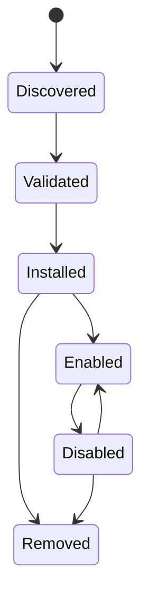

# Integraciones y complementos

## Responsabilidad

Las integraciones conectan cuentas de usuario y sistemas externos. Los complementos extienden Gnosi con contribuciones declarativas y comportamiento ejecutable limitado. Los servidores MCP aportan herramientas de agente a través de un límite de protocolo separado.

## Persistencia en la integración

El administrador de integración almacena la configuración de la cuenta no secreta y las referencias a secretos bajo datos locales. Cada máquina reconecta las cuentas de forma independiente. Configura APIs listan el estado de conexión enmascarado, validar la configuración, probar la conectividad, elegir por defecto y desconectar proveedores sin exponer tokens brutos.

Los callbacks de Google y Microsoft OAuth crean o actualizan registros de proveedores. IMAP, SMTP, CalDAV, Drupal, Notion y adaptadores similares normalizan sus propios ajustes en el registro de integración común cuando es posible.

## Ciclo de vida del complemento

Los paquetes de complementos declaran identidad, versión, compatibilidad, permisos, contribuciones e información de integridad. La instalación valida rutas, estructura de manifiesto, firmas cuando sea necesario y efectos declarados. Habilitar reconcilia ídempotentemente configuraciones administradas, perfiles de IA, habilidades o herramientas. Desactivar suspende las contribuciones administradas mientras se preservan las sobreposiciones de propiedad del usuario.

El comportamiento del complemento ejecutable se ejecuta a través de un límite de sandbox con un entorno restringido y tiempo de espera. Los complementos no reciben el entorno host completo o acceso secreto arbitrario.

## Límite MCP

Los servidores MCP configurados son procesos independientes o puntos finales remotos. Startup descubre sus esquemas de herramientas y los normaliza en el catálogo de agentes. `Retry-After` El manejo está limitado. Un servidor fallido se registra sin descartar herramientas de servidores sanos.

## Ejemplo y acompañamiento de integraciones

El repositorio incluye un paquete de plugins, un proxy Drupal MCP, la extensión de citación LibreOffice y un ayudante de citación Word. Estos son clientes separados con contratos de backend estrechos; no comparten automáticamente el sistema de archivos backend o el acceso de credenciales.

## Invariantes

- Los secretos de integración viven fuera de Git y la bóveda sincronizada.
- Desconectar elimina o revoca la referencia de credencial local y seleccionada
por defecto de forma consistente.
- Los valores administrados por plugins y usuarios siguen siendo distinguibles.
- La extracción de archivos y las rutas de plugin no pueden escapar de su raíz de instalación.
- La compatibilidad y la validación de permisos se producen antes de la activación.
- El origen y efecto de la herramienta MCP permanece visible después de la normalización del catálogo.

## Enfoque de verificación

Ejecute pruebas de manifiesto, firma, sandbox, carrera de estado, contribución de IA, enrutamiento MCP, reintento y conector. Una prueba de integración en vivo utiliza una cuenta de prueba dedicada y no debe mutar los datos de producción de forma no intencional.
