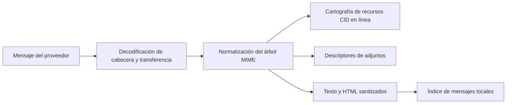

# Correo

## Responsabilidad

El correo integra cuentas IMAP/SMTP, indexación de mensajes locales, carpetas, búsqueda, etiquetas, vistas guardadas, borradores, adjuntos, respuestas, búsqueda de contactos, redacción de IA y extracción de entidades.

## Sincronización

Las integraciones de cuentas describen el protocolo y las referencias OAuth/credencial. Una sincronización completa o incremental lee mensajes del proveedor, normaliza identificadores y contenido MIME, y escribe filas de índices locales. Los trabajadores de IMAP IDLE mantienen una conexión por cuenta elegible y activan actualización incremental cuando el servidor anuncia cambios.

La ingestión de lotes utiliza savepoints para que un mensaje mal formado no pueda revolver mensajes anteriores. La identidad de mensaje e hilo debe permanecer estable en las sincronizaciones repetidas. Los nombres de carpetas son valores de proveedores; la interfaz de usuario traduce carpetas semánticas conocidas sin cambiar los valores de comparación persistentes.

## MIME y seguridad de contenidos

HTML se desinfecta antes de renderizar. Las imágenes CID en línea se resuelven contra la parte MIME correcta y se conservan cuando el contenido citado se incluye en las respuestas. Las imágenes remotas y los adjuntos siguen siendo recursos explícitos en lugar de acceso HTML arbitrario a rutas locales.

## Preparar y enviar

El editor de bloques crea una representación de borrador que se convierte en HTML y texto seguro para correo. Identidad del remitente, destinatarios, encabezados de respuesta, citas, adjuntos y cuenta del proveedor se validan lado del servidor. El borrador de guardar y enviar son efectos diferentes; el envío cruza un límite externo y devuelve diagnósticos del proveedor en caso de fallo.

## Estado local de las relaciones

La base de datos de correo almacena mensajes, etiquetas, asociaciones de etiquetas de mensajes y vistas guardadas. Las vistas guardadas contienen campos visibles, filtros tecleados, lógica, agrupación, clasificación y acciones disponibles como JSON dentro de filas SQLite.

## Invariantes

- Sync es idempotente para un identificador de mensaje del proveedor.
- Un mensaje fallido utiliza un punto de ahorro y no aborta el lote de la cuenta.
- Etiquetas y vistas guardadas son estado de aplicación local, no etiquetas del proveedor a menos que
existe una asignación explícita.
- Responder encabezados preservar la identidad de hilo.
- Las referencias CID apuntan a la parte en línea correcta después de citar o reenviar.
- Eliminar o mover un mensaje del proveedor requiere la cuenta autenticada y
un objetivo validado de carpeta/mensaje.
- Los valores secretos nunca ingresan filas de mensajes o respuestas de configuración de frontend.

## Enfoque de verificación

Prueba la decodificación MIME, sanitización HTML, renderización y respuestas CID, puntos de ahorro de ingestión, etiquetas, filtros de vista, borradores, resolución de identidad, y un proveedor real o con tablillas de enviar.
