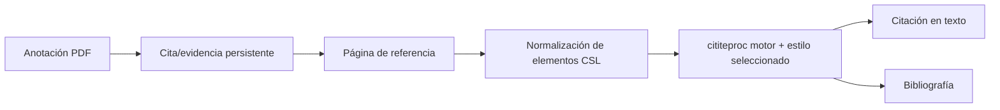

# Lector, referencias y citas

## Responsabilidad

Este dominio combina la lectura de feed/newsletter con un gestor de referencia compatible con Zotero, renderizado de citas CSL, identificador e importación web, lectura PDF/EPUB y anotaciones que pueden convertirse en evidencia citable.

## Ingestión de referencia

Las referencias ingresan a través de DOI, ISBN, arXiv, PMID, BibTeX, RIS, archivos o URLs web. Los solucionadores de identificadores y el servidor de traducción Zotero producen metadatos específicos del proveedor. Normalizadores lo asignan al esquema de referencia configurado, generan una clave de cita estable, deduplican candidatos y escriben un registro de Vault.

Translation-server es un sidecar opcional. La operación nativa puede ejecutarse sin ella; los solucionadores específicos de identificador y las referencias existentes continúan funcionando. Los fallos de traducción web devuelven errores procesables en lugar de un registro vacío exitoso.

## Ruta de citación

Los valores CSL se derivan de la materia frontal de referencia utilizando asignaciones de campo explícitas. Listas de nombres, fechas, tipos de elementos, BibTeX/LaTeX escapados y Zotero `extra` Los metadatos requieren normalización. El esquema fijado protege los tipos y campos de elementos compatibles de la deriva de aguas arriba.

## Lector y anotaciones

El lector Zotero incluido muestra contenido PDF y EPUB. Gnosi posee el puente que localiza archivos, sirve rangos de bytes seguros, recibe anotaciones y enlaza la evidencia seleccionada de nuevo a registros de Vault. Las filas de anotación incluyen URI de origen, página, tipo, geometría, texto, comentario, etiquetas, clave administrada estable y marcas de tiempo.

Los puntos finales de archivo validan la contención y manejan la hidratación de la nube. Los identificadores de anotación persistentes impiden que una cotización generada se duplique cada vez que se reabre un documento.

## Fuentes y boletines informativos

Los modelos de lectores almacenan fuentes, artículos, leen state, extraen contenido completo y una cuenta de boletín. La ingestión de alimento utiliza los puntos de ahorro de transacción para que una entrada mal formada no pueda rehacer todo el lote. Los extractos y la extracción de texto completo son separados; la truncación al ingerir no debe descartar permanentemente el contenido de fuente recuperable.

## Invariantes

- Las claves de citación permanecen estables a menos que el usuario cambie explícitamente los datos de identidad.
- La importación se deduplica mediante identificadores autorizados y metadatos normalizados.
- Las rutas de archivos del lector no pueden escapar de las raíces permitidas.
- La identidad de documento y la geometría de página de una anotación sobreviven reinicia.
- Los internos de los lectores vendidos se consideran código ascendente; integración local
las modificaciones son explícitas y reproducibles.
- Las contraseñas de la configuración de boletín de noticias legado se tratan como secretos incluso
cuando un modelo viejo aún expone un campo de compatibilidad.

## Enfoque de verificación

Ejecute la clave de cita, PubMed, tipo de artículo, estilo CSL, escape BibTeX, E/S de referencia, anotación, contención de ruta, deduplicación de importación y pruebas de puntos de ahorro de alimentación. La validación del navegador debe abrir un documento de fijación real y ejercer una cita o anotación ida y vuelta.
