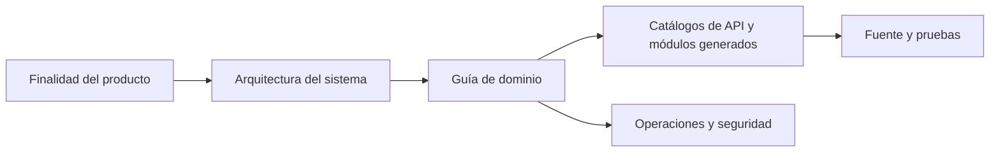

# Documentación de ingeniería de Gnosi

Este portal explica Gnosi desde la intención del producto hasta la implementación a nivel de fuente. Está escrito para ingenieros que necesitan operar, revisar, ampliar o auditar el sistema sin depender de la historia oral.

## Qué es Gnosi

Gnosi es un espacio de trabajo de conocimiento local-first y autoalojable. Los
archivos Markdown de un vault controlado por el usuario son la fuente de verdad
duradera para las notas y el conocimiento estructurado. Un frontend React y un
backend FastAPI añaden edición, vistas de base de datos, navegación por el grafo,
referencias y lectura, comunicaciones, automatización, trabajo asistido por IA,
integraciones y controles multiusuario opcionales.

El sistema soporta tres superficies de entrega:

- Desarrollo y operación nativos: uvicorn en el puerto `5002` y Vite en el `5173`.
- Autoalojamiento con Docker: backend, frontend y servidor de traducción de Zotero.
- Paquetes de escritorio Electron: el frontend más un backend local gestionado.

## Cómo leer este portal

Empiece por el [objetivo y alcance](product/purpose-and-scope.md) y lea después
el [contexto del sistema](architecture/system-context.md). Seleccione la guía del
dominio correspondiente a la capacidad que va a modificar. Los catálogos
generados permiten navegar exhaustivamente por rutas, módulos, variables de
entorno, pruebas y habilidades.

## Modelo de evidencias

La documentación utiliza esta precedencia cuando las fuentes no están de acuerdo:

1. Código fuente ejecutable y esquemas de ejecución.
2. Pruebas que demuestran comportamiento observable.
3. Definiciones de despliegue y configuración actuales.
4. Directivas de ingeniería activa.
5. Historia de Git para la motivación y la cronología.

Las páginas revisadas explican las responsabilidades y decisiones. Las páginas generadas describen lo que está presente estáticamente. Tampoco sustituyen la ejecución de las pruebas pertinentes y los flujos de tiempo de ejecución.

## Índice de la implementación actual

- [Inventario de repositorios](generated/repository-inventory.md)
- [Operaciones FastAPI](generated/api-catalog.md)
- [Módulos del backend](generated/backend-modules.md)
- [Rutas y componentes del frontend](generated/frontend-catalog.md)
- [Tablas y columnas relacionales](generated/data-model.md)
- [Nombres de configuración y consumidores](generated/configuration.md)
- [Archivos de prueba](generated/tests.md)
- [Habilidades de ejecución](generated/skills.md)
- [Cobertura de dominios](generated/coverage.md)

## Regla de cambio

Un cambio es incompleto cuando altera un contrato visible externamente, límite arquitectónico, invariante, clave de configuración, procedimiento operativo o modo de fallo sin actualizar la guía revisada pertinente y regenerar los catálogos de referencia.
