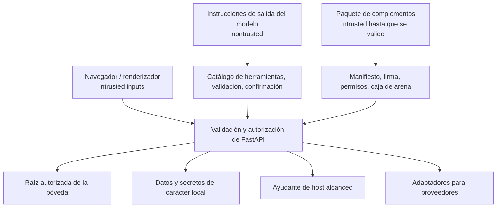

# Modelo de confianza

## Activos protegidos

- Páginas de salto, adjuntos, metadatos internos, historias y basura.
- Identidades de usuario, membresías, roles, becas de almacén, hashes PAT y acciones.
- OAuth actualizar tokens, credenciales de correo, teclas de IA, claves de firma y plugin
secretos.
- Bases de datos locales, índices, puntos de control de agentes, registros y acciones programadas.
- El sistema de archivos host y las aplicaciones de escritorio accesibles a través de API de ayuda.
- Cuentas externas capaces de enviar, publicar, suprimir o modificar
datos remotos.

## Límites de confianza

La entrada del navegador, la salida de modelos, los archivos importados, HTML remoto, las respuestas del proveedor, los paquetes de complementos y las descripciones MCP no son confiables. Un usuario no hace que las rutas, HTML, argumentos de herramientas o identificadores de espacio de trabajo sean seguros.

## Autenticación y autorización

Las sesiones de JWT utilizan una cookie HttpOnly; los mecanismos al portador admiten clientes API. La seguridad secreta de la firma se comprueba al iniciar las implementaciones expuestas. Las contraseñas se han hundido; el texto plano de PAT nunca se ha mantenido.

La autorización combina identidad efectiva, membresía de espacio de trabajo, rol ordenado, subvención de bóveda y operación. Las dependencias de ruta imponen amplios requisitos; los servicios repiten la contención y la verificación de propiedad donde el propio recurso determina el alcance.

## Contención del sistema de archivos

Las rutas se resuelven antes de la comparación y se comprueban con las raíces permitidas. Las operaciones de carga, importación, exportación, solicitud de lector, acceso a archivos de herramientas generadas, apertura nativa, búsqueda y basura utilizan límites dedicados. `..`, URL de archivos, asignaciones de ruta de nube y codificación por ciento no deben escapar de la raíz autorizada.

Se prefiere la eliminación recuperable. La purga permanente y la eliminación física de bóveda son operaciones explícitas separadas.

## Seguridad de las redes

Ingestión de URL y recuperación de contexto externo utilice un protector SSRF. Hosts resueltos, redireccionamientos, esquemas y tamaños de respuesta están limitados; los objetivos privados o locales de enlace son rechazados a menos que una integración de confianza específica sea la propietaria del endpoint.

Los clientes proveedores utilizan tiempos de espera y reintentos limitados. Las respuestas de error mostradas al navegador excluyen credenciales y rutas internas detalladas.

## AI y seguridad de las herramientas

La salida de modelo es datos hasta que se acepte una invocación de herramienta validada. Se catalogan el origen de la herramienta, el esquema, el efecto, la compatibilidad con las habilidades y la política de confirmación. Las herramientas generadas pasan la validación de fuentes y no pueden acceder a valores de entorno, importaciones arbitrarias, escrituras de sistemas de archivos sin restricciones o introspección peligrosa.

Un registro de confirmación une argumentos exactos y expira. El sistema no reutiliza una confirmación después de la mutación, desajuste de usuario/sesión o tiempo de espera.

## Ciclo de vida secreto

Los secretos se almacenan en la tienda de credenciales del sistema operativo o en el directorio de secretos de datos locales. Las variables de entorno son compatibles con la migración de arranques y legados de implementación.

Los secretos no deben vivir en Git, el almacén Markdown, la documentación generada, capturas de pantalla, registros, accesorios o paquetes de complementos compartidos.

## Controles de amenazas primarias

| Amenaza | Controles primarios |
| --- | --- |
| Acceso a los datos entre espacios de trabajo | Dependencia de Auth, búsqueda de membresía, contexto de bóveda, chequeo de propiedad de servicio. |
| Escapar de la senda transversal o simbionte | Resolución canónica, raíces permitidas, mapas de proveedores, pruebas de contención. |
| XSS del correo/web/contenido importado | Desinfectante HTML, escape de reacción, recursos limitados del lector. |
| SSRF | Esquema/host/IP validación, redirección de comprobaciones, tamaño/límites de tiempo. |
| Información acreditativa | Almacenamiento secreto local, enmascaramiento, errores genéricos, disciplina de registro. |
| El agente realiza acciones no deseadas | Herramienta de lista de permisos, clasificación de efectos, validación de argumentos, confirmaciones. |
| Complemento malicioso | Comprobaciones de manifiesto/firma, permisos, root de instalación visorizado, sandbox, timeout. |
| Sobrescribir rancio | Etags, revisiones de esquemas, escrituras atómicas, respuestas de conflicto. |
| Corrupción SQLite | Almacenamiento local; no hay sincronización en la nube. |

## Verificación de la seguridad

Los cambios sensibles a la seguridad ejecutan pruebas de autenticación central, espacio de trabajo, PAT, share, contención de rutas, XSS, SSRF, herramienta generada, caja de arena de plugin y concurrencia. El navegador QA utiliza tanto una sesión autenticada como un contexto anónimo limpio cuando cambian las superficies públicas.
