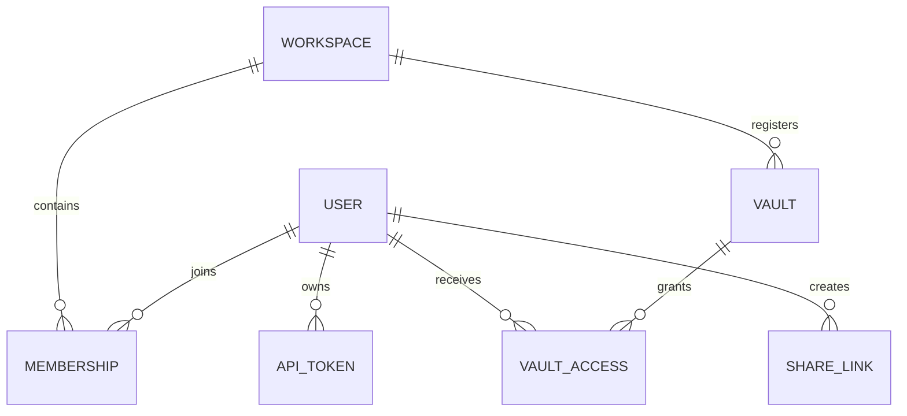

# Données et stockage

## Carte de propriété

| Données | Propriétaire durable | Règle de reconstruction ou de récupération |
| --- | --- | --- |
| Contenu de la page et première page | Démarqueur de coffre | Sauvegarde et version en fichiers ordinaires. |
| Pièces jointes et fichiers de bibliothèque | Volet actif | Préserver les références relatives ou portatives. |
| Métadonnées de la page interne | Vault `.gnosi` sidecars | Migration avec la page; cacher les champs de l'implémentation uniquement du contenu écrit. |
| Index de pages et de wikilink | Casques de données locaux | Reconstruire à partir de la voûte; les scans partiels ne doivent pas écraser les caches complètes. |
| Utilisateurs, espaces de travail, membres, accès au coffre, PAT, actions | Gestion SQLite | Sauvegarde en tant qu'état d'application local; jamais cloud-sync la base de données en direct. |
| Index de courrier, de lecteur, de notification, d'annotation et d'exécution | SQLite local | dépendant du domaine; récupérer auprès des fournisseurs ou des données de source si possible. |
| Jetons d'Auth et secrets d'intégration | Secrets de données locales ou magasin de titres de service | Reconnectez-vous par machine si vous perdez; ne copiez jamais dans un coffre-fort partagé. |
| Contrôles des agents | Données locales | Mémoire d'exécution par instance, pas contenu de coffre. |

## Format de la valise

Une page est un fichier Markdown avec la matière avant YAML. Les identifiants de page stables permettent aux liens et aux relations de survivre aux changements de titre. Les liens visibles humains utilisent la syntaxe wikilink; les pièces jointes et les propriétés évaluées par fichier utilisent des chemins portables ou des métadonnées structurées plutôt que des chemins absolus propres à la machine.

Les vues de type base de données sont des projections sur les pages et les registres. Elles ne remplacent pas Markdown par un magasin relationnel opaque. Les définitions de la vue, les métadonnées du schéma, les formules, les rollups, les relations et l'état de présentation sont résolus par la couche de service du coffre-fort.

## Rédiger une lettre d'agrément

Page lit exposer un ETag dérivé de la représentation actuelle. Les clients qui changent retournent le ETag attendu; les erreurs rejettent les écrits stale au lieu de surécrire silencieusement un changement concurrent. Les aides à l'écriture atomique ne remplacent les fichiers qu'après la nouvelle représentation est terminée.

Les opérations de renommer dépendent de l'index wikilink pour réécrire les liens entrants. Un renommage croise donc l'identité de la page, le nom du fichier, les métadonnées du registre, les sidecars et les index de liens et doit être traité comme une opération coordonnée.

## Base de données sur la gestion

Les modèles SQLAlchemy représentent :

Le moteur est initialisé parcimonieusement et protégé contre le premier accès simultané. `Base.metadata.create_all` crée des tables manquantes. Il n'y a pas de cadre général de migration : un petit passe de démarrage idempotent ajoute des colonnes explicitement enregistrées et applique des remplaçages à portée étroite.

Seuls les hachés PAT et un préfixe reconnaissable sont maintenus. Les jetons d'action publique sont des identifiants opaques dont les rangées conservent l'état de créateur, de voûte, de permission, d'expiration et de révocation.

## Isolation des données locales

`GNOSI_LOCAL_DATA` pointe vers la racine par instance. Le résolveur de chemin crée le cache, le système, le point de contrôle, le journal, l'audio, la sortie, la sauvegarde et les répertoires secrets. `/app/data`; les utilisations de la durée d'exécution native `monorepo/apps/gnosi/local_data`.

Les fichiers SQLite ne doivent pas être placés sur OneDrive, iCloud Drive, Dropbox ou sur un autre calque de synchronisation de fichiers. La synchronisation de fichiers ne fournit pas de sémantique de verrouillage SQLite et peut corrompre ou forquer la base de données.

## Volets à voile nuageux

Les adaptateurs de fournisseurs de fichiers séparent le comportement ordinaire du système de fichiers de l'hydratation et de la disponibilité. Lisez les erreurs transitoires par fichier et continuez quand une réponse partielle est significative. Un scan partiel est marqué et ne doit jamais être enregistré comme un cache complet. L'hydratation Native OneDrive utilise un aide-session GUI parce qu'un processus LaunchAgent peut recevoir un `EDEADLK` pour le contenu en ligne seulement.

## Propriété de la configuration

La configuration est fusionnée à partir des paramètres de base et de l'utilisateur ou de la valle active applicable `.gnosi/params.yaml`Les valeurs d'environnement surpassent les chemins de déploiement et un petit ensemble de comportements de bootstrap. Les lettres de créance sont des références dans le stockage secret local, et non pas des valeurs brutes intégrées dans la configuration du coffre.
