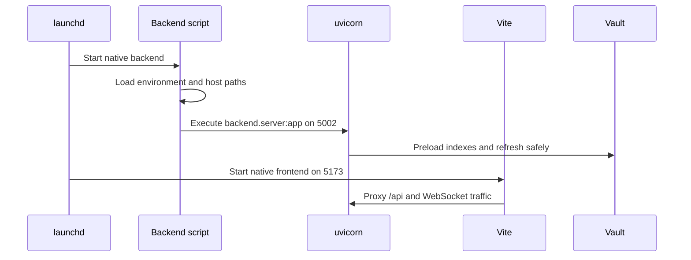

# Durée et déploiement

## Durée d'exécution autochtone

L'opération native est l'architecture de développement par défaut. LaunchAgents gère deux scripts de dépôt :

| Processus | Bornière de commande | Adresse | Recharger le comportement |
| --- | --- | --- | --- |
| Infrastructure | `.venv/bin/uvicorn backend.server:app` | `127.0.0.1:5002` | Montres `backend/`; les changements de dépendances nécessitent un redémarrage. |
| Frontière | `npm run dev` | HTTPS `:5173` | Vite recharge la source chaude. |

`run_native_dev.sh` charge l'entrée d'environnement partagé sans l'approvisionner en code shell, établit des chemins de voûte natif et de données locales, sélectionne les défauts host-safe et démarre uvicorne. `run_native_frontend.sh` sélectionne la cible proxy et les surfaces lorsque la caisse servie est un ancêtre déjà fusionné de `origin/main`.

L'environnement virtuel de dépôt fait autorité. Intel macOS utilise des caps validés pour sa pile machine-learning; les modifications de paquet doivent commencer par inspecter l'environnement réel plutôt que d'assumer l'ensemble de dépendance Apple Silicon.

## Auto-hébergement des dockers

Docker Compose fournit le backend, le frontend et le serveur de traduction Zotero. Le backend voit le coffre actif à `/vault`, le parent multi-vault à `/vaults`, et l'état local seulement dans le `gnosi_local_data` les chemins d'accueil sont passés explicitement pour traduire les actions de fichiers à travers la limite du conteneur.

L'image de l'arrière-plan utilise l'uvicorn sur `5002`; la façade est exposée sur `5173` et des proxys au service backend. `1969`. Docker exige un secret de signature non par défaut JWT parce qu'il est considéré comme un déploiement exposé.

Le conteneur backend installe la version épinglée de PyTorch pour CPU avant les dépendances Python générales. L'inférence Docker utilise le CPU ; les compilations Linux ARM64 ne téléchargent donc pas de bibliothèques CUDA inutiles et n'épuisent pas le disque du runner.

Docker est une cible de déploiement supportée, pas un repli pour cette machine de développement. Code doit sélectionner les défauts spécifiques Docker par détection de temps d'exécution et conserver le comportement natif.

## Emballages électroniques

Electron possède le cycle de vie de l'application emballé. Il démarre le backend Python groupé, expose une surface étroite de la CIB par précharge, ouvre le render et gère l'état de mise à jour manuelle. Le render s'abonne aux mises à jour et peut interroger l'état le plus récent pour éviter les événements manquants émis avant les montages de React.

Le processus de bureau installe un menu d'application natif explicite au lieu du menu de développement par défaut d'Electron. Réagissez comme la source de vérité pour les étiquettes traduites : une fois la langue d'interface configurée résolue, le render envoie un ensemble d'étiquettes validées par précharge et répète cette poignée de main lorsque la langue change.

Les fenêtres principales de Gnosi sont suivies de manière indépendante. Fichier → Nouvelle fenêtre crée un autre render contre le même backend groupé, la fermeture d'une fenêtre ne supprime que cette fenêtre, et l'activation de macOS Dock recrée une fenêtre principale après la fermeture de la dernière.

Construire et libérer des emplois produisent des installateurs de plateformes plus les métadonnées de mise à jour requises par `electron-updater`. Les brouillons de libération restent inpublicés jusqu'à ce qu'un responsable inspecte tous les objets de plateforme.

## Services auxiliaires d'accueil

- Aide-hôte ouvert : ouverture de fichiers, recherche appuyée sur Spotlight, sélectionneurs natifs, et
déplacer les fichiers vers la corbeille sans accorder l'accès sans restriction à l'hôte du conteneur.
- Chauffage OneDrive : récupération et hydratation des placeholders en ligne uniquement.
- Native watchdog: détecte les processus natifs échoués et redémarre dans son
portée documentée.

## Invariants de port et de procédé

- Exactement un backend possède le port `5002`.
- Exactement une frontend possède le port `5173`; en silence, se déplacer vers `5174` est un QA
- C'est un échec.
- Les instances Native et Docker ne doivent pas fonctionner simultanément sur les mêmes ports.
- Le rechargement de source de l'arrière-pays n'installe pas les dépendances Python modifiées.
- Frontend hot recharge ne remplace pas une version de compilation injectée par démarrage.
- Les arbres temporaires doivent avoir accès aux certificats de développement existants pour
valide HTTPS navigateur QA.

## Portes sanitaires

`/api/health` prouve le mode processus et rapports de l'arrière-plan, la politique d'authentification efficace et la configuration du coffre-fort. `/api/config` et `/api/vault/pages`; la santé des procédés ne peut à elle seule prouver la lisibilité du stockage.
