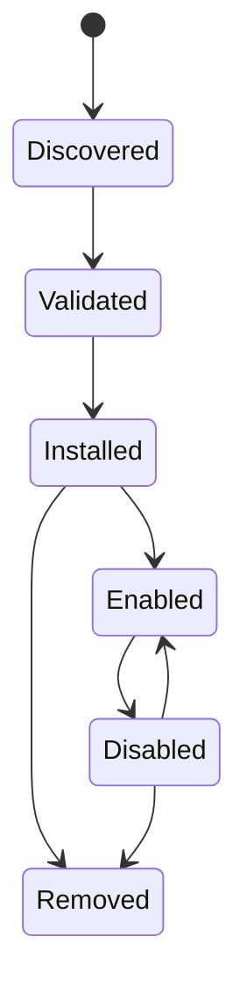

# Intégrations et plugins

## Responsabilité

Intégrations connectent les comptes utilisateurs et les systèmes externes. Les plugins étendent Gnosi avec des contributions déclaratives et un comportement exécutable limité. Les serveurs MCP contribuent aux outils d'agents à travers une limite de protocole distincte.

## Persistance de l'intégration

Le gestionnaire d'intégration stocke la configuration non secrète des comptes et les références aux secrets sous les données locales. Chaque machine reconnexe les comptes de façon indépendante. Les API de configuration listent l'état de connexion masqué, valident la configuration, testent la connectivité, choisissent les défauts et déconnectent les fournisseurs sans exposer les jetons bruts.

Les callbacks Google et Microsoft OAuth créent ou mettent à jour des enregistrements de fournisseurs. IMAP, SMTP, CalDAV, Drupal, Notion et adaptateurs similaires normalisent leurs propres paramètres dans le registre d'intégration commun si possible.

## Cycle de vie du greffon

Les paquets de plugins déclarent l'identité, la version, la compatibilité, les permissions, les contributions et l'intégrité des informations. L'installation valide les chemins, la structure des manifestes, les signatures, le cas échéant, et les effets déclarés.

Le comportement des plugins exécutables passe par une limite de sandbox avec un environnement et un temps de fermeture limités. Les plugins ne reçoivent pas l'environnement hôte complet ou un accès secret arbitraire.

La mise en réseau directe reste désactivée dans les deux exécutions de plugin. `network` la capacité expose seulement le RPC hôte, qui rejette les destinations privées et les méthodes de limites, les redirections, le temps et la taille de la réponse. `connect-src 'none'`; le parent appelle la même limite de l'arrière-plan après avoir vérifié les autorisations déclarées et accordées par le plugin.

## Distribution sur le marché

L'index officiel du plugin et sa signature détachée sont publiés sous la forme d'actifs GitHub Release. L'installation du catalogue à distance nécessite un index signé de confiance et chaque paquet sélectionné nécessite à la fois l'intégrité SHA-256 et une signature détachée Ed25519 de confiance. La provenance installée enregistre l'URL source, la somme des vérifications et l'éditeur vérifié.

Les plugins installés peuvent être exportés comme ZIP déterministes. La soumission publique est une opération d'administrateur envoyée à un courtier de modération explicitement configuré; Gnosi ne intègre jamais un jeton d'écriture GitHub. Le courtier met en quarantaine le paquet et le publie seulement après CI et la revue humaine.

## Délimitation du PCM

Les serveurs MCP configured sont des processus indépendants ou des endpoints distants. Startup découvre leurs schémas d'outils et les normalise dans le catalogue des agents. `Retry-After` un serveur échoué est enregistré sans rejeter les outils de serveurs sains.

## Exemples et intégrations complémentaires

Le dépôt comprend des exemples de packaging de plugins, un proxy MCP Drupal, l'extension de citation LibreOffice et un assistant de citation Word. Ce sont des clients séparés avec des contrats de backend étroits; ils ne partagent pas automatiquement le système de fichiers backend ou l'accès aux titres.

## Invariants

- Les secrets d'intégration vivent à l'extérieur de Git et de la chambre forte synchronisée.
- Déconnecter supprime ou révoque la référence locale de la certification et sélectionnée
par défaut, de façon cohérente.
- Les valeurs gérées par les plugins et les utilisateurs restent distinctives.
- Les chemins d'extraction et de plugin d'archives ne peuvent pas échapper à leur racine d'installation.
- La compatibilité et la validation des autorisations se produisent avant l'activation.
- Les index officiels et les paquets distants échouent lorsque les métadonnées d'intégrité sont manquantes.
- Les prises de plugin directes et les connexions du navigateur ne contournent jamais le RPC hôte.
- L'origine et l'effet de l'outil MCP restent visibles après la normalisation du catalogue.

## Aspects de vérification

Exécutez des tests de manifeste, signature, sandbox, course d'état, contribution AI, routage MCP, réessayez et connectez. Un test d'intégration en direct utilise un compte de test dédié et ne doit pas mutation des données de production involontairement.
