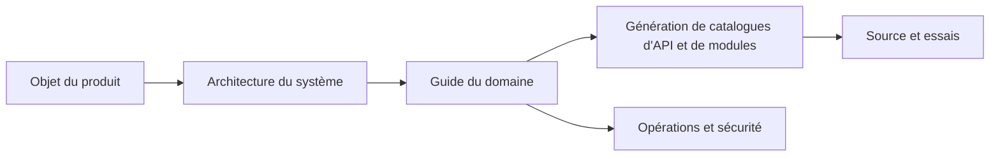

# Documentation technique Gnosi

Ce portail explique Gnosi de l'intention du produit à la mise en oeuvre au niveau de la source. Il est écrit pour les ingénieurs qui doivent exploiter, examiner, étendre ou vérifier le système sans dépendre de l'historique oral.

## Qu'est-ce que Gnosi

Gnosi est un espace de travail local et autonome. Les fichiers de marquage dans un coffre-fort contrôlé par l'utilisateur sont la source durable de vérité pour les notes et les connaissances structurées. Un frontend React et le backend FastAPI ajoutent l'édition, les vues de type base de données, la navigation graphique, les références et la lecture, les communications, l'automatisation, le travail assisté par l'IA, les intégrations et les commandes multiutilisateurs optionnelles.

Le système supporte trois surfaces de livraison:

- Développement et exploitation des autochtones : uvivirne sur le port `5002` et de la `5173`.
- Auto-hébergement de Docker : backend, frontend et serveur de traduction Zotero.
- Paquets de bureau Electron : le frontend plus un backend local géré.

## Comment lire ce portail

Commencer par [Objet et portée](product/purpose-and-scope.md), puis lire le [contexte du système](architecture/system-context.md). Sélectionnez un guide de domaine pour la capacité que vous changez. Les catalogues générés fournissent une navigation exhaustive vers les itinéraires, modules, noms d'environnement, tests et compétences.

## Modèle de preuve

La documentation utilise cette préséance lorsque les sources ne sont pas d'accord :

1. Les schémas de source et d'exécution exécutables.
2. Tests démontrant un comportement observable.
3. Définitions actuelles de déploiement et de configuration.
4. Directives actives en matière d'ingénierie.
5. Git histoire pour la motivation et la chronologie.

Les pages examinées expliquent les responsabilités et les décisions. Les pages générées décrivent ce qui est présent statiquement.

## Indice de mise en œuvre actuel

- [Inventaire des dépôts](generated/repository-inventory.md)
- [Opérations FastAPI](generated/api-catalog.md)
- [Modules de gestion de l'arrière-pays](generated/backend-modules.md)
- [Itinéraires et composants frontaliers](generated/frontend-catalog.md)
- [Tableaux et colonnes relatifs](generated/data-model.md)
- [Noms de configuration et consommateurs](generated/configuration.md)
- [Fichiers de test](generated/tests.md)
- [Compétences en cours d'exécution](generated/skills.md)
- [Couverture des domaines](generated/coverage.md)

## Règle de modification

Un changement est incomplet lorsqu'il modifie un contrat visible externe, une limite architecturale, un invariant, une clé de configuration, une procédure opérationnelle ou un mode de défaillance sans mettre à jour le guide examiné et régénérer les catalogues de référence.
