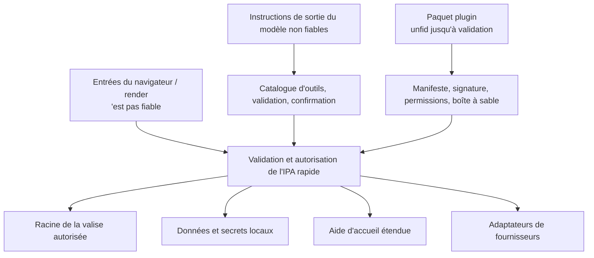

# Modèle de confiance

## Actifs protégés

- Pages de vault, pièces jointes, métadonnées internes, histoires et déchets.
- Identités d'utilisateur, adhésions, rôles, subventions de coffre, haches de PAT et actions.
- OAuth rafraîchir les jetons, les identifiants de courriel, les clés AI, les clés de signature et le plugin
secrets.
- Bases de données locales, index, points de contrôle des agents, registres et actions prévues.
- Le système de fichiers hôte et les applications de bureau accessibles par des API d'aide.
- Comptes externes capables d'envoyer, de publier, de supprimer ou de modifier
données à distance.

## Limites de la confiance

L'entrée du navigateur, la sortie du modèle, les fichiers importés, le HTML distant, les réponses du fournisseur, les paquets de plugins et les descriptions MCP ne sont pas fiables.

## Authentification et autorisation

Les sessions JWT utilisent un cookie HttpOnly; les mécanismes porteurs supportent les clients API. La sécurité secrète de la signature est vérifiée au démarrage pour les déploiements exposés. Les mots de passe sont hachés; le texte clair de PAT n'est jamais persistant.

L'autorisation combine l'identité efficace, l'appartenance à un espace de travail, le rôle ordonné, la subvention de coffre-fort et l'exploitation.

## Contention du système de fichiers

Les chemins sont résolus avant la comparaison et vérifiés à partir des racines autorisées. Les téléchargements, les importations, les exportations, les demandes de lecteurs, l'accès aux fichiers d'outils générés, les opérations d'ouverture native, de recherche et de déchets utilisent des limites dédiées. `..`Les URL de fichiers, les cartes de chemins cloud et l'encodage pour cent ne doivent pas échapper à la racine autorisée.

La suppression récupérable est préférée. La purge permanente et la suppression physique du coffre sont des opérations explicites séparées.

## Sécurité du réseau

L'ingestion d'URL et la récupération de contexte externe utilisent un garde SSRF. Les hôtes résolus, les redirections, les schémas et les tailles de réponse sont limités; les cibles privées ou locales sont rejetées à moins qu'une intégration de confiance spécifique ne possède le paramètre.

Les clients fournisseurs utilisent des délais et des replis limités. Les réponses d'erreur affichées sur le navigateur excluent les identifiants et les chemins internes détaillés.

## Sécurité des IA et des outils

La sortie du modèle est des données jusqu'à ce qu'une invocation d'outils validée soit acceptée. L'origine de l'outil, le schéma, l'effet, la compatibilité des compétences et la politique de confirmation sont catalogués.

Un enregistrement de confirmation lie des arguments exacts et expire. Le système ne réutilise pas une confirmation après mutation, inadéquation utilisateur/session ou temps de sortie.

## Cycle de vie secret

Les secrets sont stockés dans le magasin de titres de l'OS ou dans le répertoire de secrets de données locales. Les variables d'environnement sont prises en charge pour le bootstrap de déploiement et la migration héritée.

Les secrets ne doivent pas vivre dans Git, le coffre Markdown, la documentation générée, les captures d'écran, les journaux, les accessoires, ou les paquets de plugin partagés.

## Contrôles de la menace primaire

| Menace | Contrôles primaires |
| --- | --- |
| Accès aux données interespaces de travail | Dépendance, recherche d'adhésion, contexte de voûte, contrôle de la propriété de service. |
| Évasion traversée ou par liaison symbolique | Résolution canonique, racines autorisées, cartographie de fournisseur, tests de confinement. |
| XSS à partir du contenu du courrier/de la toile/importé | Dessinifiant HTML, évasion de réaction, ressources de lecteur limitées. |
| SSRF | Validation du système/de l'hôte/de l'IP, vérifications de redirection, limites de taille/temps. |
| Communication des éléments de preuve | Stockage secret local, masquage, erreurs génériques, discipline de journal. |
| L'agent effectue des actions involontaires | Liste d'outils, classification des effets, validation des arguments, confirmations. |
| plugin malveillant | Contrôles de signature/manifestation, permissions, installation de la racine, sandbox, timeout. |
| Paquet malveillant sur le marché | Index signé, somme de contrôle, signature de l'éditeur, extraction de mise en scène limitée, publication atomique. |
| Données privées filtrées à travers un modèle | Exporter liste de permission, exclusions, scan secret, prévisualisation, reconnaissance, soumission d'administrateur. |
| Écraser les grappes | ETags, révisions de schémas, écrits atomiques, réponses de conflits. |
| Corruption SQLite | Stockage local seulement; pas de synchronisation du cloud. |

## Vérification de la sécurité

Les changements sensibles à la sécurité fonctionnent auth, espace de travail, PAT, partage, confinement de chemin, XSS, SSRF, outil généré, sandbox plugin, et tests de concurrence.
