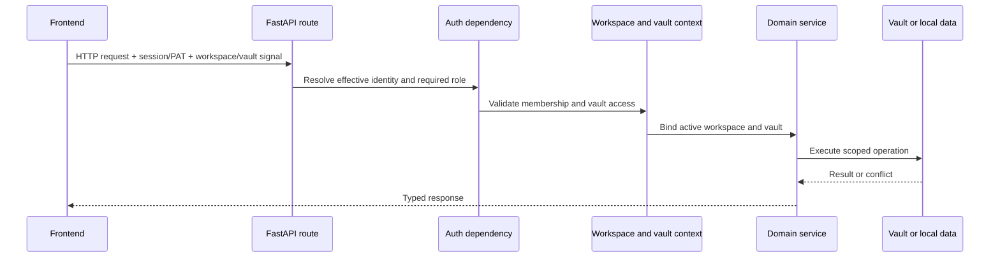

# Cross-cutting flows

## Request context and authorization

Personal mode may resolve a local effective user without a login. Organization
mode requires a valid session or accepted bearer mechanism. The backend owns
the decision; the frontend authentication gate improves UX but is not a
security boundary.

Context variables carry the active vault through nested service calls without
turning the path into a global mutable setting. Code outside a request must
provide an explicit vault or use the documented default resolution path.

## Configuration flow

1. Environment files and the OS credential store supply bootstrap values.
2. Application base YAML supplies versioned defaults.
3. Home or active-vault parameters supply persisted user configuration.
4. Environment variables override deployment-sensitive paths and policies.
5. Settings routes validate and persist supported changes.

Deleted AI providers use a tombstone so a legacy environment variable cannot
silently recreate a provider during a later config load.

## Error handling

Routes translate known domain failures into explicit status codes. A global
handler logs unexpected exceptions with an error identifier and returns a
generic response so file paths, SQL fragments, or tokens are not leaked to the
client.

Long-running optional operations report state or progress and degrade without
blocking unrelated domains. Background tasks must own their database sessions
and event-loop boundaries; request-scoped sessions cannot be reused after the
response lifecycle.

## Observability

Backend modules use standard logging. Native runtime logs are captured under
the user's Gnosi log directory by LaunchAgents. Operational notifications and
task history live in local data. Health endpoints report effective behavior,
not just raw environment values.

Logs are developer-facing and written in English. They must not contain
credentials, unredacted provider responses, or full sensitive user content.

## Internationalization

User-visible frontend strings pass through `react-i18next` and exist in all
four locale catalogs: Catalan, English, Spanish, and French. Code comments,
docstrings, developer logs, public technical documentation, and identifiers are
English unless an identifier or compatibility value is already persisted.

## External-effect policy

Agent tools and application actions classify effects such as read, write,
external communication, or destructive change. Role checks, scoped services,
confirmation records, and recoverable operations are applied according to the
effect. Client confirmation alone does not authorize the backend action.
