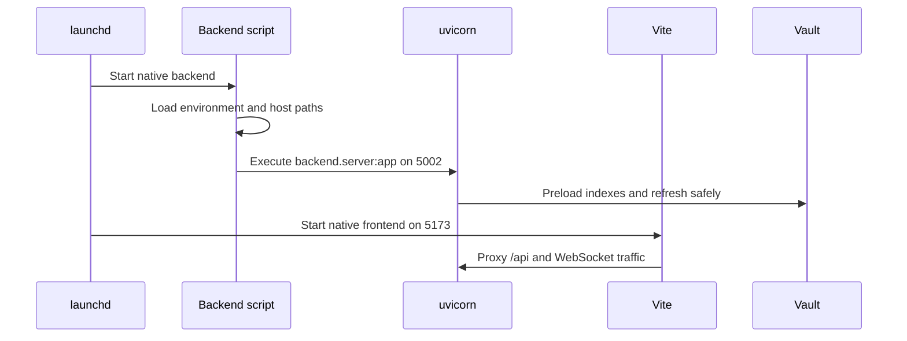

# Runtime and deployment

## Native runtime

Native operation is the default development architecture. LaunchAgents manage
two repository scripts:

| Process | Command boundary | Address | Reload behavior |
| --- | --- | --- | --- |
| Backend | `.venv/bin/uvicorn backend.server:app` | `127.0.0.1:5002` | Watches `backend/`; dependency changes need a restart. |
| Frontend | `npm run dev` | HTTPS `:5173` | Vite hot reloads source. |

`run_native_dev.sh` loads shared environment input without sourcing it as shell
code, establishes native vault and local-data paths, selects host-safe defaults,
and starts uvicorn. `run_native_frontend.sh` selects the backend proxy target and
surfaces when the served checkout is an already-merged ancestor of
`origin/main`.

The repository virtual environment is authoritative. Intel macOS uses validated
caps for its machine-learning stack; package changes must begin by inspecting
the actual environment rather than assuming the Apple Silicon dependency set.

## Docker self-hosting

Docker Compose provides backend, frontend, and the Zotero translation-server.
The backend sees the active vault at `/vault`, the multi-vault parent at
`/vaults`, and local-only state in the `gnosi_local_data` volume. Host paths are
passed explicitly for translating file actions across the container boundary.

The backend image uses uvicorn on `5002`; the frontend is exposed on `5173` and
proxies to the backend service. Translation-server remains internal on `1969`.
Docker requires a non-default JWT signing secret because it is considered an
exposed deployment.

The backend container installs the pinned CPU-only PyTorch wheel before the
general Python requirements. Docker inference is CPU-based, and this prevents
Linux ARM64 builds from downloading unused CUDA libraries and exhausting the
runner disk.

Docker is a supported deployment target, not a fallback for this development
machine. Code must select Docker-specific defaults through runtime detection
and retain native behavior.

## Electron packages

Electron owns the packaged application lifecycle. It starts the bundled Python
backend, exposes a narrow IPC surface through preload, opens the renderer, and
manages manual update state. The renderer subscribes to updates and can query
the latest state to avoid missing events emitted before React mounts.

The desktop process installs an explicit native application menu instead of
Electron's default development menu. React remains the source of truth for
translated labels: once the configured interface language is resolved, the
renderer sends a validated label set through preload and repeats that handshake
when the language changes. Native Settings commands return to the existing
Global Settings modal. Production menus exclude reload and developer tools.

Gnosi main windows are tracked independently. File → New Window creates another
renderer against the same bundled backend, closing one window removes only that
window, and macOS Dock activation recreates a main window after the last one has
closed. Renderer-bound menu commands focus an existing Gnosi window or wait for
a newly created renderer before delivery.

Build and release jobs produce platform installers plus the update metadata
required by `electron-updater`. Release drafts remain unpublished until a
maintainer inspects all platform artifacts.

## Auxiliary host services

- Host-open helper: opening files, Spotlight-backed search, native pickers, and
  moving files to Trash without granting the container unrestricted host access.
- OneDrive warmup: recovery and hydration of online-only placeholders.
- Native watchdog: detects failed native processes and restarts within its
  documented scope.

## Port and process invariants

- Exactly one backend owns port `5002`.
- Exactly one frontend owns port `5173`; silently moving to `5174` is a QA
  failure.
- Native and Docker instances must not run concurrently on the same ports.
- Backend source reload does not install changed Python dependencies.
- Frontend hot reload does not replace a startup-injected build version.
- Temporary worktrees need access to the existing development certificates for
  valid HTTPS browser QA.

## Health gates

`/api/health` proves the backend process and reports mode, effective
authentication policy, and vault configuration. Operational validation also
exercises `/api/config` and `/api/vault/pages`; process health alone cannot
prove storage readability.
