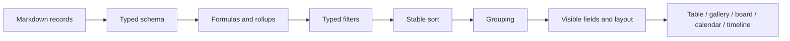

# Database views and project planning

## Structured knowledge model

A Gnosi database is a schema and view layer over pages, normally rooted in a
Vault folder. Page front matter contains record values. Registry data defines
field types, view configurations, formulas, rollups, relations, options,
display settings, and actions.

At least one main view is an invariant. Startup and read-time repair paths
restore it when legacy or interrupted writes leave a table without a valid
view.

## View pipeline

Typed values must be compared as their declared field type. Text input alone
cannot represent every filter value; date, checkbox, number, relation, select,
and multi-value fields normalize through field-aware operators.

Derived-field evaluation has an explicit order. Formulas that depend on raw
values run before rollups that aggregate relations, and dependent formulas are
resolved without allowing cycles to recurse indefinitely. Backend and frontend
representations must agree on checkbox truthiness, percentages, empty values,
and option identifiers.

## Schema evolution and concurrency

Schema revisions protect a client from saving an older field list over a newer
one. Renaming a field updates filters, sorts, formulas, actions, and saved-view
references. Renaming a table detects flat-folder filename collisions before
moving content.

Registries are written atomically and refreshed after batch metadata changes.
Cached snapshots are invalidated when source records or the schema revision
changes.

## Project planning

Planning consumes structured task fields and produces an authoritative schedule
rather than duplicating scheduling logic in the UI. The engine normalizes
dependencies, calendars, durations, constraints, resources, deadlines,
progress, and scheduling direction. It then calculates dates, slack, critical
tasks, warnings, and resource allocations.

The frontend renders the result and editing controls. It does not independently
recompute critical-path semantics. Cached schedules are keyed by relevant input
state and live in local data, not the vault source records.

## Failure behavior

- Invalid formulas return a controlled field error rather than aborting the
  table response.
- Broken relations remain visible as unresolved values when possible.
- Missing views trigger a deterministic main-view repair.
- Planning cycles, impossible constraints, or missing calendars produce
  diagnostics and partial results where safe.
- An outdated schema revision returns a conflict and requires reload/merge.

## Verification focus

Test typed filter parity, schema revision conflicts, field and table renames,
formula/rollup ordering, relation synchronization, snapshot sorting, option
catalog actions, scheduling constraints, critical paths, and dashboard E2E
rendering.
