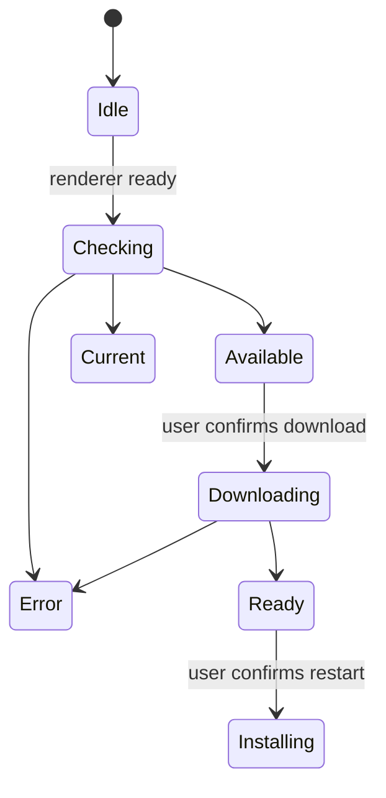

# Desktop and companion clients

## Electron desktop

Electron packages Gnosi as a desktop application. The main process owns backend
startup, process cleanup, window lifecycle, packaged-resource paths, update
checks, downloads, installation, and privileged desktop actions. The renderer
receives a narrow preload API rather than direct Node.js access.

The bundled Python backend must be ready before the renderer treats the app as
usable. Startup failures are surfaced with diagnostics and cleanup prevents
orphaned backend processes after the window exits.

## Update state machine

Checks are disabled in development. Downloads never begin merely because a
release exists. The main process stores the latest updater state so a renderer
that subscribes late can recover it through IPC.

Release artifacts include installers and updater metadata for macOS, Windows,
and Linux. Version preparation keeps frontend and Electron manifests aligned;
tags are created only from reviewed `main` commits.

The release catalog, localized notes, generated changelog, Electron manifest,
frontend manifest, and monorepo lockfile form one versioned unit. The
deterministic synchronizer updates the three version fields only after the
catalog and changelog validate.

## Application mark

`frontend/public/favicon.svg` defines the Gnosi application mark: a centered
white G with clear blue margin inside a rounded blue gradient. The Electron
icon generator produces the PNG, ICNS, and ICO variants from the same visual
proportions so the browser, macOS, Windows, and Linux clients do not present a
different or edge-to-edge glyph. Regenerate these derived resources whenever
the canonical mark changes; do not edit a packaged application bundle.

## Release preparation

`frontend/src/content/releases.json` is the canonical bundled release history.
The version synchronizer keeps the frontend manifest, Electron manifest, and
frontend workspace entry in the monorepo lockfile identical. A stable entry
prepared before publication deliberately omits `downloadUrl`; that field is
added only after the immutable tag and its platform artifacts exist.
Changelog validation normalizes line endings before comparison so an equivalent
Windows CRLF checkout does not fail the cross-platform packaging gate.

Before tagging, the release PR must pass frontend validation, backend tests,
native browser QA, and the engineering-documentation gate. After merge, the
reviewed commit must reach the public repository through the sync workflow and
pass release readiness there. The private source workflow is the sole owner of
official tags, cross-platform artifacts, signed catalogs, release notes, and
the draft in the public repository. The synchronized public desktop workflow is
manual-only so it can validate packaging without racing or duplicating an
official tag build. The resulting macOS, Windows, and Linux artifacts are
inspected before publication.

## Web clipper

The browser extension extracts the current page's title, URL, selected or
readable content, and supported metadata, then sends a bounded request to the
Gnosi API. The backend performs authentication, sanitization, deduplication,
and Vault writes. The extension does not receive arbitrary Vault filesystem
access.

## LibreOffice and Word citation clients

The LibreOffice extension registers a protocol handler and calls Gnosi's
citation endpoints from the office process. The Word helper maintains the
task-pane/add-in state required to access the same local service. Both clients
treat citation insertion and bibliography refresh as explicit document
mutations.

Office-specific APIs are isolated behind traversal and insertion helpers so
tests can fake the UNO or add-in boundary without requiring the full office
application for every unit test.

## Invariants

- Renderer code has no unrestricted Node.js or filesystem capability.
- IPC exposes named operations with validated inputs.
- Update download and installation require explicit user actions.
- Packaged resource paths differ from development paths and are resolved at
  runtime.
- Companion clients authenticate to the backend and remain within their narrow
  capture or citation scope.
- Release drafts are inspected before publication.

## Verification focus

Run Electron syntax/build checks, packaged backend smoke tests, updater state
tests, extension build validation, citation traversal tests, and platform CI.
Local macOS packaging cannot prove Windows or Linux artifacts.
