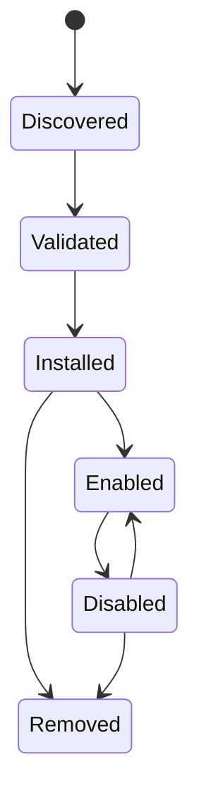

# Integrations and plugins

## Responsibility

Integrations connect user accounts and external systems. Plugins extend Gnosi
with declarative contributions and bounded executable behavior. MCP servers
contribute agent tools through a separate protocol boundary.

## Integration persistence

The integration manager stores non-secret account configuration and references
to secrets under local data. Each machine reconnects accounts independently.
Settings APIs list masked connection state, validate configuration, test
connectivity, choose defaults, and disconnect providers without exposing raw
tokens.

Google and Microsoft OAuth callbacks create or update provider records. IMAP,
SMTP, CalDAV, Drupal, Notion, and similar adapters normalize their own settings
into the common integration registry where possible.

## Plugin lifecycle

Plugin packages declare identity, version, compatibility, permissions,
contributions, and integrity information. Installation validates paths,
manifest structure, signatures where required, and declared effects. Enabling
reconciles managed settings, AI profiles, skills, or tools idempotently.
Disabling suspends managed contributions while preserving user-owned overrides.

Executable plugin behavior runs through a sandbox boundary with a constrained
environment and timeout. Plugins do not receive the complete host environment
or arbitrary secret access.

## MCP boundary

Configured MCP servers are independent processes or remote endpoints. Startup
discovers their tool schemas and normalizes them into the agent catalog. Retry
and `Retry-After` handling are bounded. One failed server is recorded without
discarding tools from healthy servers.

## Example and companion integrations

The repository includes example plugin packaging, a Drupal MCP proxy, the
LibreOffice citation extension, and a Word citation helper. These are separate
clients with narrow backend contracts; they do not share backend filesystem or
credential access automatically.

## Invariants

- Integration secrets live outside Git and the synchronized vault.
- Disconnecting removes or revokes the local credential reference and selected
  defaults consistently.
- Plugin-managed and user-managed values remain distinguishable.
- Archive extraction and plugin paths cannot escape their installation root.
- Compatibility and permission validation occurs before activation.
- MCP tool origin and effect remain visible after catalog normalization.

## Verification focus

Run plugin manifest, signing, sandbox, state-race, AI contribution, MCP routing,
retry, and connector tests. A live integration test uses a dedicated test
account and must not mutate production data unintentionally.
