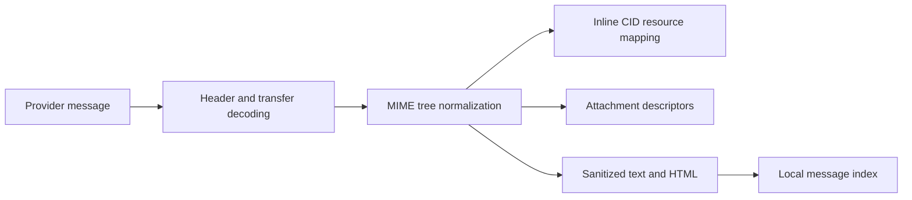

# Mail

## Responsibility

Mail integrates IMAP/SMTP accounts, local message indexing, folders, search,
tags, saved views, drafts, attachments, replies, contact lookup, AI drafting and
entity extraction. Provider credentials remain local per machine.

## Synchronization

Account integrations describe protocol and OAuth/credential references. A full
or incremental sync reads provider messages, normalizes identifiers and MIME
content, and writes local index rows. IMAP IDLE workers hold one connection per
eligible account and trigger incremental refresh when the server announces
changes.

Batch ingestion uses savepoints so a malformed message cannot roll back earlier
messages. Message and thread identity must remain stable across repeated syncs.
Folder names are provider values; the UI translates known semantic folders
without changing persisted comparison values.

## MIME and content safety

HTML is sanitized before rendering. Inline CID images are resolved against the
correct MIME part and preserved when quoted content is included in replies.
Remote images and attachments remain explicit resources rather than arbitrary
HTML access to local paths.

## Compose and send

The block editor creates a draft representation that is converted to mail-safe
HTML and text. Sender identity, recipients, reply headers, quoting, attachments,
and provider account are validated server-side. Draft save and send are
different effects; sending crosses an external boundary and returns provider
diagnostics on failure.

## Local relational state

The mail database stores messages, tags, message-tag associations, and saved
views. Saved views contain visible fields, typed filters, logic, grouping,
sorting, and available actions as JSON within SQLite rows.

## Invariants

- Sync is idempotent for a provider message identifier.
- A failed message uses a savepoint and does not abort the account batch.
- Tags and saved views are local application state, not provider labels unless
  an explicit mapping exists.
- Reply headers preserve thread identity.
- CID references point to the correct inline part after quoting or forwarding.
- Deleting or moving a provider message requires the authenticated account and
  a validated folder/message target.
- Secret values never enter message rows or frontend configuration responses.

## Verification focus

Test MIME decoding, HTML sanitization, CID rendering and replies, ingestion
savepoints, tags, view filters, drafts, identity resolution, and a real or
stubbed provider send. Playwright verifies paste, compose, and quoted reply
behavior.
