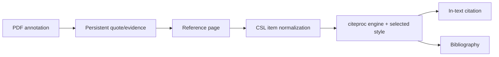

# Reader, references, and citations

## Responsibility

This domain combines feed/newsletter reading with a Zotero-compatible reference
manager, CSL citation rendering, identifier and web import, PDF/EPUB reading,
and annotations that can become citable evidence.

## Reference ingestion

References enter through DOI, ISBN, arXiv, PMID, BibTeX, RIS, files, or web URLs.
Identifier resolvers and Zotero translation-server produce provider-specific
metadata. Normalizers map it to the configured reference schema, generate a
stable citation key, deduplicate candidates, and write a Vault record.

Translation-server is an optional sidecar. Native operation may run without it;
identifier-specific resolvers and existing references continue to work. Web
translation failures return actionable errors rather than an empty successful
record.

## Citation path

CSL values are derived from reference front matter using explicit field
mappings. Name lists, dates, item types, escaped BibTeX/LaTeX, and Zotero
`extra` metadata require normalization. The pinned schema protects compatible
item types and fields from upstream drift.

## Reader and annotations

The bundled Zotero reader displays PDF and EPUB content. Gnosi owns the bridge
that locates files, serves safe byte ranges, receives annotations, and links
selected evidence back to Vault records. Annotation rows include source URI,
page, type, geometry, text, comment, tags, stable managed key, and timestamps.

File endpoints validate containment and handle cloud hydration. Persistent
annotation identifiers prevent a generated quote from duplicating every time a
document is reopened.

## Feeds and newsletters

Reader models store sources, articles, read state, extracted full content, and a
newsletter account. Feed ingestion uses transaction savepoints so one malformed
entry cannot roll back the whole batch. Excerpts and full-text extraction are
separate; truncation at ingest must not permanently discard recoverable source
content.

## Invariants

- Citation keys remain stable unless the user explicitly changes identity data.
- Import is deduplicated by authoritative identifiers and normalized metadata.
- Reader file paths cannot escape allowed roots.
- An annotation's document identity and page geometry survive restarts.
- Vendored reader internals are treated as upstream code; local integration
  modifications are explicit and reproducible.
- Passwords from legacy newsletter configuration are treated as secrets even
  when an old model still exposes a compatibility field.

## Verification focus

Run citation-key, PubMed, item-type, CSL-style, BibTeX escaping, reference I/O,
annotation, path-containment, import deduplication, and feed savepoint tests.
Browser validation must open an actual fixture document and exercise a citation
or annotation round trip.
