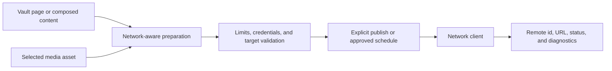

# Social publishing and media

## Responsibility

This domain prepares, schedules, publishes, and observes content across
configured social networks. The media center provides reusable visual assets
and metadata. Publishing is always an external effect.

## Network adapters

Service clients isolate Mastodon, Bluesky, Telegram, and other configured
network semantics: authentication, text limits, media upload, post identifiers,
threads, response normalization, and error reporting. Stored network entries
reference local credentials; responses never return secret values.

The API exposes configured networks, streams, publishing actions, and related
settings. UI tabs are keyed by stable network identifiers while display names
and labels use localized strings.

## Publish flow

Preparation may translate or reshape content but does not publish by itself.
Immediate publication requires an explicit user action; scheduled publication
requires a stored schedule whose execution policy authorizes the same target.

## Media handling

Uploads validate file type, size, allowed roots, and generated names. Media
views index assets without treating caches or thumbnails as originals. A
missing thumbnail can be regenerated; losing the source asset cannot.

## Invariants

- A network credential is resolved only in the backend at execution time.
- Preview/preparation and publication are distinct states.
- Text and media limits are validated per target before the external call.
- A partial multi-network failure reports each result and does not claim global
  success.
- Scheduled and interactive publication use the same adapter contract.
- Remote post identifiers and URLs are stored for audit and follow-up actions.

## Verification focus

Test media upload containment, schedule/connection alignment, network response
normalization, retry boundaries, partial multi-target failure, and a sandbox or
stubbed publish. Live publishing is never used as an incidental unit-test side
effect.
