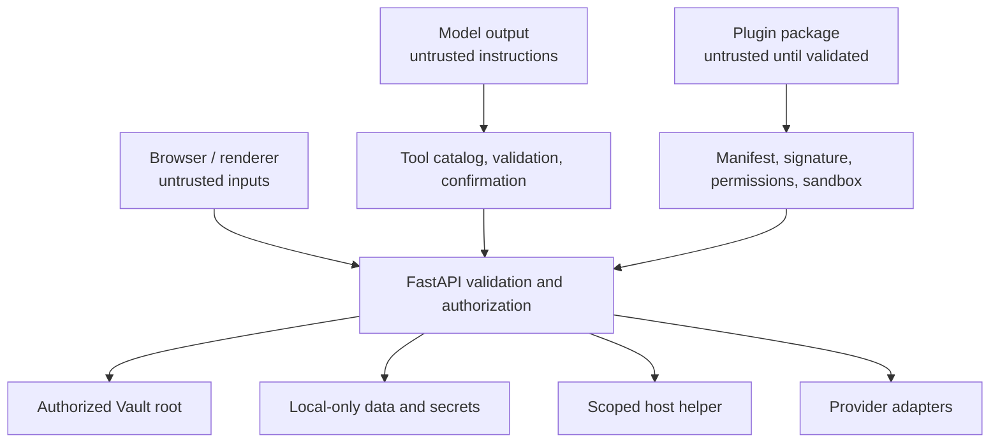

# Trust model

## Protected assets

- Vault pages, attachments, internal metadata, histories, and trash.
- User identities, memberships, roles, vault grants, PAT hashes, and shares.
- OAuth refresh tokens, mail credentials, AI keys, signing keys, and plugin
  secrets.
- Local databases, indexes, agent checkpoints, logs, and scheduled actions.
- The host filesystem and desktop applications reachable through helper APIs.
- External accounts capable of sending, publishing, deleting, or modifying
  remote data.

## Trust boundaries

Browser input, model output, imported files, remote HTML, provider responses,
plugin packages, and MCP descriptions are untrusted. A user login does not make
paths, HTML, tool arguments, or workspace identifiers safe.

## Authentication and authorization

JWT sessions use an HttpOnly cookie; bearer mechanisms support API clients.
Signing-secret safety is checked at startup for exposed deployments. Passwords
are hashed; PAT plaintext is never persisted.

Authorization combines effective identity, workspace membership, ordered role,
vault grant, and operation. Route dependencies enforce broad requirements;
services repeat containment and ownership checks where the resource itself
determines scope.

## Filesystem containment

Paths are resolved before comparison and checked against allowed roots.
Uploads, imports, exports, reader requests, generated tool file access, native
open, search, and trash operations use dedicated boundaries. Symlinks, `..`,
file URLs, cloud path mappings, and percent encoding must not escape the
authorized root.

Recoverable deletion is preferred. Permanent purge and physical vault deletion
are separate explicit operations.

## Network safety

URL ingestion and external context retrieval use an SSRF guard. Resolved hosts,
redirects, schemes, and response sizes are constrained; private or link-local
targets are rejected unless a specific trusted integration owns the endpoint.
Remote HTML is sanitized before rendering or conversion.

Provider clients use timeouts and bounded retries. Error responses shown to the
browser exclude credentials and detailed internal paths.

## AI and tool safety

Model output is data until a validated tool invocation is accepted. Tool origin,
schema, effect, skill compatibility, and confirmation policy are cataloged.
Generated tools pass source validation and cannot access environment values,
arbitrary imports, unrestricted filesystem writes, or dangerous introspection.

A confirmation record binds exact arguments and expires. The system does not
reuse a confirmation after mutation, user/session mismatch, or timeout.

## Secret lifecycle

Secrets are stored in the OS credential store or local-data secrets directory.
Environment variables are supported for deployment bootstrap and legacy
migration. API responses mask secret state; documentation catalogs names and
consumers but redacts defaults.

Secrets must not live in Git, the Markdown vault, generated documentation,
screenshots, logs, fixtures, or shared plugin packages.

## Primary threat controls

| Threat | Primary controls |
| --- | --- |
| Cross-workspace data access | Auth dependency, membership lookup, vault context, service ownership checks. |
| Path traversal or symlink escape | Canonical resolution, allowed roots, provider mapping, containment tests. |
| XSS from mail/web/imported content | HTML sanitizer, React escaping, constrained reader resources. |
| SSRF | Scheme/host/IP validation, redirect checks, size/time limits. |
| Credential disclosure | Local secret storage, masking, generic errors, log discipline. |
| Agent performs unintended action | Tool allowlist, effect classification, argument validation, confirmations. |
| Malicious plugin | Manifest/signature checks, permissions, scoped install root, sandbox, timeout. |
| Malicious marketplace package | Signed index, checksum, publisher signature, bounded staging extraction, atomic publish. |
| Private data leaked through a template | Export allowlist, hard exclusions, secret-like scan, preview, acknowledgement, admin submission. |
| Stale overwrite | ETags, schema revisions, atomic writes, conflict responses. |
| SQLite corruption | Local-only storage; no cloud synchronization. |

## Security verification

Security-sensitive changes run central auth, workspace, PAT, share, path
containment, XSS, SSRF, generated-tool, plugin sandbox, and concurrency tests.
Browser QA uses both an authenticated session and a clean anonymous context
when public surfaces change.
