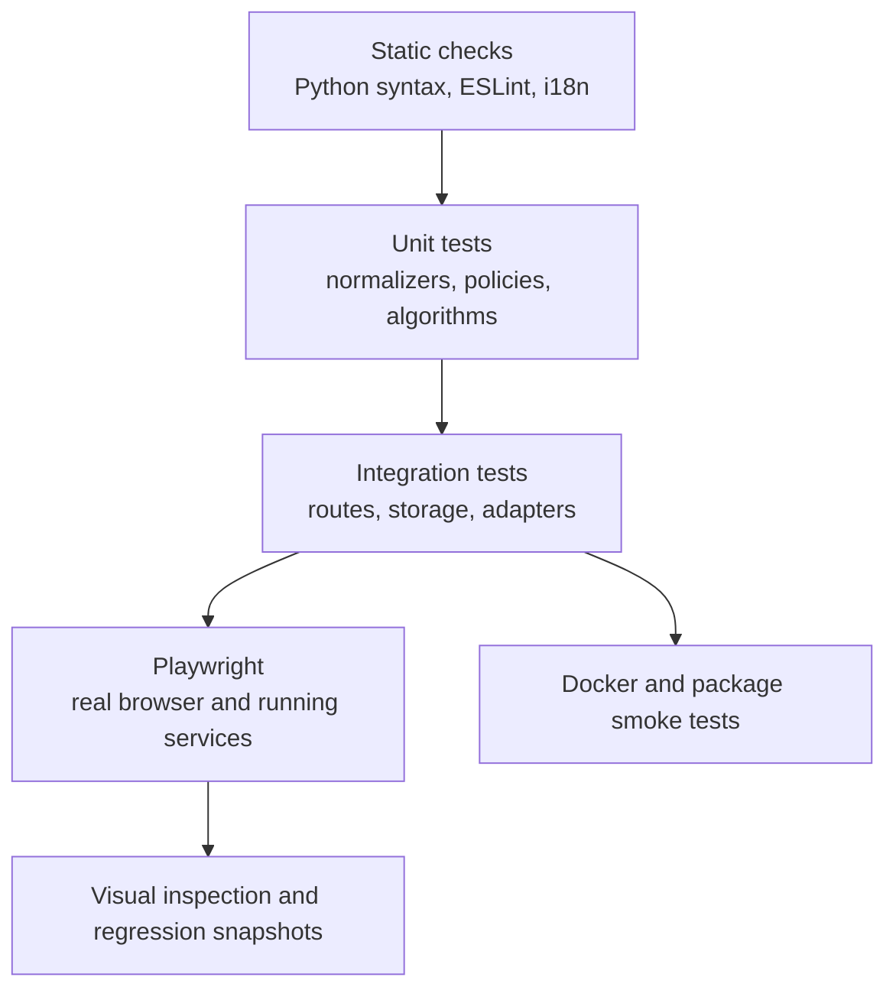

# Test strategy

## Quality layers

No single layer is sufficient. A frontend build catches imports and syntax but
not a broken interaction. A route unit test does not prove browser integration.
A screenshot does not prove persistence or authorization.

## Backend tests

Pytest covers services, route dependencies, normalization, storage, security,
concurrency, and regression cases. Tests use temporary vault and local-data
directories. External providers are stubbed unless a test is explicitly marked
as live/E2E.

Important suites include:

- Auth, PAT, workspace bootstrap, roles, and public surfaces.
- Path containment, safe writes, ETags, races, registry and sidecar behavior.
- Formulas, rollups, typed filters, relations, planning, and scheduling.
- Mail MIME/CID, contacts merge/vCard, calendar containment and reminders.
- AI routing, skills, MCP resilience, confirmations, and generated tools.
- Plugins, imports, citations, reader normalization, XSS, and SSRF.

## Frontend tests

Vitest covers components, hooks, registries, formatting utilities, typed view
logic, and state behavior. ESLint and the production Vite build are mandatory.
`check:i18n` verifies that referenced user-facing keys exist in every locale.

The build must finish with zero errors. Existing warnings are not permission to
add new warnings without review.

## End-to-end and visual tests

Playwright runs as a host-level project against the native application. An
anonymous setup covers boot and public behavior; authenticated setup covers
workspace functionality. Domain tests exercise Vault, dashboard, mail,
calendar, contacts, drawings, automation, agent chat, and navigation.

Visual snapshots cover representative desktop and mobile pages. For a UI
change, inspect the actual rendered page, click the changed control, watch the
console, and take a screenshot. Confirm that modals, overlays, toasts, and
menus use the registered z-index system and do not trap interaction.

## Accessibility gate

The Playwright `accessibility` project is a blocking WCAG 2.2 AA gate. It runs
axe against a representative route from every top-level product domain in
light and dark themes, including color contrast, labels, landmarks, and ARIA
relationships. The suite keeps application-owned markup in scope and does not
maintain a permanent violation allowlist. Its deterministic fixture enables
the optional modules represented by the route matrix, and every route also
fails on unhandled browser page errors so a crashed surface cannot pass axe.

Interaction assertions complement axe for behavior that static analysis cannot
prove: skip navigation, visible focus, logical focus order, complete keyboard
operation, mobile tab roving focus, cancelable-dialog Escape handling, focus
trap and restoration, accessible names, and live route announcements. Shared
focus, modal, navigation, or color-token changes must pass this project before
release.

Global focus styling uses the `data-focus-modality` attribute on the document
root. Pointer activation suppresses generic outlines; keyboard activation uses
contextual indicators: existing borders for fields, underlines for links, and
outlines for borderless controls. Editable Vault page titles retain their caret
without an enclosing ring. Unit tests must cover modality transitions, while
browser checks cover pointer and keyboard focus in light and dark themes.

## Deployment tests

Docker CI builds backend and frontend images, validates Compose, and exercises
the health endpoint with local storage. Electron release CI owns cross-platform
packaging; a macOS local build cannot validate Windows and Linux artifacts.

## Change-to-test mapping

| Change | Minimum evidence |
| --- | --- |
| Pure reviewed documentation | Generator check, validator, strict docs build, browser docs smoke. |
| Generated catalog logic | Generator unit tests, two-run determinism, validator, strict docs build. |
| Backend behavior | Narrow pytest regression plus affected integration suite. |
| Frontend behavior | Vitest where feasible, i18n check, production build, browser action and screenshot. |
| Accessibility or shared UI token | Vitest for the shared primitive, four-locale parity, axe route matrix in light and dark, keyboard interaction suite, and browser screenshot. |
| Auth/security/path behavior | Negative tests and cross-scope attempts, not only the golden path. |
| Deployment/dependency | Native verification plus Docker or package CI as applicable. |

## Test catalog

The generated [test catalog](../generated/tests.md) lists owned test files and
navigation signals. Runner collection remains authoritative for executable test
counts.
