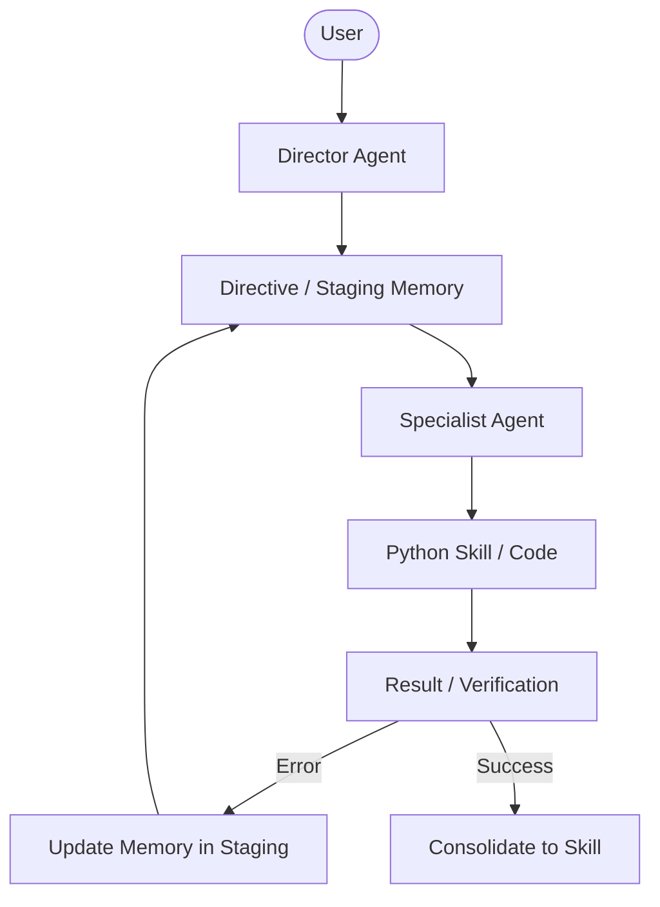

# Directive: Ecosystem Architecture (Gnosi Project Structure)

This document maps the physical and logical structure of the Gnosi ecosystem. It defines where components reside and how they are categorized to ensure a clean monorepo organization.

> [!IMPORTANT]
> **Operational Protocol**: For detailed instructions on agent roles, the "Central Loop," and the "Self-Correction Protocol," always refer to the primary [AGENTS.md](../../../AGENTS.md).

---

## 1. File Map and Key Paths

| Component | Key File / Directory | Status | Description |
|-----------|----------------------|--------|-------------|
| **Agents** | `AGENTS.md` | Core | Primary source of truth for agent behavior and protocols. |
| | `docs/dev_memory/directives/ai_agent_architecture.md` | Design | Detailed design of the Multi-Agent hierarchy (LangGraph). |
| | `.antigravity/team/` | Infra | Mailboxes and state for agent collaboration. |
| **Memory** | `docs/dev_memory/directives/` | Staging | **Short-term memory**. Active instructions and plans. |
| | `pipeline/skills/[skill]/SKILL.md` | Consolidated | **Long-term memory**. Protocols for mature tools. |
| **Skills** | `monorepo/apps/gnosi/pipeline/skills/` | Application | Business logic for the Gnosi app (Sync, AI, Processing). |
| | `.agent/skills/` | Environment | Development-time tools (MCP) for managing infrastructure. |
| | `monorepo/apps/gnosi/pipeline/private_skills/` | Private | Logic containing secrets or restricted dependencies. |

---

## 2. Component Lifecycle and Consolidation

The Gnosi ecosystem follows a "Staging to Consolidation" lifecycle to maintain idempotency and continuous learning.

*   **Ideation**: New procedures start as a plan or a draft in `docs/dev_memory/directives/`.
*   **Validation**: Once the procedure is tested and idempotent (follow the *Self-Correction Protocol* in `AGENTS.md`), it is eligible for consolidation.
*   **Consolidation**: The logic is moved to `pipeline/skills/` (Python scripts) and the documentation becomes a `SKILL.md`.

---

## 3. Workflow Overview

The following diagram visualizes the interaction between the User, the Agent, and the Gnosi knowledge base.

*Note: This workflow implements the "Central Loop" defined in `AGENTS.md`.*

---

## 4. Key Distinctions & Conflict Resolution

> [!CAUTION] 
> **.agent/skills vs pipeline/skills**: 
> *   `/.agent/skills/`: Contains MCP tools used by the AI assistant *during development* (e.g., managing Docker, Drupal, n8n). 
> *   `/monorepo/apps/gnosi/pipeline/skills/`: Contains the actual *business logic* and automation engine of the Gnosi application.
> *   **Rule**: Never mix development-time assistant tools with application runtime skills.

> [!NOTE] 
> **Directive Scoping**: Directives in `docs/` should focus on high-level architecture or complex multi-step flows. Individual tool usage should be documented in its respective `SKILL.md`.

---

## 5. Maintenance Recommendations

1.  **Directive Pruning**: Periodically archive or consolidate directives from `docs/dev_memory/directives/` into `SKILL.md` files to reduce noise.
2.  **Standardization**: Ensure all new skills follow the `scripts/` and `SKILL.md` internal structure for system-wide consistency.
3.  **Protocol Sync**: If the operational loop changes, update `AGENTS.md` first; this document only maps how that protocol manifests in the file system.
