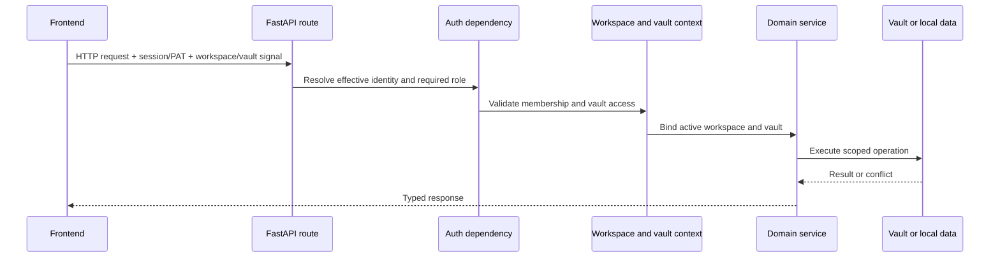

# Fluxos transversals

## Context de petició i autorització

El mode personal pot resoldre un usuari efectiu local sense iniciar sessió.
El mode d'organització requereix una sessió vàlida o un mecanisme bearer admès.
La decisió correspon al backend; el control d'autenticació del frontend millora
l'experiència d'ús, però no és un límit de seguretat.

Les variables de context transporten el vault actiu entre crides de serveis
imbricades sense convertir la ruta en una configuració global mutable. El codi
que s'executa fora d'una petició ha de proporcionar un vault explícit o utilitzar
el mecanisme documentat de resolució predeterminada.

## Encaminament per Vault

Els enllaços privats del navegador identifiquen el slug estable del vault abans
de l'aplicació i el recurs: `/@{vaultSlug}/{app}/{resourceType}/{resourceId}`.
Les pàgines d'entrada acaben al segment de l'aplicació. Els noms dels vaults es
poden editar, però els slugs es desen per separat i no canvien en reanomenar-los.
Les comparticions públiques i les pantalles globals de compte o gestió de vaults
queden fora d'aquest espai de noms.

Les API de dades del vault reflecteixen aquest mateix límit sota
`/api/v1/vaults/{vaultSlug}/{app}/...`. `ActiveVaultMiddleware` resol el slug
abans del despatx normal de FastAPI, vincula l'identificador immutable i la ruta
del vault i reutilitza la implementació existent de l'endpoint. La ruta canònica
preval sobre una capçalera, paràmetre de consulta o galeta antics en conflicte,
però les dependències d'espai de treball i accés al vault continuen decidint
l'autorització.

L'anàlisi dels senyals s'aïlla en helpers tipats de capçaleres, consultes i
galetes. La crida del middleware només reescriu l'àmbit canònic, instal·la el
token de context, despatxa la petició i el restaura. Així, HTTP i WebSocket
comparteixen el mateix límit de propagació.

El frontend separa la construcció de rutes del transport de xarxa. L’HTTP
ordinari passa pel client tipat `openapi-fetch` o per l’adaptador de
compatibilitat; tots dos deleguen a `transportFetch`, que afegeix el context de
workspace, usuari i Vault i canonitza peticions de tipus cadena/URL sense
substituir `window.fetch`. TanStack Query gestiona la memòria cau del servidor
i la invalidació al límit dels proveïdors de l'aplicació. SSE, streaming,
descàrregues i WebSockets de col·laboració usen adaptadors especialitzats
explícits perquè OpenAPI no descriu completament els seus contractes de navegador.

L'artefacte OpenAPI i les operacions TypeScript es generen de manera determinista
des de l'aplicació FastAPI canònica en un runtime efímer. Un control del codi
prohibeix Axios, `fetch` directe en producció, monkeypatches globals i
transports especials no revisats; l’allowlist mínima documenta només els límits
del navegador que no poden importar el client de l’aplicació.
Els enllaços antics desats encara se substitueixen per ubicacions canòniques
del navegador, i les rutes API antigues es mantenen com a àlies de
compatibilitat per als clients anteriors.

## Flux de configuració

1. Els fitxers d'entorn i el magatzem de credencials del sistema operatiu aporten els valors d'arrencada.
2. El YAML base de l'aplicació aporta valors predeterminats versionats.
3. Els paràmetres del directori personal o del vault actiu aporten la configuració desada de l'usuari.
4. Les variables d'entorn substitueixen les rutes i polítiques sensibles al desplegament.
5. Les rutes de Configuració validen i desen els canvis admesos.

Els proveïdors d'IA eliminats deixen una marca de supressió perquè una variable
d'entorn antiga no els pugui recrear silenciosament en una càrrega posterior.

## Gestió d'errors

Les rutes tradueixen els errors de domini coneguts en codis d'estat explícits.
Un gestor global registra les excepcions inesperades amb un identificador
d'error i retorna una resposta genèrica per no revelar rutes, fragments SQL
o tokens al client.

Les operacions opcionals llargues informen de l'estat o el progrés i es
degraden sense bloquejar dominis independents. Les tasques en segon pla han de
gestionar les seves pròpies sessions de base de dades i els límits del bucle
d'esdeveniments; no poden reutilitzar sessions de petició després del cicle
de vida de la resposta.

## Observabilitat

Els mòduls del backend utilitzen logging estàndard. Els LaunchAgents recullen
els registres d'execució nativa al directori de registres de Gnosi de l'usuari.
Les notificacions operatives i l'historial de tasques resideixen a les dades
locals. Els endpoints de salut informen del comportament efectiu, no només
dels valors d'entorn en brut.

Els registres s'adrecen als desenvolupadors i s'escriuen en anglès. No han de
contenir credencials, respostes de proveïdors sense depurar ni contingut sensible
complet de l'usuari.

## Internacionalització

Les cadenes del frontend visibles per l'usuari passen per `react-i18next` i
existeixen als quatre catàlegs: català, anglès, castellà i francès. Els
comentaris de codi, les docstrings, els registres de desenvolupament, la
documentació tècnica pública i els identificadors són en anglès, tret que un
identificador o valor de compatibilitat ja estigui desat.

## Accessibilitat

La carcassa de l’aplicació és responsable de l’única regió principal, la
navegació de salt, els tokens de focus visible i els anuncis discrets de canvi
de ruta. Els dominis hereten aquestes primitives i mantenen els noms
accessibles als mateixos quatre catàlegs d’idioma que les etiquetes visuals.

Els diàlegs cancel·lables utilitzen la capa compartida de teclat: només el
diàleg superior gestiona Escape, Tab queda atrapat dins seu i el focus torna a
l’obridor. Les pestanyes responsives exposen relacions completes amb els seus
panells i desplaçament del focus amb teclat. Playwright combina anàlisis axe
WCAG 2.2 AA sobre la matriu de rutes del producte amb proves explícites de
teclat, perquè cap de les dues capes demostra el funcionament de l'altra.

## Política d'efectes externs

Les eines d'agent i les accions de l'aplicació classifiquen els efectes com a
lectura, escriptura, comunicació externa o canvi destructiu. Segons l'efecte
s'apliquen comprovacions de rol, serveis acotats, registres de confirmació i
operacions recuperables. La confirmació del client, per si sola, no autoritza
l'acció del backend.
