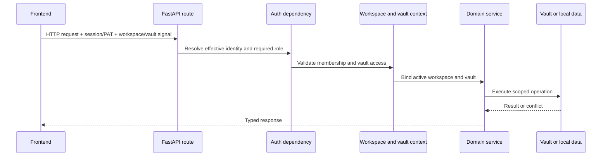

# Desigxs de creu

## Sol· licita context i autorització

El mode personal pot resoldre un usuari efectiu local sense accés. El mode d' organització requereix un mecanisme vàlid o acceptat. El dorsal té la decisió; la porta de la interfície millora l' UX però no és un límit de seguretat.

Les variables de context porten la volta activa a través de les crides de servei niats sense convertir el camí en un arranjament de taula global. Codi fora d' una sol· licitud ha de proporcionar una volta explícita o usar el camí per omissió documentat.

## Encaminament per Vault

`ActiveVaultMiddleware` resol primer la ruta canònica i després aplica la
prioritat capçalera → consulta → galeta. Helpers tipats comparteixen aquesta
resolució entre HTTP i WebSocket, i el context sempre es restaura en acabar.

El frontend separa la construcció de rutes del transport de xarxa. L’HTTP
ordinari passa pel client tipat `openapi-fetch` o per l’adaptador de
compatibilitat; tots dos deleguen a `transportFetch`, que afegeix el context de
workspace, usuari i Vault sense substituir `window.fetch`. TanStack Query
gestiona la memòria cau del servidor. SSE, streaming, descàrregues i WebSockets
usen adaptadors especialitzats explícits.

OpenAPI i els tipus TypeScript es generen de manera determinista en un runtime
efímer. Un guard prohibeix Axios, `fetch` directe, monkeypatches globals i
transports especials no revisats; l’allowlist mínima documenta només els límits
del navegador que no poden importar el client de l’aplicació.

## Flux de configuració

1. Fitxers d' entorn i els valors de subministrament de l' OSMCdencial de l'OMS.
2. Aplicació base per omissió de fonts YALM.
3. La configuració dels paràmetres a casa o a l' inici activa del subministrament de paràmetres persisteix la configuració de l' usuari.
4. Les variables d' entorn substitueixen camins i polítiques sensibles a la desplegament.
5. Arranjament de rutes validades i persisteixen els canvis acceptats.

Els proveïdors de l'AI han esborrat la làpida per tal que una variable d' entorn heretat no pugui tornar a crear silenciosament un proveïdor durant una càrrega de configuració posterior.

## Gestió d' errors

Les rutes de ruta traduïdes de domini conegudes en codis d' estat explícites. Un registre global d' excepcions no s' ha trobat un identificador d' error i retorna una resposta genèrica de manera que els camins de fitxers, fragments SQL, o fitxes no es filtraran al client.

Operacions opcionals en execució sobre l' estat o el progrés i degragrades sense bloqueig de dominis no relacionats. Les tasques de fons han de tenir els seus límits de base de dades i els esdeveniments- ellop; les sessions sol· licituds no es poden tornar a utilitzar després del cicle de resposta.

## Observabilitat

Els mòduls del dorsal usen un registre estàndard. Els registres natius d' execució es contenen sota el directori de registre del Gnosi mitjançant l' execució de l' agent. Les notificacions i la història de la tasca viuen en dades locals. Els punts de sortida de salut acaben han estat efectius, no només els valors d' entorn cru.

Els registres són provisions i escrits en anglès. No han de contenir credencials, respostes de proveïdor no reconeguts, o contingut d' usuari molt sensible.

## Internacionalització

Cadenes visibles per l' usuari passar- hi `react-i18next` i existeix en tots quatre catàlegs locals: català, anglès, espanyol i francès. Els comentaris de codi, les cadenes de documentació dels desenvolupadors, la documentació tècnica i els identificadors són anglesos a menys que un identificador o un valor de compatibilitat ja està persisteix.

## Accessibilitat

La carcassa de l’aplicació és responsable de l’única regió principal, la
navegació de salt, els tokens de focus visible i els anuncis discrets de canvi
de ruta. Els dominis hereten aquestes primitives i mantenen els noms
accessibles als mateixos quatre catàlegs d’idioma que les etiquetes visuals.

Els diàlegs cancel·lables utilitzen la capa compartida de teclat: només el
diàleg superior gestiona Escape, Tab queda atrapat dins seu i el focus torna a
l’obridor. Les pestanyes responsives exposen relacions completes amb els seus
panells i focus roving. Playwright combina axe WCAG 2.2 AA amb proves explícites
de teclat.

## Política d' efectes externs

Les eines de l' agent i les accions classifiquen els efectes com ara la lectura, l' escriptura, la comunicació externa o el canvi destructiu. Les comprovacions de rol, els serveis d' àmbit, els registres de confirmació i les operacions recunibles s' apliquen segons l' efecte. La confirmació client només no autoritza l' acció del dorsal.
