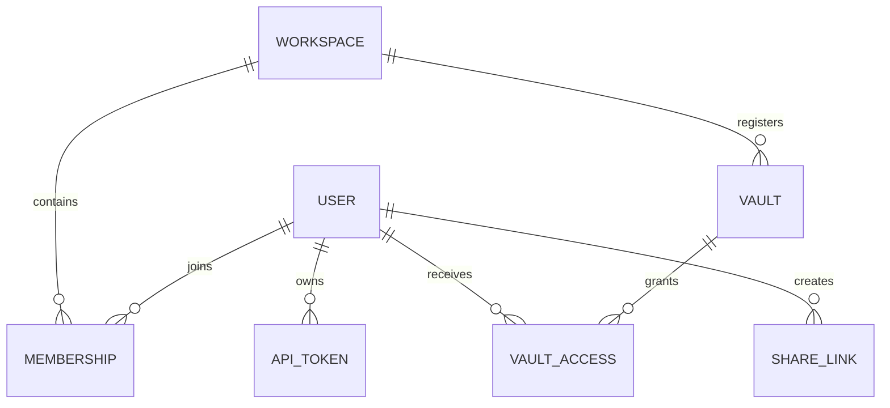

# Dades i emmagatzematge

## Configuració bibliogràfica

`GNOSI_DATA_DIR/config/references.json` conté la designació de la taula
bibliogràfica, la desactivació explícita i la configuració dels adjunts enllaçats.
Les còpies dins del codi es migren explícitament amb
`scripts/migrate-reference-config.py`, mai mitjançant una petició API ni una còpia
implícita en arrencar. El migrador preserva l'original i els camps desconeguts,
verifica els bytes JSON UTF-8, publica sense substituir altres fitxers i conserva
un diari privat de recuperació. L'arrencada rebutja configuracions antigues no
migrades abans d'actualitzar bases de dades o iniciar tasques en segon pla.

## Responsabilitat sobre les dades

| Dades | Emmagatzematge persistent responsable | Regla de reconstrucció o recuperació |
| --- | --- | --- |
| Contingut de pàgina i frontmatter | Vault Markdown | Fer còpies de seguretat i versionar com a fitxers ordinaris. |
| Adjunts i fitxers de biblioteca | Vault actiu | Preservar referències relatives o portàtils. |
| Metadades internes de pàgina | Fitxers auxiliars `.gnosi` del vault | Migrar amb la pàgina; mantenir els camps interns fora del contingut escrit per l'usuari. |
| Índexs de pàgines i wikilinks | Memòries cau de dades locals | Reconstruir des del vault; els escaneigs parcials no han de substituir memòries cau completes. |
| Usuaris, espais de treball, membres, accessos al vault, PAT i comparticions | SQLite de gestió | Fer còpies com a estat local de l'aplicació; no sincronitzar mai la base de dades activa al núvol. |
| Índexs de correu, lector, notificacions, anotacions i execucions | SQLite local | Segons el domini, recuperar dels proveïdors o de les dades d'origen quan sigui possible. |
| Tokens OAuth i secrets d'integració | Secrets locals o gestor de credencials del sistema | Tornar a connectar cada màquina si es perden; no copiar-los a un vault compartit. |
| Punts de control de l'agent | Dades locals | Memòria d'execució de cada instància, no contingut del vault. |

## Format del vault

Una pàgina és un fitxer Markdown amb frontmatter YAML. Els identificadors estables
permeten que els enllaços i les relacions sobrevisquin als canvis de títol. Els
enllaços visibles utilitzen sintaxi wikilink; els adjunts i les propietats de tipus
fitxer utilitzen rutes portàtils o metadades estructurades, no rutes absolutes
específiques d'una màquina.

Les vistes de tipus base de dades són projeccions sobre pàgines i registres. No
substitueixen Markdown per un magatzem relacional opac. La capa de serveis del
vault resol les definicions de vista, els esquemes, les fórmules, els rollups,
les relacions i l'estat de presentació.

## Concurrència d'escriptura

Les lectures de pàgina exposen un ETag derivat de la representació actual. Els
clients que modifiquen dades retornen l'ETag esperat; una discrepància rebutja
l'escriptura obsoleta en lloc de sobreescriure un canvi concurrent. Les utilitats
d'escriptura atòmica només substitueixen el fitxer quan la nova versió és completa.

Canviar un nom requereix l'índex de wikilinks per actualitzar els enllaços entrants.
L'operació afecta la identitat de pàgina, el nom del fitxer, el registre, els
fitxers auxiliars i els índexs d'enllaços; cal executar-la coordinadament.

## Base de dades de gestió

Els models SQLAlchemy representen:

Tots els models de gestió hereten d'una mateixa `DeclarativeBase` tipada de
SQLAlchemy. Les factories de motor i sessió s'inicialitzen atòmicament i retornen
tipus concrets `Engine` i `Session`. Les metadades i els noms de taula continuen
sent la referència d'Alembic i de les instal·lacions SQLite existents.

Abans d'iniciar els processos de treball, el coordinador d'esquemes localitza la
base de gestió, cada vault dinàmic i els magatzems auxiliars persistents de Gnosi.
Línies de revisions Alembic independents reconeixen empremtes estructurals 2.x
revisades, creen còpies verificades i apliquen migracions cap endavant. Els esquemes
desconeguts o divergents provoquen una aturada sense modificacions. Les memòries
cau derivades i les bases de dades externes no formen part d'aquestes migracions.

Els fitxers `academic_index.sqlite3` acotats pertanyen a la família
`literature_index`. Els registres OAI i `oai_sync_state` són duradors; la taula
virtual FTS es pot reconstruir, però roman en la mateixa migració revisada perquè
els seus identificadors de fila es mantenen sincronitzats amb els registres
duradors. Les connexions en temps d'execució només estableixen pragmes operatius
de SQLite i mai executen DDL d'esquema.

Només es desen els hashes dels PAT i un prefix recognoscible. Els tokens de
compartició pública són identificadors opacs; les seves files conserven el creador,
el vault, el permís, la caducitat i l'estat de revocació.

## Aïllament de les dades locals

`GNOSI_DATA_DIR` apunta a l'arrel de cada instància. El resolutor de rutes crea
directoris de memòria cau, sistema, punts de control, registres, àudio, sortides,
còpies de seguretat i secrets. Docker utilitza `/data`; els valors natius segueixen
la convenció de dades d'aplicació del sistema operatiu. `GNOSI_LOCAL_DATA` continua
sent un àlies obsolet admès durant la sèrie 3.x.

Els fitxers SQLite no s'han de situar a OneDrive, iCloud Drive, Dropbox ni cap altra
capa de sincronització de fitxers. Aquesta sincronització no ofereix els bloquejos
que requereix SQLite i pot corrompre la base o crear-ne versions divergents.

## Vaults amb fitxers al núvol

Els adaptadors de proveïdor separen el comportament ordinari del sistema de fitxers
de la descàrrega local sota demanda i la disponibilitat. Les lectures gestionen
errors transitoris per fitxer i continuen quan una resposta parcial és útil. Un
escaneig parcial es marca i no es pot desar com a memòria cau completa. A macOS,
la descàrrega sota demanda utilitza una acció de la sessió gràfica, perquè un
LaunchAgent pot rebre `EDEADLK` en accedir a contingut disponible només en línia.
OneDrive, iCloud Drive, Google Drive, Nextcloud i Dropbox tenen adaptadors i
prefixos de configuració independents. Un servei desconegut muntat sota
`~/Library/CloudStorage` utilitza l'adaptador genèric `fileprovider`. Les carpetes
muntades ordinàries o completament sincronitzades utilitzen el sistema de fitxers local.

## Responsabilitat sobre la configuració

La configuració combina recursivament els paràmetres base amb els de l'usuari o del
vault actiu a `.gnosi/params.yaml`. L'entorn té prioritat sobre les rutes de
desplegament i alguns comportaments d'arrencada. Les credencials són referències
al gestor local de secrets, no valors en brut dins de la configuració del vault.

Les variables del procés tenen prioritat sobre el `.env` local de Gnosi. El fitxer
compartit només es carrega si `GNOSI_SHARED_ENV_FILE` l'indica explícitament i és
de només lectura per a l'app. Les credencials gestionades per la interfície van al
gestor del sistema, amb alternativa xifrada sota `GNOSI_DATA_DIR/secrets`.
