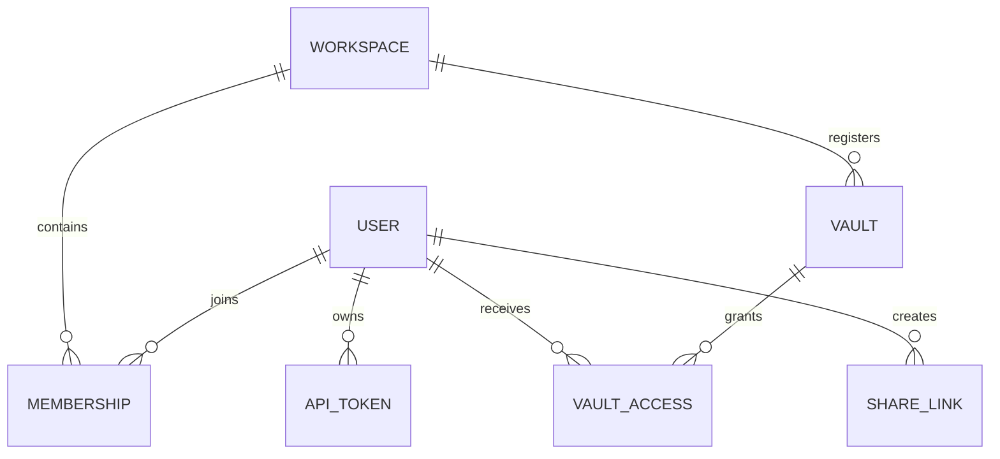

# Dades i emmagatzematge

## Mapa propietari

| Dades | Propietari durant el temps | Reconstrueix o recuperació del govern |
| --- | --- | --- |
| Contingut de la pàgina i assumpte frontal | Marca enrere volta | Torneu i versió com a fitxers normals. |
| Adjunts i fitxers de biblioteca | Gràvola activa | Preserva les referències relatives o portàtils. |
| metadata internes de la pàgina | VaultCity name (optional, probably does not need a translation) `.gnosi` Connectors laterals | Migrar amb la pàgina; ocultar els camps de només implementació des del contingut autoritzat. |
| Índexs de pàgines i wikilink | Memòria cau de dades locals | Reconstrueix des de la volta; els escàners parcials no han de sobreescriure cap cau completa. |
| Usuaris, espais de treball, accions, accés de la volta, PATs, accions compartits | Gestió SQLiteComment | Reforços com a estat de l' aplicació local, mai no superen la base de dades en directe. |
| Correu, lector, notificació, anotacions i índexs d' execució | SQLite local | Domini-dependent; recupera dels proveïdors o dades de codi font on sigui possible. |
| fitxes outh i secrets d'integració | secrets de dades locals o botigues de l' OSMIS | Reconnecta per màquina si es perd, no es copia mai a una volta compartida. |
| points de control de l' agent | Dades locals | Per exemple, la memòria d'execució, no el contingut de la volta. |

## Format de laulta

Una pàgina és un fitxer Markdown amb YAL front matter. Els identificadors de pàgina estables permeten enllaços i relacions per a sobreviure als títols. Els enllaços invisibles usen la sintaxi wikilink; adjunts i propietats de fitxers usen camins portàtils o metadades estructurades en comptes de camins absoluts per a màquines.

Les vistes a l' estil de base de dades són projeccions sobre pàgines i registes. No substitueixen Markdown amb una botiga relacional opaca. Visualitza definicions, metadades d' esquema, fórmules, característiques, relacions i estat de presentació es resolen per la capa de servei de la volta.

## Escriguitigència

La pàgina llegeix una representació d' ETag derivada de la representació actual. Els clients de rodació retornen l' ETag; desaparella el temps de desestimar, es rebutja els fitxers que es considera silenci sobre sobreescrivint un canvi concurrent. Els ajudas atòmics de l' escriptura només substitueixen fitxers després que la nova representació estigui completa.

Reanomena les operacions dependrà de l' índex del wikilink per a reescriure enllaços. Per tant, es pot canviar el nom de la identitat de pàgina, el nom de fitxer, les metadades de registre, els carcars i els índexs d' enllaç i els canvis d' operació de coordenades.

## Base de dades de gestió

Models SQLAlchem represent:

El motor està inicialitzat la i està vigilat per primera vegada l'accés conactual. `Base.metadata.create_all` Crea taules que no són necessàries. No hi ha cap marc general de migració: una petita passada d' inici impotant afegeix explícitament columnes registrades i aplica les vores estretes. L' esquema nou no additius necessita un disseny de migració dedicat.

Només PAT hahes i un prefix reconegut es persisteix. Les fitxes públiques comparteixen són identificadors opacs que tinguin les files a mà, la volta, el permís, la caducitat i l' estat de revocació.

## Instústització de dades locals

`GNOSI_LOCAL_DATA` Apunta a l' arrel per exemple. El mecanisme de resolució de rutes crea el cau, el sistema, el punt de comprovació, el registre, l' àudio, la sortida, els directoris secrets i els directoris. Feu- ho a `/app/data`; l' ús de temps d' execució natiu `Gnosi/local_data`.

No s' han de situar fitxers SQLite a OneDriva, iCloud Drive, Dropbox, o una altra capa de sincronització de fitxers. La sincronització de fitxer no proporciona semàntics SQLite i pot corrompre o forçar la base de dades.

## Núvols enrere

Els adaptadors de fitxers que proporciona un sistema de fitxers separats del comportament normal de la hidratació i de disponibilitat. Llegiu " atch transitori " per fitxer " i continuen quan una resposta parcial és significativa. Es marca un exploració parcial i mai s' ha de desar com a cau completa. L' abreviació nativa d' una sírvaria utilitza un ajuda IGU- sessions perquè es pot rebre un procés d' execució `EDEADLK` pel contingut de només en línia.

## Propietat de configuració

La configuració està molt ocupada des dels paràmetres base i l' usuari aplicable o la barra d' estat actiu `.gnosi/params.yaml`Els valors d' entorn anul· lan les rutes de desplegament i un petit conjunt de comportaments de les botes. Els conflictes són referències a l' emmagatzematge secret local, no els valors en brut encastats a la configuració de la volta.
