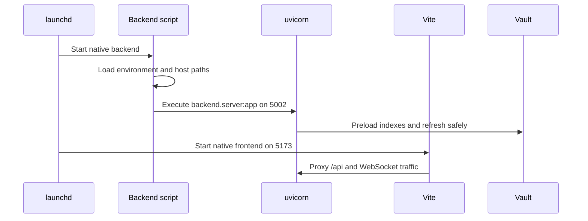

# Execució i desplegament

## Hora d' execució nativa

L' operació nativa és l' arquitectura de desenvolupament per omissió. Els agents d' execució gestionen dos scripts de repositori:

| Procés | Límit d' ordre | Adreça | Recarrega el comportament |
| --- | --- | --- | --- |
| Dorsal | `uv run uvicorn backend.server:app` | `127.0.0.1:5002` | Observacions `backend/`El canvi de dependència necessita un reinici. |
| Frontal | `pnpm dev:frontend` | HTTPS `:5173` | Torna a carregar la font de les fallades calenta. |

`run_native_dev.sh` S' ha compartit una entrada d' entorn sense reubicar- la com a codi shell, establir rutes de volta natius i dades locals, seleccioneu els valors per omissió de la zona, i comença avucorar. `run_native_frontend.sh` Selecciona el destí i superfícies del dorsal de l' intermediari quan la recuperació servia és un avantpassat ja prestat `origin/main`.

L' entorn virtual del repositori és autoritiu. Intel macOS usa barrets validats per a la seva pila de màquines; els canvis del paquet han de començar a inspeccionar l' entorn actual en comptes d'assumir el conjunt Apple Silicon Slider.

## Amarxa auto- màquina

Complaador proveeix dorsal, frontal i servidor de traducció Zotero. El dorsal veu la volta activa a `/vault`, el pare multi-vult a `/vaults`Estat i només local en `gnosi_local_data` volum. Les rutes d' ordinador es transmeten explícitament per traduir accions de fitxer a través del límit del contenidor.

La imatge del dorsal usa luv uvicon `5002`; el frontal està exposat `5173` i intermediaris al servei del dorsal. El servidor de traducció encara és intern `1969`. Docker requereix un secret de signatura no per omissió de JWT perquè es considera un desplegament exposat.

El contenidor del backend instal·la la versió fixada de PyTorch només per a CPU abans dels requisits generals de Python. La inferència amb Docker usa la CPU; així, les compilacions Linux ARM64 no descarreguen biblioteques CUDA innecessàries ni exhaureixen el disc del runner.

El Docker és un objectiu de desplegament, no una alternativa per a aquesta màquina de desenvolupament. El codi ha de seleccionar valors específics de Docker mitjançant la detecció d' execució i mantenir el comportament natiu.

## Paquets electrònica

El propietari de l' aplicació electrònica és el bisectricle de cicle de vida de l' aplicació empaquetada. Comença el paquet de Python, mostra una superfície IPP a través de la càrrega, obre el renderitzador i gestiona l' estat d' actualització del manual. Els renderitzadors subscriptors poden consultar l' últim estat per evitar que els esdeveniments no s' hagin emès abans de tornar a muntar.

Construïu i deixeu anar treballs produir instal· lats de plataformes més les metadades d'actualitzament necessàries per `electron-updater`Els esborranys de llançament continuen sense resoldre fins que un mantenidor inspeccioni tots els artefactes de la plataforma.

## Serveis de la màquina auxiliars

- Ajudador de la màquina: obrir fitxers, cerca de llum de llum, selecció natiu i
Mou fitxers a la paperera sense concedir accés a la màquina amb el recipient.
- L'escalfament d'una sola banda: la recuperació i la hidratació de les variables de només en línia.
- No s'han pogut veure el gos natiu: detecten processos natius i reinicia dins seu
Àmbit documentada.

## Port i procés avariants

- Exactament un dorsal propietari `5002`.
- Exactament un port per a la interfície `5173`; en silenci es mou a `5174` és un QA
Error.
- Els locals i els casos de Docker no han d'executar actualment en els mateixos ports.
- La càrrega del codi font del dorsal no s' instal· larà les dependències del Python canviades.
- La càrrega de la Frontal no substitueix cap versió de construcció d' inici establerta.
- Els arbres temporals necessiten accés als certificats de desenvolupament existents
Navegador HTTPS vàlid QA.

## portes de salut

`/api/health` Prova el procés del dorsal i el mode d' informes, política d' autenticació efectiva i configuració de la volta. La validació de l' operació també és fàcil `/api/config` i `/api/vault/pages`El procés de salut sol no pot provar la llegibilitat d' emmagatzematge.
