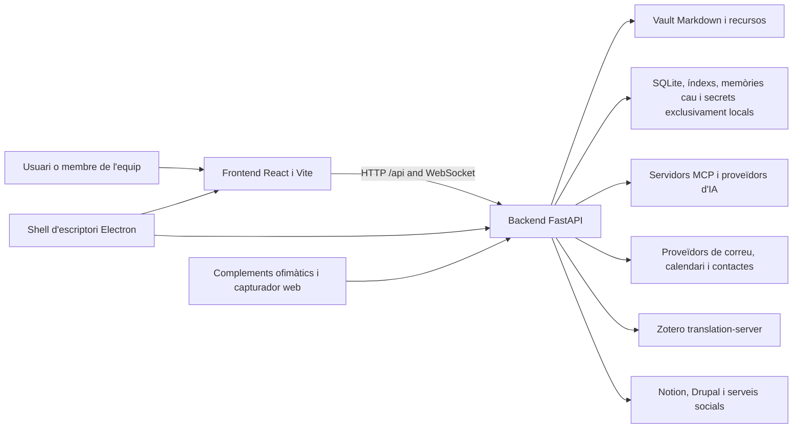

# Context del sistema

## Vista dels contenidors

## Límit del frontend

El frontend és una aplicació React de pàgina única. `app/App.tsx` gestiona
l'autenticació i el shell global; `app/routes.tsx` compon les rutes, l'àmbit
del Vault, les redireccions i la càrrega diferida de pàgines, mentre Home es
carrega inicialment. `app/bootstrap.tsx` prepara l'encaminament i l'idioma;
`app/AppProviders.tsx` conserva l'ordre StrictMode → API → router → autenticació.
El trasllat situa l'entrada CSS i la crida a bootstrap a `app/main.tsx`,
amb els estils ordenats a `app/styles/index.css`. Vite fa de proxy de `/api`
i WebSocket durant el desenvolupament natiu.

### Organització dels mòduls

El trasllat revisat assigna la composició, la navegació i la integració global
a `app/`; els dominis de producte a `features/`; la infraestructura, la UI,
els registres, l'encaminament i els adaptadors API reutilitzables a `shared/`;
i els contractes generats a `generated/`. Els contractes generats es regeneren,
mai no s'editen manualment. El proveïdor d'autenticació pertany a
`features/auth/context/AuthProvider.tsx` i el context reutilitzable a
`shared/auth/auth-context.ts`.

El manifest `frontend/feature-public-entries.json` recull camins públics
exactes revisats i els seus motius. Les entrades `index` de l'arrel de cada
feature continuen admeses; un mòdul veí no llistat continua sent privat.
Els consumidors accedeixen directament a l'entrada arrel o a una entrada
explícitament revisada, incloent-hi imports diferits separats, sense introduir
un agregador de càrrega immediata. El manifest descriu l'accés; no importa mòduls.

Les dependències poden anar d'`app` cap a les features i la infraestructura
compartida. Les features no depenen d'`app`; `shared` no depèn de features ni
d'`app`, tampoc en imports només de tipus. Traslladar la previsualització
Markdown/wikilink a la infraestructura compartida no resol el seu cicle intern.
El trasllat ha de conservar la càrrega diferida, els estils, les rutes i els
payloads; l'estructura per si sola no acredita una integració ni una release completes.

Els components criden el backend mitjançant adaptadors API tipats a `shared/api/`.
El backend continua autoritzant usuaris, workspaces, vaults i operacions destructives.

## Límit del backend

`backend/server.py` crea l'aplicació FastAPI i registra els encaminadors de
domini. Els mòduls de rutes tradueixen els contractes HTTP en crides a serveis.
La lògica de negoci pertany a `backend/services/`; les entitats relacionals
persistents, a `backend/models/`; l'orquestració d'IA, a `backend/agent/`; i
les tasques programades, a `backend/scheduler/` i a les habilitats d'execució.

El cicle de vida de l'aplicació inicia la infraestructura compartida, construeix
les capacitats d'agent, prepara els índexs que es poden carregar amb seguretat,
inicia els processos IDLE de correu i, al final, tanca aquests recursos.
L'arrencada d'integracions opcionals s'aïlla perquè un proveïdor no disponible
no interrompi tot el servidor.

## Límits d'emmagatzematge

El vault i les dades locals tenen propietats de persistència i sincronització
deliberadament diferents:

- Vault: contingut portable de l'usuari; pot residir en un disc local o en un
  proveïdor de fitxers amb emmagatzematge al núvol.
- Dades locals: SQLite, índexs, memòries cau, secrets, registres, punts de
  control i sortides; no se sincronitzen mai al núvol.
- Configuració: combinació de valors predeterminats de l'aplicació, paràmetres
  d'usuari o vault, valors d'entorn i magatzems locals de credencials.

Consulteu [dades i emmagatzematge](data-and-storage.md) per conèixer les
responsabilitats i les regles de reconstrucció.

## Sistemes externs

Tots els serveis externs són dependències opcionals dels dominis. OAuth i les
credencials es gestionen localment. Els adaptadors normalitzen el comportament
específic de Google, Microsoft, IMAP/SMTP, CalDAV, Notion, Drupal, els proveïdors
d'IA, les xarxes socials, els proveïdors de fitxers i la traducció de Zotero.

## Navegació a la implementació

- [Catàleg d'API](../generated/api-catalog.md)
- [Catàleg del frontend](../generated/frontend-catalog.md)
- [Catàleg de mòduls del backend](../generated/backend-modules.md)
- [Catàleg de configuració](../generated/configuration.md)
