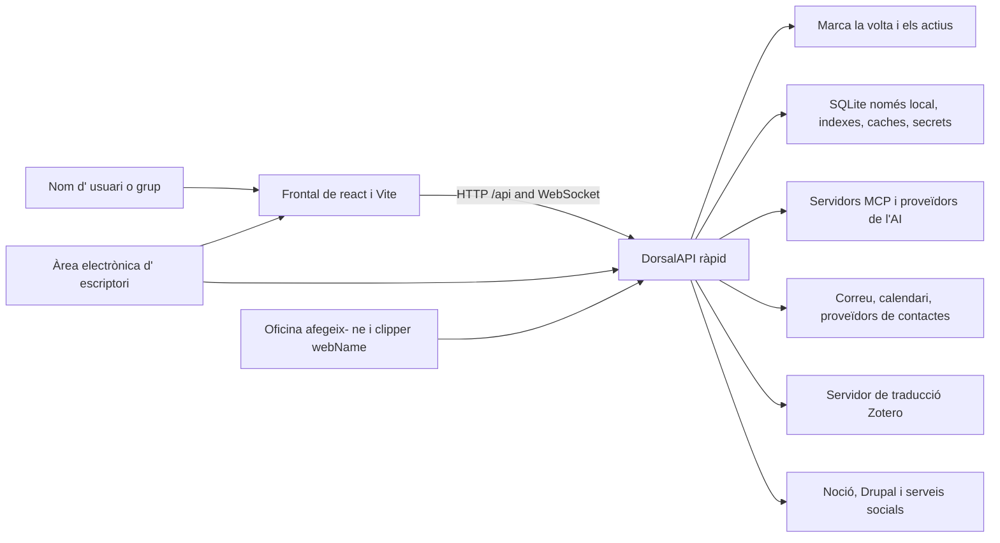

# Context del sistema

## Vista de contenidor

## Límit del frontend

El frontend és una aplicació React de pàgina única. `app/App.tsx` gestiona
l'autenticació i el shell global; `app/routes.tsx` compon les rutes, l'àmbit
del Vault, les redireccions i la càrrega diferida de pàgines, mentre Home es
carrega inicialment. `app/bootstrap.tsx` prepara l'encaminament i l'idioma;
`app/AppProviders.tsx` conserva l'ordre StrictMode → API → router → autenticació.
El trasllat situa l'entrada CSS i la crida a bootstrap a `app/main.tsx`,
amb els estils ordenats a `app/styles/index.css`. Vite fa de proxy de `/api`
i WebSocket durant el desenvolupament natiu.

### Organització dels mòduls

El trasllat revisat assigna la composició, la navegació i la integració global
a `app/`; els dominis de producte a `features/`; la infraestructura, la UI,
els registres, l'encaminament i els adaptadors API reutilitzables a `shared/`;
i els contractes generats a `generated/`. Els contractes generats es regeneren,
mai no s'editen manualment. El proveïdor d'autenticació pertany a
`features/auth/context/AuthProvider.tsx` i el context reutilitzable a
`shared/auth/auth-context.ts`.

El manifest `frontend/feature-public-entries.json` recull camins públics
exactes revisats i els seus motius. Les entrades `index` de l'arrel de cada
feature continuen admeses; un mòdul veí no llistat continua sent privat.
Els consumidors accedeixen directament a l'entrada arrel o a una entrada
explícitament revisada, incloent-hi imports diferits separats, sense introduir
un agregador de càrrega immediata. El manifest descriu l'accés; no importa mòduls.

Les dependències poden anar d'`app` cap a les features i la infraestructura
compartida. Les features no depenen d'`app`; `shared` no depèn de features ni
d'`app`, tampoc en imports només de tipus. Traslladar la previsualització
Markdown/wikilink a la infraestructura compartida no resol el seu cicle intern.
El trasllat ha de conservar la càrrega diferida, els estils, les rutes i els
payloads; l'estructura per si sola no acredita una integració ni una release completes.

Els components criden el backend mitjançant adaptadors API tipats a `shared/api/`.
El backend continua autoritzant usuaris, workspaces, vaults i operacions destructives.

## Límit del dorsal

`backend/server.py` Crea l' aplicacióAPI ràpida i registra els encaminadors de domini. Els mòduls de ruta tradueixen contractes HTTP en crides al servei. La lògica professional pertany a `backend/services/`; persisteixva les entitats relacionals en què viuen `backend/models/`; L' IAtractoral viu en `backend/agent/`; Funciona programada en `backend/scheduler/` i habilitats en temps d'esbarjo.

L' aplicació comença a compartir infraestructures, construccions d' agent, índexs de seguretat calents, inicien els treballadors IDLE de correu i després tanca aquests recursos. Opcionals 'startup' està aïllada per a que un proveïdor no disponible no avortarà tot el servidor.

## Límits d' emmagatzematge

Les dades voltes i locals tenen propietats deliberadament diferents de la durera i de sincronització:

- Culta: contingut d' usuari portàtil; pot viure en un disc local o en un fitxer " cdR."
proveïdor.
- Dades locals: SQLite, índexs, caches, secrets, registres, punts de comprovació i sortides;
Mai no s'hi resisteix al núvol.
- Configuració: fusionat per omissió de l' aplicació, paràmetres per omissió o de la volta,
L'entorn sobreescriu, i les botigues de confiança locals.

Veure [dades i emmagatzematge](data-and-storage.md) Per a la propietat i reconstruir les normes.

## Sistemes externs

Tots els serveis externs són dependències opcionals de domini. Les credencials i les credencials estan gestionades localment. Adaptadors s' inclouen comportaments normals per al proveïdor de Google, Microsoft, IMAP/ STP, CalDAV, Noon, Drupal, AAD, proveïdors, xarxes socials, proveïdors de fitxers i traduccions Zotero.

## Navegació a la implementació

- [Catàleg d' API](../generated/api-catalog.md)
- [Catàleg de Frontal](../generated/frontend-catalog.md)
- [Catàleg de mòduls del dorsal](../generated/backend-modules.md)
- [Catàleg de configuració](../generated/configuration.md)
