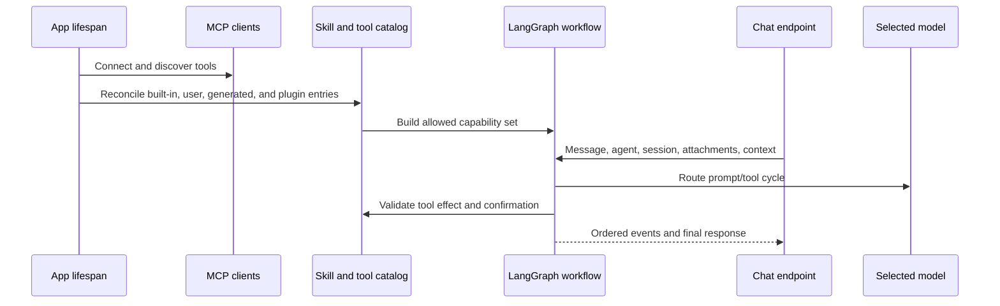

# Agents de la IA, models, eines i habilitats

## Model de capacitat

El Gnomi separa models, agents, habilitats i eines:

- Model: una ruta del proveïdor amb capacitats, límits, metadades costdes, fiabilitat,
i credencials.
- Agent: instruccions, selecció de model, política de notes de memòria/ comprovació, i assignada
habilitats.
- Skill: un paquet de capacitat documentada que contribueix a instruccions i
Força les eines compatibles.
- Eina: una operació cal· lada classificada per efecte i origen.
- Font de context: S' ha afegit l' usuari- Vulta, taula, fitxer o material extern
a una conversa amb comportament de contenció i mida explícita.

## Inici i sol· licitud de flux

L' encaminador de models resol combinacions de proveïdor/ model, límits de context, suport d' eines, despeses i política de reserva. S' obtindran les Credives del magatzem secret local o la migració d' entorn suportat, no es mostren al frontal. Les raons de suport per separat es registra de les respostes d' usuari per a distingir els operadors, el rebuig, les credencials del proveïdor, el context i l' eina en lacompatibilitat.

## Interfície de governança

Els descriptors d' eina declaren efectes read/ write/externals/destructiu. Genera eines que passen la validació AST amb base i s' executen en un entorn restringit. El validador bloqueja les capacitats perilloses com ara fitxers innecessiu escriu, accés d' entorn, accés dinàmic de traveral, i importacions insegures.

Accions requerides crear registres pendents amb confirmació. Confirmació de l' usuari, sessió, arguments, efecte i caducitat; acceptar una acció estable o alterat no s' autoritza d' una provocació diferent. El manteniment expirarà i elimina els registres independentment del tràfic de xat.

## Skils i connectors

Les habilitats en temps integrat viuen en `pipeline/skills/`Els paquets d' usuari i connectors es validen en un catàleg mentre es preserva l' origen, l' activació, la compatibilitat i els camps controlats contra l' usuari. La reconciliació del connector és idescriptible: deshabilitar un connector suspendre la seva contribució gestionada sense eliminar les sobreescriucions de l' usuari.

## Context i memòria

L' estat de la conversa es pot trobar per agent i sessió. L' ordenació del missatge de la IU fa servir identificadors estables en comptes de l' hora d' arribada. Adjunts i fonts de context validant camins, mida, tipus de fitxer i àmbit de treball/ vviult. Les fonts externes grans usen representacions cercables en comptes d' injectar text sense límit en cada torn.

La navegació del Vault aporta context de pàgina, taula i vista activa només per
al torn actual. El servidor amplia un dashboard amb una sola vista incrustada a
la vista canònica de la taula, reaplica els filtres i l'ordenació i exposa una
consulta exacta i acotada amb recompte i paginació. Les lectures exactes de
pàgina i taula són crides d'eina creades pel servidor; després d'un resultat
complet, la síntesi s'executa sense eines perquè un model insistent no repeteixi
la crida fins al límit de recursió del graf.

La resta de torns de només lectura tenen un pressupost independent de tres
resultats: si el model continua demanant eines, la següent invocació de Cervell
rep les evidències acumulades sense eines vinculades i ha de sintetitzar la
resposta. Així, el límit de recursió del graf continua sent una xarxa de
seguretat final i no un control normal del flux.

El xat mesura cada resposta des de l'enviament de la petició fins al final del
flux. Un comptador viu de segons enters es reemplaça pel temps transcorregut
desat a la resposta completada. Cada missatge visible també permet rebobinar la
conversa: després de confirmar-ho, el servidor retalla el checkpoint canònic de
l'àmbit en el límit complet del torn i retorna la seva projecció pública. El
rebobinat només canvia la memòria de conversa; mai no es presenta com si hagués
revertit confirmacions completades o efectes externs.

Els registres editables de models s'hidraten des del catàleg canònic abans
d'arribar a Configuració o a l'encaminament d'execució. Les actualitzacions
parcials de pressupost i configuració es fusionen amb les capacitats, la finestra
de context, el cost i la qualitat existents. Els canvis de proveïdor o model
invaliden els grafs en memòria perquè el suport d'eines i les credencials siguin
efectius al torn següent. La capçalera del xat mostra el model seleccionat, el
nombre exacte d'eines i motius accionables per a qualsevol degradació.

## Configuració del LLM Wiki

`backend/domains/configuration/llm_wiki.py` valida la taula Brain, les fonts,
les dimensions categòriques, els camps de fitxer/URL, els valors fixos i les
relacions abans de mutar l'esquema. Després crea els rols i relacions canònics,
revalida els camps d'índex, desa atòmicament i actualitza les pàgines del sistema.
`backend/domains/configuration/llm_wiki_schema.py` gestiona separadament la
reparació idempotent dels camps Brain i la consolidació d'una relació canònica
per font, incloent-hi àlies, metadades de pàgina i vistes contextuals.

## Ha fallat i seguretat envaris

- El proveïdor no fa ruta en silenci a una ruta més cara o menys privada
model fora de la política configurada.
- Una eina no disponible al model/ es pot invocar pel nom
Sol.
- Els efectes obsolets o externs requereixen la seva política proposada.
- El codi generat no pot accedir als secrets o a l' estat del sistema de fitxers sense restriccions.
- Un ha fallat el servidor MCP no elimina servidors sans del catàleg.
- No s' ha presentat cap sortida de model parcial com una acció confirmada completada.
- Els missatges de l' agent estan aïllats per l' agent i la sessió a través de les tornades.

## Concentrat de verificació

Executa model rout, esborrat del proveïdor, fiabilitat, temps d' espera, MCP reintentar i resicionar, catàleg de habilitat/runtime/API, validació d' eines generada, contenidor de context, confirmació/expiry, ordenació de xat, i xat del navegador fluxos.
