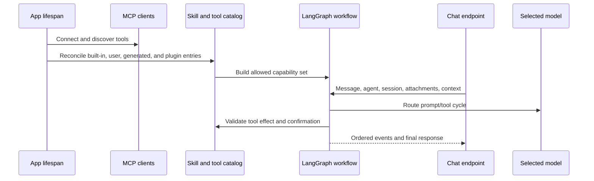

# Agents, models, eines i habilitats d’IA

## Responsabilitats del frontend de conversa

`features/agent` gestiona la composició del xat, les sessions, les confirmacions,
les accions dels missatges i la presentació del flux. El seu punt d’entrada públic
exporta `AgentChat` i el contracte complet de propietats. L’aplicació carrega
aquesta entrada dinàmicament; els quaderns importen el mateix component dins del
seu fragment de ruta opcional. Cap consumidor accedeix als mòduls privats del xat
ni força el component a un tipus més restringit.

Les llistes de referències de context es mantenen de només lectura a la interfície
i només es copien en construir la petició HTTP existent. Això preserva les
metadades de les fonts, l’àmbit del quadern, les càrregues útils, la reproducció
del flux i les claus de persistència. Els adaptadors genèrics HTTP i NDJSON
continuen a `shared/api`; les proves que combinen feedback i transport pertanyen
a la funcionalitat d’agent perquè el codi compartit no depengui d’interiors de la UI.

## Model de capacitats

Gnosi distingeix models, agents, habilitats i eines:

- Model: una ruta de proveïdor amb capacitats, límits, metadades de cost,
  fiabilitat i credencials.
- Agent: instruccions, selecció de model, política de memòria i punts de control,
  i habilitats assignades.
- Habilitat: un paquet de capacitats documentat que aporta instruccions i
  restringeix les eines compatibles.
- Eina: una operació invocable classificada per efecte i origen.
- Font de context: material d’un Vault, taula, fitxer o origen extern seleccionat
  per l’usuari i afegit a una conversa amb límits explícits d’accés i mida.

El conjunt d’eines de coneixement del Vault manté els objectes LangChain
`StructuredTool` al punt de registre i només n’extreu les funcions tipades per
compondre eines internament. La creació de pàgines es registra mitjançant el
responsable canònic del Vault; la cerca obté explícitament el seu magatzem de
càrrega diferida, i les lectures de camins i PDF conserven els límits d’accés i
de mida fixats pel servidor.

El feed d’Artificial Analysis és una frontera tipada de comparació al servidor.
Manté les credencials API privades, valida cada resposta paginada, completa només
les metadades absents del catàleg, preserva les mètriques verificades de la memòria
cau i recorre a la memòria cau antiga o a models.dev amb procedència explícita.

## Arrencada i flux de peticions

Les importacions històriques d’Agent continuen disponibles mitjançant façanes
de compatibilitat estretes. El paquet de domini gestiona la correspondència i
l’emmagatzematge del context, l’execució d’eines pròpies, els contractes
d’evidència i citació, l’estat del flux, les confirmacions, les sessions i la
composició de rutes. El catàleg i les rutes de governança d’agents segueixen el
mateix patró al domini de configuració, preservant l’ordre de les rutes i els
identificadors d’operació.

L’encaminador de models resol combinacions de proveïdor i model, límits de
context, suport d’eines, límits de despesa i política d’alternatives. Obté les
credencials del magatzem local de secrets o de la migració d’entorn admesa, sense
exposar-les al frontend. Registra els motius de fallada separadament de les
respostes visibles perquè els operadors puguin distingir temps d’espera,
rebuig del proveïdor, credencials invàlides, excés de context i incompatibilitat
d’eines.

El client híbrid històric continua disponible per a la composició social, els
esborranys de correu i els analitzadors antics del pipeline a través d’una
frontera de compatibilitat estrictament tipada. Delimita els mapes YAML dinàmics
de proveïdors, exigeix un URL concret de proveïdor abans de qualsevol petició de
xarxa, valida els embolcalls de resposta compatibles amb OpenAI, desa
atòmicament la memòria cau indexada pel hash del prompt sota el directori de
dades per dispositiu i preserva l’ordre establert de model principal i alternativa
sense exposar credencials.

La transcripció Whisper local exposa un protocol de model i una forma de resultat
tipats; l’àudio es manté al dispositiu i la memòria cau dels models descarregats
sota demanda resideix sota `GNOSI_DATA_DIR`, independent del proveïdor.
La importació opcional no tipada de `faster-whisper` queda confinada a aquest
adaptador. La conversió de divises delimita igualment el JSON remot i el desat
abans dels càlculs de pressupost, conserva les alternatives amb dades reals
antigues i valors estàtics, i sempre retorna una taxa tipada positiva d’unitats
per dòlar nord-americà.

L’encaminador normalitza les metadades desconegudes del registre abans
d’iterar-les, compara les quotes de tokens i finestres de context com a enters
i manté el registre d’ús rere fronteres tipades de camins, càrrega i desament
atòmic. Els límits monetaris distingeixen explícitament l’absència de límit
del zero, preservant la política existent quan s’apropa el límit i les
alternatives de models gratuïts, mentre que les dades persistides malformades
es recuperen com un registre buit.

L’observabilitat d’agents, la reproducció, els diaris de flux, les reserves de
torns, la qualitat revisada, les memòries personal i semàntica, les avaluacions
de models i l’auditoria i salut de capacitats són estat operatiu per dispositiu.
Els magatzems SQLite/JSON es resolen directament mitjançant `GNOSI_DATA_DIR`;
mai no deriven la ubicació d’un Vault ni d’un proveïdor de núvol. Les proves
injecten aquest mateix resolutor canònic, i les claus de xifratge del flux
romanen al subdirectori `secrets` del directori de dades local.

Els perfils utilitzen `pinned`: només el proveïdor i model configurats. Les opcions antigues `resilient`, `adaptive` i `decision_engine: jev` ja no seleccionen alternatives per als perfils. El formulari desa un únic model sense alternatives. Les utilitats antigues continuen cobertes a `backend/tests/test_agent_model_decisions.py`; l’edició de perfils es comprova a `frontend/src/features/settings/global-settings/AIAgentForm.test.tsx`.

El client MCP per stdio valida els objectes JSON-RPC, tipa explícitament les
peticions asíncrones pendents i encamina eines a través d’una memòria cau que
només es refresca quan no hi troba una entrada. Els catàlegs d’eines malformats
fallen localment, sense propagar valors no comprovats a l’execució de l’agent.

La configuració d’IA manté les credencials, les marques de connexions eliminades,
el registre de models i les rutes de pressupost i ús en una façana de
compatibilitat estrictament tipada. La generació i correcció de l’editor viuen
al domini de configuració d’IA; les càrregues validades de mapes YAML i les
metadades explícites de resposta històrica preserven exactament els contractes
HTTP i OpenAPI existents.

## Governança d’eines

Els descriptors d’eina declaren efectes de lectura, escriptura, externs i
destructius. Les eines generades passen una validació basada en AST i s’executen
en un entorn restringit. El validador bloqueja capacitats perilloses com
l’escriptura indiscriminada de fitxers, l’accés a l’entorn, el recorregut dinàmic
d’atributs de doble guió baix i les importacions insegures.

Les accions que requereixen confirmació creen registres pendents durables.
La confirmació vincula usuari, sessió, eina, arguments, efecte i caducitat;
acceptar una acció caducada o alterada no autoritza una invocació diferent.
El manteniment caduca i elimina registres independentment del trànsit del xat.

Les metadades versionades de capacitats es delimiten a partir d’un model o
mapa abans de validar-les. Els contractes de versió 2 rebutgen l’operació si les
polítiques de temps d’espera, idempotència, privacitat, sortida de xarxa i resultat
durable no són completes i vàlides; els descriptors històrics de versió 1 es
mantenen compatibles. La cancel·lació cooperativa embolcalla qualsevol objecte
Python esperable en un futur cancel·lable, de manera que els adaptadors de
proveïdor basats en corrutines o futurs comparteixen la mateixa semàntica de token.

## Habilitats i connectors

Les habilitats integrades d’execució viuen a `pipeline/skills/`. Els paquets
d’usuari i de connectors es validen en un catàleg preservant l’origen, l’activació,
la compatibilitat i la distinció entre camps gestionats i camps de l’usuari.
La reconciliació de connectors és idempotent: deshabilitar-ne un suspèn la seva
aportació gestionada sense eliminar les personalitzacions de l’usuari.

Les traduccions de files, pàgines i instruccions de skills utilitzen l’operació
compartida `translation`. Els botons de la interfície seleccionen el perfil del
plugin de Traducció; les accions dins d’una conversa hereten el perfil de l’agent
en execució. El perfil determina el model, les polítiques i el registre d’activitat.
El panell de traducció enllaça a aquest perfil. Els arguments històrics de DeepL
i Softcatalà es mantenen per compatibilitat, però s’ignoren; ja no hi ha
encaminament per parelles de llengües ni alternativa amb marcadors. Traduir una
skill només en mostra una còpia de lectura i conserva les instruccions originals.

La reconciliació de connectors també pot executar-se abans de compondre les
rutes FastAPI. Deriva el directori `.gnosi` del context canònic del Vault
actiu i llegeix l’estat mitjançant
`backend/domains/configuration/plugin_state.py`; mai no importa una ruta del
Vault només per resoldre camins o configuració. Abans que existeixi el magatzem
del procés, el mateix normalitzador i escriptor atòmic operen rere un bloqueig
d’inicialització; després de la composició, la reconciliació reutilitza el
magatzem compartit i els bloquejos de mutació.

La façana històrica de memòria Chroma continua sent de càrrega diferida i
estrictament tipada per compatibilitat d’importació. Importar-la només crea el
directori d’emmagatzematge configurat; no carrega models d’embeddings. Si no hi
ha embeddings, les lectures són buides i les escriptures fallen explícitament,
mentre que la memòria personal canònica governada continua al servei SQLite
acotat del domini Agent.

## Context i memòria

L’estat de conversa queda acotat per agent i sessió. L’ordenació dels missatges
a la UI usa identificadors estables, no només l’hora d’arribada. Els adjunts i
les fonts de context validen camins, mida, tipus de fitxer i àmbit d’espai de
treball i Vault. Les fonts externes grans usen representacions cercables en lloc
d’injectar text brut il·limitat a cada torn.

El punt de control durable continua sent el registre complet d’auditoria, però
els prompts del proveïdor usen una projecció acotada. Els missatges anteriors
d’usuari i les respostes finals de l’assistent romanen com a memòria de conversa,
mentre que s’ometen els grups històrics de crides d’eines i les seves càrregues
brutes. El torn actual conserva els grups complets del protocol de crida i
resultat, i el conjunt de la projecció conversacional té un límit estricte de
caràcters encara que el model anunciï una finestra de context molt més gran.

La memòria personal revisada és un magatzem local separat i explícit, acotat per
Vault i agent. A Configuració, els usuaris poden crear, editar, deshabilitar,
caducar i eliminar fets o preferències amb revisions. La recuperació és lèxica i
es limita a cinc elements; el prompt els etiqueta com a dades que no poden
canviar polítiques, eines ni autoritzacions. Els punts de control de conversa
i les associacions de vocabulari mantenen cicles de vida separats.

La navegació del Vault aporta context de pàgina, taula i vista activa només per
al torn actual. El servidor amplia un tauler amb una única vista incrustada a
la vista canònica de la taula, reaplica filtres i ordenació, i exposa una consulta
exacta i acotada de files amb recompte i paginació. Les lectures exactes de
pàgines i taules són crides d’eina creades pel servidor; després d’un resultat
complet, la síntesi s’executa sense eines vinculades perquè un model insistent
no repeteixi la crida fins al límit de recursió del graf.

La petició canònica de Recursos d’autoria pròpia també s’encamina al servidor.
Gnosi executa la vista desada d’autoria exactament una vegada i formata el
recompte i la llista acotada de registres directament a partir del resultat
governat. Aquest camí no fa cap crida de model després de l’èxit de l’eina.
Les peticions que requereixen interpretació o generació continuen amb la síntesi
normal del model.

El mateix contracte determinista s’aplica ara a inventaris arbitraris del Vault
adjunt, no només a temes o taules concrets. Abans de seleccionar eines, el servidor
classifica l’operació com a conversa, consulta, inventari, anàlisi o acció
governada. Les peticions d’inventari reben una exploració estructurada exhaustiva
amb recompte exacte, identificadors canònics, resolució de tipus del registre
actiu, agrupació per tipus, metadades seleccionades de procedència i paginació
per desplaçament. El tema és una dada de consulta: afegir un tema o una taula
nova no afegeix una branca d’intenció. La primera pàgina i les continuacions
es formaten directament a partir del resultat governat, sense cridar cap model.

El mode de petició també evita que l’adjunt Coneixement per defecte desviï feines
no relacionades. El mode de conversa no llegeix fonts ni vincula eines passives.
Les peticions explícites de correu, calendari, contactes, Reader, temps
meteorològic, web, Notion o Zotero ometen les eines de Vault per defecte, tret
que la mateixa petició també esmenti un objecte del Vault; l’habilitat pertinent
assignada continua disponible.

Cada petició porta ara un pla universal efectiu del torn al graf. El pla combina
mode d’operació, dominis de dades explícits, descriptors actius, evidència
requerida, permisos condicionats, localitat del proveïdor i estratègies
d’execució i resposta. És estat propi de la petició que substitueix les dades
del punt de control de torns anteriors. El node Brain interseca la selecció
normal d’eines amb els noms del pla, de manera que les metadades mostrades a
l’usuari descriguin les eines realment disponibles, no un classificador orientatiu.

La privacitat també és pròpia de cada petició. El pla distingeix processament
local, evidència privada tractada pel model remot configurat, lectures externes
i conversa ordinària. Les dades d’un Vault adjunt no compten com a utilitzades
quan un domini explícit com Mail, Reader, Notion o web n’exclou les eines.
La UI només informa d’aquesta situació i dels recomptes de fonts; els cossos
de les fonts, prompts, secrets i raonament ocult no entren mai a les metadades
de transparència.

Les respostes finals del model passen per un verificador determinista. Només
comprova els resultats d’eines del torn actual i la política d’efectes; bloqueja
afirmacions d’accions governades completades sense un resultat reeixit i
respostes dependents de fonts que n’han omès l’evidència obligatòria; registra
fallades d’eines com a limitacions i emet recomptes d’evidències i eines.
Les respostes d’inventari usen el mateix verificador encara que el servidor
en generi el text. La verificació mai no invoca un segon model.

Les respostes dependents de fonts també inclouen citacions d’afirmacions
validades pel servidor. Els resultats d’eines defineixen els únics identificadors
de font vàlids del torn. Els inventaris deterministes associen cada línia al
registre canònic del Vault i les afirmacions de recompte, agrupació, paginació i
mètode al manifest exacte del resultat de l’eina. La síntesi del model pot emetre
marcadors `[[cite:SOURCE_ID]]`; el verificador elimina els marcadors vàlids del
text visible, rebutja identificadors absents de l’evidència actual i marca el
fonament incomplet com a limitació. El xat mostra una correspondència acotada
entre afirmacions i fonts amb enllaços segurs a Vault, Reader o HTTP(S), sense
persistir fragments ni camins de fitxer com a metadades de citació.
Cada font citada també incorpora una empremta curta de versió derivada de la
revisió, etag, data d’actualització o manifest exacte de l’eina del torn.
La UI distingeix versions exactes de versions basades només en identitat,
sense exposar cossos de fonts ni secrets de connectors.

La cerca del Vault usa una classificació híbrida determinista: expansió de
termes lèxics multilingües, reforços per títol exacte i rol d’índex, i puntuació
vectorial reconstruïble. Els resultats es desen breument en una memòria cau
indexada només per Brain, consulta i k; és acotada i no reté prompts ni cossos
de fonts il·limitats. Els fragments retornats es delimiten com a evidència no
fiable i es marquen instruccions semblants a injeccions; el prompt de Brain
tracta cada font, connector, adjunt i resultat web com a dades, no instruccions.

Els inventaris exhaustius reutilitzen els índexs locals persistits de documents
analitzats i enllaços. Els identificadors de relació s’amplien als títols
indexats dels destins, de manera que un registre vinculat a un projecte o font
coincident es pugui trobar sense reobrir cada document sincronitzat al núvol.
Les escriptures normals de Gnosi actualitzen aquests índexs; el manteniment
periòdic reconcilia edicions externes. Els registres absents de la memòria cau
recorren a una lectura directa acotada. La cerca semàntica top-k continua sent
el camí per descobrir evidències en consultes i anàlisis, i mai no es presenta
com un inventari complet.

Les càrregues d’inventari també informen de l’antiguitat de l’índex d’enllaços,
la cobertura de memòria cau, les lectures directes alternatives i l’estat
d’ús de dades antigues mentre es revaliden. Un índex antic o absent demana una
reconciliació protegida en segon pla sense retardar la resposta; el missatge
conserva la limitació i no suggereix que l’índex s’acabi de reconstruir.

L’anàlisi de tota una col·lecció Reader s’admet com una operació de segon pla
mitjançant la façana de treballs de capacitats independent del proveïdor.
El servidor crea determinísticament la crida de treball, retorna un
identificador amb espai de noms `reader:` i exposa estat, disponibilitat del
resultat, represa després de fallada o interrupció i cancel·lació cooperativa
als detalls del missatge. La mateixa façana és extensible a altres proveïdors
durables que gestionin les seves fonts; les peticions no compatibles es mantenen
en primer pla i mai no es presenten com a treball durable.

Les eines d’agent de Reader exigeixen un Vault actiu concret abans d’analitzar
o persistir pàgines, exposen càrregues d’àmbit tipades i només conserven un
decorador identitat per a entorns mínims sense LangChain. Les lectures i
mutacions d’articles delimiten els descriptors ORM històrics en una única
frontera, preservant noms d’eina, efectes i respostes serialitzades.
Les eines de context de Reader adjunt apliquen la mateixa comprovació i
reutilitzen un únic Vault resolt per autoritzar l’estat i recuperar resultats,
evitant canvis d’àmbit entre Vaults dins d’una crida. L’embolcall de contingut
no fiable i els límits de sortida no canvien.
Els proveïdors i despatxadors de cua registren contractes versionats que declaren
tipus de treball, idempotència, concessió temporal, pressupostos d’intents i
crides de model, resultat, represa i cancel·lació. Els tipus desconeguts fallen
visiblement en lloc d’entrar en una branca de worker codificada a mà.

Els treballs Reader persisteixen una política acotada de recuperació juntament
amb els punts de control. Un temps d’espera transitori, una fallada temporal de
xarxa o servei, o un límit de peticions activa una espera cancel·lable amb
retard exponencial acotat. Els intents i les crides de model consumeixen
pressupostos persistits separats abans de qualsevol crida nova. Un temporitzador
en segon pla gestiona els reintents normals del procés; la reconciliació de
llistes i estats inicia un reintent vençut després de reiniciar el backend.
Les fallades permanents, cancel·lades, malformades o sense pressupost continuen
sent terminals i visibles. La represa manual usa els mateixos pressupostos i
no pot eludir el límit del bucle.

La resta de torns de només lectura tenen un pressupost independent de tres
resultats: si el model continua demanant eines, la invocació següent de Brain
rep les evidències acumulades sense eines vinculades i ha de sintetitzar la
resposta. El límit de recursió del graf continua sent, per tant, una última
xarxa de seguretat, no el control normal del flux.

El pla universal també incorpora un pressupost operatiu immutable per torn:
temps d’espera HTTP i màxims de crides de model, crides d’eina i resultats
de lectura. Les converses reben un pressupost curt sense eines; les consultes
i inventaris, pressupostos acotats de lectura; les anàlisis i accions governades,
un pressupost més gran però finit. El graf aplica aquests valors abans de la
invocació següent de proveïdor o eina, i el flux exposa els mateixos valors i
si s’ha assolit un límit. Un pressupost de zero eines declara un mode, no eludeix
l’autorització: les lectures de context obligatòries creades pel servidor
segueixen el seu camí explícit. Les eines dinàmiques de context no es trien per
a una pregunta general si l’usuari no ha aportat realment cap font de context.

Les automatitzacions de capacitats persisteixen àmbit, revisió, calendari i
pressupostos per execució a la seva base SQLite migrada dins del directori
local canònic. La reserva d’execució és transaccional, rebutja tasques
solapades o que excedeixen el pressupost, recupera concessions caducades i
registra un estat terminal encara que falli l’agent. L’absència de configuració
de dades o una fallada de desament i lectura de comprovació avorta explícitament
en lloc d’informar d’una automatització que no s’ha desat.

El ToolNode conserva el conjunt complet d’habilitats actives per executar i
comprovar polítiques; cada invocació de model només vincula lectures passives
i eines condicionades explícitament autoritzades per la petició actual.
Els perfils automàtics històrics també limiten les lectures passives a
coincidències multilingües amb el domini demanat i a l’operació exacta de
context requerida, amb un màxim acotat; les habilitats d’àmbit explícit
conserven el seu conjunt reduït de lectures assignades. Les lectures
obligatòries de context només vinculen l’eina de la font requerida al primer
pas. Aquesta vinculació per torn es deriva de la petició i mai no es reutilitza
com a autorització en memòria cau.

El xat mesura cada resposta des de l’enviament de la petició fins al final
del flux. Un comptador en viu de segons enters es reemplaça pel temps desat
a la resposta completada. El flux també informa de les durades de preparació
del servidor, encaminament, eines, model, temps residual i total, amb recomptes
de crides i tokens; els detalls del missatge conserven aquest diagnòstic acotat.
Cada missatge visible també permet rebobinar la conversa: després de confirmar,
el servidor retalla el punt de control canònic de l’àmbit al límit complet
del torn i retorna la seva projecció pública. El rebobinat només canvia la
memòria de conversa; mai no presenta com a revertides confirmacions completades
ni efectes externs.

Durant l’execució, el flux emet una marca de fase acotada per a encaminament,
generació del model o execució d’eines. El xat mostra la fase activa al costat
del comptador de segons i la restableix en acabar el torn. Els codis estables de
fallada transitòria (`agent_loop_exhausted`, temps d’espera, servei no disponible
i variants de límit de peticions) inclouen metadades orientatives de recuperació.
El client ofereix un reintent deliberat de la petició original després de
revisió de l’usuari; el servidor mai no repeteix automàticament un torn fallit,
perquè pot haver-se preparat una acció governada. Els errors permanents de
configuració o autorització conviden, en canvi, a editar la petició o els
ajustos d’execució.

El flux és propietari d’un token opac de cancel·lació. L’acció explícita de
cancel·lar crida un endpoint autenticat i acotat al flux, i arriba al pont de
cancel·lació asíncrona del proveïdor. Una desconnexió accidental del navegador
o servidor intermediari no cancel·la el torn acotat acceptat: un productor
independent continua, i els esdeveniments es poden reprendre. Els workflows
en memòria cau no capturen esdeveniments específics de petició i els tokens
s’alliberen en acabar el productor. Les fallades de proveïdor usen un
tallacircuit acotat del procés, indexat per proveïdor i model; els errors
d’autenticació i política continuen sent terminals. Els descriptors també
exposen un estat de salut lleuger —saludable, no disponible o en quarantena
temporal— perquè identificadors, noms o gestors absents i adaptadors que fallen
repetidament no s’anunciïn com a capacitats executables. Dues fallades dins de
la finestra de salut acotada posen breument l’eina en quarantena; una crida
posterior reeixida esborra el registre de fallades consecutives.

El transport delimitat per salts de línia s’embolcalla en la versió 1 del
protocol. Cada esdeveniment conté un identificador opac de flux, identificador
d’esdeveniment, seqüència monòtona, identificador de traça i identificador opcional
de torn. Una operació pendent del proveïdor es manté activa mentre s’emet un
senyal de vida, de manera que un proveïdor lent però saludable no es cancel·li
pel mecanisme de manteniment de connexió. El client ignora seqüències duplicades.
Els esdeveniments es xifren en un diari local vinculat a l’àmbit durant com a
màxim una hora, i el navegador reprèn des de l’última seqüència durant tot el
temps d’espera del torn. La reproducció no repeteix crides de model, eines ni
accions governades: només reaplica l’embolcall original d’esdeveniments.

Els prompts llargs conserven el punt de control complet com a registre
d’auditoria, però afegeixen a la projecció del proveïdor un resum determinista
acotat dels torns humans i d’assistent omesos. El resum només conté fragments
curts i hashes opacs; no arrossega càrregues brutes d’eines ni cossos de fonts
sense límit.

Cada torn amb flux rep un `trace_id` opac que es propaga per planificació,
selecció del model, salut d’execució, missatges, errors, mètriques i
esdeveniments de finalització. Això dona als registres distribuïts i a la UI
una clau de correlació sense persistir prompts, credencials ni text de fonts.
La disponibilitat MCP es desa breument en memòria cau per servidor, i el
comprovant d’execució inclou instantànies de proveïdors i connectors.

La recuperació del Brain combina puntuació vectorial reconstruïble, expansió
lèxica multilingüe normalitzada sense accents, reforços de títol i índex,
memòria cau acotada i evidències marcades contra injeccions. Les proves HTTP
reals de taules i paperera són opcionals i s’executen a CI contra un Vault
d’un sol ús i un port separat; la suite hermètica sempre apunta a un port
tancat perquè no es pugui modificar accidentalment el backend natiu del
desenvolupador.

Les files editables del registre de models es completen des del catàleg
canònic abans d’arribar a Configuració o a l’encaminament d’execució.
Les actualitzacions parcials de pressupost o configuració es fusionen amb les
metadades existents de capacitats, finestra de context, cost i qualitat.
Els canvis de proveïdor o model invaliden els grafs en memòria cau perquè
les eines i credencials siguin efectives al torn següent. La capçalera del xat
informa del model seleccionat, el nombre exacte d’eines i motius accionables
de qualsevol degradació.

Els detalls del missatge aporten una explicació operativa acotada: mode, ruta,
execució en primer o segon pla, eines realment utilitzades, recompte
d’evidències, situació de privacitat, estat del verificador, actualitat de
l’índex, estat durable del treball quan existeix i temps. És un comprovant
d’execució, no una cadena de pensament.

El mateix comprovant inclou una interpretació semàntica depurada —operació,
confiança, conceptes i estratègia de recuperació—, la decisió del selector de
capacitats —nombre d’eines candidates i condicionades— i l’àmbit del punt de
control. Les metadades del client exclouen resums de consulta, cossos de fonts,
càrregues històriques d’eines, prompts i raonament ocult.

Les mètriques del torn inclouen una estimació en USD basada en el catàleg de
proveïdors, juntament amb tokens i latència. El registre persistent de despesa
continua sent la font de veritat; l’estimació és una metadada de visualització
acotada i mai no autoritza res per si sola. La suite d’avaluació determinista
també comprova que tots els plans respectin el límit de latència de 120 segons.

El corpus determinista de `backend/agent/evals/` cobreix tots els modes de
petició, les quatre llengües de la UI, la delimitació de dominis, el tractament
privat local i remot, les accions governades i l’admissió durable de Reader.
S’executa abans de la suite de backend a les peticions d’integració pertinents
i cada dia; qualsevol cas fallit acaba amb codi no nul, sense cridar proveïdors
ni consumir tokens.

Els errors de producció i el feedback amb polzes de l’assistent alimenten
un cicle local i autenticat de qualitat. `POST /api/chat/feedback` només
accepta metadades operatives acotades i rebutja explícitament contingut de
resposta. El servidor registra errors de flux amb codis estables. El
magatzem SQLite local reté hashes d’identitats de torn, sessió i agent,
camps del pla i verificador, noms d’eina i franges de temps; no té columnes
de prompts, respostes, fonts, títols, camins, URL, fragments, adjunts ni
càrregues brutes d’eines. El feedback negatiu i els errors creen o actualitzen
determinísticament candidats sintètics d’avaluació deduplicats. Els
administradors els llisten, accepten, rebutgen, reobren i executen a través
de `/api/ai/evals/candidates*`. Els casos locals acceptats continuen separats
del corpus versionat de CI fins que un mantenidor els hi incorpori expressament.

Els administradors també poden executar una avaluació explícita amb cost d’un
model real per al model principal assignat a un agent. Usa tres prompts
sintètics multilingües i d’esquema, i només desa identitat de ruta, puntuació,
latència, tokens i codis estables de fallada. Mai no persisteix prompts ni
respostes. Les puntuacions revisades poden influir en l’ordre `adaptive`,
però no poden afegir models ni capacitats permeses.

## Qualitat adaptativa i descobriment de capacitats

La salut d’eines sobreviu als reinicis del backend en un magatzem SQLite local
acotat. Cada capacitat conserva comptadors d’èxits i fallades, una finestra de
fallades consecutives, quarantena temporal i latència acumulada d’invocació.
La construcció del catàleg actiu llegeix aquestes files en una instantània de
memòria cau de vida curta, en lloc d’obrir la base per cada eina. Una invocació
posterior reeixida aixeca la quarantena però conserva totals acotats del servei
per al diagnòstic.

La recuperació d’inventaris del Vault combina frases exactes, tokens lèxics
normalitzats, similitud conservadora de caràcters, metadades, text en memòria
cau i relacions canòniques, mantenint una exploració exhaustiva de l’àmbit
autoritzat. Els usuaris poden afegir o eliminar associacions de vocabulari
revisades a `/api/ai/semantic-associations`. El magatzem local desa el hash
de l’àmbit del Vault i només conté parelles de termes acotades i un hash de
l’autor; mai no desa prompts, respostes, cossos de fonts, camins, credencials
ni text executable.

El verificador determinista final publica ara una puntuació de qualitat sobre
text visible, evidència requerida, èxit d’eines, afirmacions de finalització
sustentades, citacions, paginació d’inventaris i tractament de contradiccions.
Els fets estructurats amb el mateix registre i camp però valors incompatibles
al torn actual produeixen un comprovant acotat de conflicte amb noms de
procedència, però sense valors privats. La resposta visible rep un avís
localitzat en lloc de fusionar silenciosament els fets. Un corpus de respostes
sense proveïdor complementa el d’encaminament i prova aquests contractes finals
a CI.

Les evidències d’eines i adjunts s’examinen per detectar indicadors de
substitució d’instruccions, suplantació d’autoritat, coerció d’eines i
exfiltració de secrets. Només les categories acotades de risc arriben a les
metadades de resposta; el text d’origen continua sent una dada no fiable i
el comprovant sempre registra que l’autorització no ha canviat. El corpus
adversarial de respostes comprova aquest límit.

Cada pla exposa un límit flexible de síntesi abans del temps d’espera estricte
del torn. Quan s’assoleix aquesta reserva i hi ha l’evidència requerida,
Brain elimina les eines vinculades i sintetitza el millor resultat sustentat;
el flux emet una fase de termini perquè el client mostri la transició.
Si encara falta evidència obligatòria, aquest límit continua sent determinant,
en lloc de produir una resposta sense suport.

El descobriment de capacitats forma part del pla de torn aplicat. Per a cada
domini explícit informa d’una capacitat utilitzable, una d’assignada però
condicionada, o una connexió o habilitat absent. El descobriment no pot
instal·lar programari, concedir permisos ni autoritzar accions condicionades.
Configuració → IA → Qualitat mostra només metadades de recomptes de torns,
franges de latència, resultats de verificació, errors, candidats d’avaluació,
salut persistent de capacitats i l’editor reversible de vocabulari a través
de `/api/ai/quality/dashboard`.

Els contractes de capacitat poden optar per la versió 2 d’esquema mitjançant
metadades del descriptor. La versió 2 rebutja l’operació si el temps d’espera,
la idempotència, la privacitat, la sortida de xarxa i el resultat durable no
són vàlids. Les eines i habilitats històriques de versió 1 continuen visibles
com a antigues o parcials a Configuració mentre migren; les metadades de
conformitat mai no fan executable un gestor.

## Configuració de LLM Wiki

Coneixement utilitza el seu perfil de plugin. El paràmetre històric `agent_id` es conserva però no substitueix el perfil del plugin. L’antic perfil gestionat `llm-wiki` continua retirat; el perfil nou conserva les instruccions complementàries de Coneixement migrades. La configuració enllaça al perfil del plugin i a les seves habilitats.

El menú secundari Eines del Cervell és a la capçalera de la taula del Cervell,
incloses les taules dins de pàgines. Ofereix la revisió determinista amb el
resum a la mateixa vista i propostes de connexió amb IA que actualitzen i obren
la bústia existent. Les accions de manteniment ja no apareixen als ajustos.

`backend/domains/configuration/llm_wiki.py` valida la taula Brain, les taules
d’origen, les dimensions categòriques, els camps de fitxer/URL, els valors fixos
i els destins de relació abans de mutar l’esquema. Després crea els rols i les
relacions canòniques, revalida els camps d’índex elegibles, persisteix
atòmicament i actualitza les pàgines del sistema mitjançant ports de façana
resolts en temps de crida.
La façana de configuració per Vault delimita mapes de propietats, fonts i
dimensions a objectes tipats, conservant deliberadament les funcions de camins
i taules de referència resoltes en temps de crida de `vault_routes`; les proves
amb Vaults d’un sol ús i les integracions existents poden substituir així
aquests punts històrics sense duplicar-ne l’estat mutable.
La seva frontera HTTP delimita una vegada l’encaminador històric resolt
dinàmicament a `APIRouter`, de manera que els endpoints de designació de Brain
i configuració LLM Wiki es mantenen estrictament tipats sense alterar permisos,
esquemes de càrrega útil, ordre de rutes ni OpenAPI.
L’adaptador de rutes importa directament els serveis canònics de configuració,
esquema i registres, evitant cerques de façana parcialment inicialitzada durant
l’arrencada autònoma d’Agent. Les operacions del Vault substituïbles en execució
continuen sent ports explícits, inclòs el `VaultActionsPort` tipat de les
accions de processament de Brain.
La frontera de processament usa el mateix encaminador tipat per a ingestió
durable, consulta periòdica, evidència, manteniment, lint, revisió de suggeriments,
dictat i aprenentatge de glossari; els serveis resolts en temps de crida i els
errors HTTP recuperables no canvien.
La planificació de Brain reintenta els errors transitoris del proveïdor, inclòs
HTTP 429, amb un màxim de cinc intents per fragment, 120 segons d’espera acumulada
i un límit total de 360 segons per crida. Cada petició rep el temps límit restant
(com a màxim 240 segons). L’espera exponencial incorpora una variació aleatòria i
respecta `Retry-After` en segons, les dates HTTP i `retry-after-ms`; si el període
d’espera supera el límit disponible, l’intent s’atura en lloc de reintentar abans
d’hora. No es reintenten els errors d’autenticació, de validació ni les quotes de
facturació explícitament exhaurides, i no es canvia de proveïdor automàticament.
El treball durable exposa `phase: retrying` durant les esperes. El diàleg de
processament continua consultant l’estat, explica els límits de peticions i
ofereix un nou intent quan el treball s’atura.
Els plans de fragments completats es desen com a punts de recuperació amb el
hash exacte del prompt i el fragment d’origen. Un nou intent no forçat d’un
treball amb error o parcial reutilitza només els plans coincidents, els copia
al nou treball i continua amb els fragments pendents. Els canvis en l’evidència
d’origen o les entrades de planificació invaliden els fragments desats; el
processament forçat explícitament ignora tots els punts de recuperació anteriors.
Els treballs interromputs conserven el progrés real i les notes de font només
s’escriuen quan la planificació s’ha completat.
Cada crida d’ingestió selecciona explícitament l’agent configurat a `agent_id`.
Una resposta del proveïdor amb `x-ratelimit-limit-req-minute: 0` atura els
reintents automàtics, perquè esperar no pot reposar un límit de zero peticions;
la capacitat restant nul·la amb un límit positiu continua rebent els reintents
habituals. Després d’un reinici del servidor, la consulta d’estat llegeix el
treball desat pel seu identificador exacte i comprova la taula font si s’indica.
Els treballs en execució interromputs passen a `phase: partial` i conserven el
recompte de fragments completats. El diàleg permet una sola petició d’estat
alhora, ignora respostes cancel·lades i mostra el progrés per fragments;
`phase: idle` per a un treball seguit atura les consultes amb un error recuperable.

La càrrega de configuració permet fins a 45 segons per a una resposta local
lenta. Les respostes HTTP fallides es rebutgen abans d’entrar a la memòria cau
compartida de configuració, de manera que un reintent pot arribar al servidor
recuperat. Els errors del servidor sense detall fan servir el missatge traduït
de configuració amb un botó de reintent separat. Carregar aquests ajustos no
requereix un proveïdor de models disponible.

`backend/domains/configuration/llm_wiki_schema.py` gestiona separadament la
reparació idempotent dels camps Brain i la consolidació d’una relació canònica
de font, inclosos àlies històrics, metadades de pàgina i vistes contextuals
incrustades.
`backend/domains/configuration/llm_wiki_records.py` normalitza les notes
gestionades existents, etiquetes de font i títols localitzats d’índex de
recursos, sense gestionar rutes HTTP.
L’extracció de fonts es divideix entre
`backend/domains/llm_wiki/documents.py`, per als adaptadors tipats de documents
i multimèdia, i `origins.py`, per a identitat determinista d’evidències,
deduplicació i fragmentació. El servei històric continua sent una façana de
compatibilitat compacta perquè els contractes de quaderns i connectors
mantinguin els seus símbols actuals.
Les entrades dels extractors incorporen ara mapes explícits de metadades i
configuració i travessen els ajudants històrics d’adjunts i dades locals com a
valors `Path` concrets. La importació opcional de `yt-dlp` és l’únic adaptador
de tercers no tipat localitzat; la comprovació d’URL públics, empremtes, ordre
de fonts i procedència es mantenen estables.
El processament es divideix més en `planning.py` per a prompts, anàlisi i
plans fonamentats; `dimensions.py` per a correspondències de camps fixes,
d’origen o d’IA; `ingestion.py` per al flux bloquejant, i `writing.py` per
a persistència idempotent. `index_rendering.py` gestiona les pàgines de
recursos, dimensions i generals; `search_index.py`, els índexs reconstruïbles
JSON, FTS5 i vectorials. `backend/services/llm_wiki.py` i
`backend/services/llm_wiki_indices.py` continuen sent façanes de compatibilitat
resoltes en temps de crida perquè les importacions i els punts substituïbles
de connectors i proves continuïn resolent-se quan es criden.
`backend/domains/llm_wiki/legacy_ports.py` delimita els col·laboradors de camins,
taules, anàlisi de pàgines i persistència sense importar rutes prematurament.
L’escriptor JSON continua exposat per la façana perquè és un punt històric
substituïble; la reconstrucció i les actualitzacions incrementals conserven
la invalidació de memòria cau.
El mateix port de camins resolts en temps de crida gestiona les ubicacions del
Vault, `.gnosi` i les dades locals del glossari personal de dictat, la cua
de connexions i els treballs durables de Brain, les instantànies, els manifests
i els fitxers auxiliars de pàgina sincronitzats. Les exploracions de cua i lint
usen el port dinàmic de pàgines de taula, preservant les substitucions
existents en execució.
Aquest port d’entrada encara retorna pàgines tipades dinàmicament; el contracte
de metadades continua sent deute de tipatge separat.
La façana d’ingestió usa els mateixos ports per enumerar pàgines Brain, cercar
taules i actualitzar l’estat processat. La substitució de connectors en execució
es preserva, però les anotacions àmplies `Any` d’aquests ports no acrediten
un tipatge complet.

El lint determinista de Brain es divideix en comprovacions acotades de notes
òrfenes, revisions antigues, referències creuades absents, claus duplicades de
procedència, notes gestionades retingudes, citacions d’evidència trencades,
reprocessament i deriva dels índexs de recursos. La forma de l’informe i els
límits de resultats són estables i no requereixen cap proveïdor de models.

`backend/domains/llm_wiki/lint_contracts.py` defineix la projecció normalitzada
de notes, les vuit categories de resultats, els recomptes i l’informe complet
al punt de producció. Són diccionaris ordinaris amb tipus estàtics precisos,
no models d’execució ni esquemes imposats a metadades arbitràries desades.
La ruta HTTP pot afegir totals opcionals de suggeriments; el lint pur no els
emet. L’ordre de sortida, el tractament de dates, la descodificació de citacions
i el truncament no canvien. La frontera històrica d’entrada de pàgines i la
composició de rutes encara requereixen feina de tipatge separada.

Les citacions PDF fonamentades usen una frontera de persistència determinista
separada. Resol la geometria de les cites amb un únic document en memòria
cau per adjunt, crea o actualitza ressaltats gestionats estables en una
transacció, preserva anotacions manuals i només elimina entrades obsoletes
gestionades per Gnosi.

## Invariants de fallada i seguretat

- Una fallada de proveïdor no encamina silenciosament cap a un model més car
  o menys privat fora de la política configurada.
- Una eina no disponible per al model o habilitat seleccionats no es pot
  invocar només pel nom.
- Els efectes destructius o externs requereixen la política declarada.
- El codi generat no pot accedir a secrets ni a l’estat del sistema de fitxers
  sense restriccions.
- Un servidor MCP fallit no elimina els servidors saludables del catàleg.
- La sortida parcial del model no es presenta com una acció confirmada completada.
- La sortida dependent de fonts no pot superar la verificació sense evidència
  de fonts del torn actual.
- Els identificadors de citació no es poden resoldre si el mateix torn no ha
  retornat exactament aquella font.
- Les metadades de transparència no poden contenir cossos de fonts, prompts
  ni càrregues brutes d’eines.
- La recuperació automàtica o manual de treballs no pot superar els pressupostos
  persistits d’intents o crides de model.
- La telemetria de qualitat no pot acceptar ni retenir contingut de prompts
  o respostes.
- L’evidència d’índex antic s’etiqueta i s’actualitza fora del torn en primer pla.
- Els missatges d’agent es mantenen aïllats per agent i sessió després de recarregar.
- L’encaminament adaptatiu no pot sortir de la llista explícita de models de
  l’agent seleccionat ni del límit de confiança local o remot.
- La detecció d’evidència sospitosa i la memòria personal no poden concedir eines
  ni canviar autoritzacions.

## Focus de verificació

Executa proves d’encaminament de models, eliminació de proveïdors, fiabilitat,
temps d’espera, reintents i resiliència MCP, catàleg d’habilitats, execució i API,
validació d’eines generades, delimitació de context, curses de confirmació i
caducitat, ordre del xat i fluxos de xat al navegador.

## Execució universal d’agents

Gnosi encamina cada torn mitjançant un contracte acotat i independent del
proveïdor. Abans de seleccionar capacitats, l’intèrpret semàntic normalitza
la intenció multilingüe, registra una puntuació de confiança i pot abstenir-se
si la petició no té tema. El resultat s’inclou al pla del torn sense desar
el prompt original.

Les capacitats de segon pla usen la cua durable SQLite local. Un treball té
clau d’idempotència, pressupost d’intents, concessió temporal i senyal de vida;
una concessió caducada es pot recuperar després de reiniciar el procés o quan
hi ha un segon worker actiu. L’anàlisi Reader conserva les seves instantànies
JSON i punts de control de lots; la cua és la font de veritat de l’orquestració.

Cada operació de model o eina emet un registre acotat de diagnòstic correlacionat
amb el `trace_id` del torn. Els noms d’atributs es limiten a una llista permesa;
els consumidors no hi han de posar prompts, fonts, arguments ni sortides brutes
del proveïdor. Aquest filtre no cerca secrets en text arbitrari. Les crides
d’eina també passen per validació de mida d’arguments, temps d’espera del
descriptor, límits de sortida i política existent de rol i confirmació.

La cerca Brain manté la memòria cau JSON de compatibilitat i un fitxer auxiliar
FTS5. Aquest redueix els candidats lèxics abans de la classificació híbrida
vectorial determinista i exposa metadades d’actualitat per al diagnòstic.
Si el fitxer auxiliar no està disponible, la memòria cau JSON continua sent
una alternativa segura.

Els identificadors explícits de torn es reserven de manera durable a l’àmbit
d’espai de treball, usuari i sessió. Una petició duplicada es rebutja en lloc
d’executar dues vegades la mateixa acció o treball de segon pla. El flux
NDJSON emet esdeveniments `progress` amb node, fase, temps transcorregut i
comptadors acotats de crides perquè els clients mostrin el progrés de manera
àgil sense llegir prompts interns.

Els límits de seguretat es mantenen conservadors: les eines generades es
revaliden en carregar-les, els URL de connectors poden usar la política
de sortida a hosts públics i les credencials habituals s’oculten abans de
persistir diagnòstics o missatges d’eina.
El registre d’eines generades declara el camí SQLite local només a través
d’una frontera idempotent d’inicialització; les migracions i la creació del
directori pare es completen abans que cap consulta de cerca, aprovació,
rebuig o estadístiques pugui obrir la base. Els fitxers font sincronitzats al
núvol es mantenen separats d’aquest estat local.
La protecció de simulació conserva les signatures de les funcions
embolcallades, genera identificadors pendents resistents a col·lisions i mai
no invoca una funció d’escriptura externa abans de confirmar-la.
Confirmar i cancel·lar només consumeixen el registre pendent indicat; les
operacions no externes mantenen l’execució normal.

L’execució d’eines generades també manté fronteres tipades des dels registres
fins a les memòries cau dels carregadors, esquemes JSON dinàmics, resultats
del cicle d’aprenentatge i callbacks de recursos del sandbox. Les càrregues
d’esquema no fiables es delimiten abans de crear models Pydantic; aquestes
anotacions documenten el contracte existent de subprocés sense debilitar
la validació ni traslladar l’execució al procés de l’aplicació.
El proveïdor del registre d’aprovacions construeix directament instàncies
validades de `ToolDescriptor` i exposa una funció de càrrega diferida que
preserva la signatura, de manera que política del catàleg i càrrega en
execució comparteixin la mateixa frontera tipada de registre. Els gestors
d’aprovació i rebuig també validen les respostes de mutació amb Pydantic,
mantenint les formes històriques de diccionaris i OpenAPI.
Les aportacions de connectors de tercers usen el mateix descriptor després
de delimitar esquemes de manifest i resoldre el Vault actiu mitjançant
l’adaptador tipat del domini. Els gestors continuen sent funcions del
sandbox Node amb exactament el subconjunt de permisos declarat; el tipatge
no importa Python dels connectors a FastAPI.
El suport d’eines pròpies de Gnosi també delimita els ports restants de
façanes històriques per analitzar metadades de capçalera, versionar pàgines,
actualitzar índexs i gestionar revisions de vistes de taula. Aquests
adaptadors mantenen tipades les instantànies de confirmació i les
comprovacions de concurrència optimista sense canviar formats persistits.
Les eines d’administració del Vault consumeixen aquests ports mitjançant
signatures explícites de registre, files de taula, actualització de metadades
i índex de pàgines. El descobriment de taules, les vistes desades d’autoria,
el filtratge determinista i la reubicació acotada de pàgines conserven així
el contracte JSON existent sota tipatge estricte.
Les eines de contactes vinculen cada operació a una sessió de gestió tipada
i a `ContactsService` acotat a l’espai de treball. La detecció de duplicats,
les actualitzacions acotades i les fusions destructives continuen tancant
la sessió determinísticament; l’absència del registre principal després
d’una actualització concurrent segueix ara el camí existent de resultat d’error.
Les eines de treball independents del proveïdor resolen un Vault actiu
concret abans de llistar, estimar, llegir, reprendre o cancel·lar feina
durable. L’absència de context de petició falla en aquesta frontera
d’adaptador, mentre que els identificadors de treball amb espai de noms
i totes les càrregues persistides de resultats no canvien.
La construcció d’eines MCP delimita cada descriptor de tercers i esquema
JSON abans de crear el model dinàmic Pydantic d’arguments. Els camps
obligatoris i opcionals preserven la semàntica de crida anterior, les
entrades malformades romanen aïllades i l’encaminament qualificat per
servidor continua passant pel client MCP existent.
Les eines de correu usen directament el contracte d’eina LangChain
instal·lat i tipen la frontera de serialització acotada per a missatges,
fils i carpetes exactes. Les lectures remotes, marques d’estrella,
respostes i operacions per lots, la delimitació de comptes i els efectes
de confirmació no canvien.
Els adaptadors governats restants de traducció, context web públic,
calendari, publicació social, clonació Notion i planificació de projectes
usen signatures d’eina concretes i rutes canòniques de domini. Les
peticions web també expliciten l’estat altrament inabastable de manca
de resposta després de gestionar redireccions acotades; es mantenen
les comprovacions SSRF, límits de càrrega, polítiques de compte i efectes
de confirmació.
Les fonts de context d’agent exposen ara un protocol tipat de font
cercable per al BOE i exigeixen camins concrets de Vault actiu abans
d’obrir estat de Reader o planificació. L’estat dels connectors es
llegeix mitjançant el domini canònic de configuració del Vault, mentre
que el petit graf de compatibilitat LangGraph usa un tipus de clau API
que conté secrets sense canviar les respostes alternatives.
El suport d’execució tipa ara els tokens de context de confirmació i
exigeix el directori de dades locals configurat abans d’obrir la base
d’auditoria. La memòria i la cerca del Vault usen accessors explícits
de magatzem diferit; el JSON del catàleg, identificadors de model,
classificació de fiabilitat i metadades d’avaluació es delimiten a
l’entrada sense alterar l’evidència d’encaminament.
Les fronteres d’integració Notion tipen ara respostes MCP allotjades,
arbres Markdown, callbacks de localització d’adjunts i configuració de
verificació de clonacions. Una primitiva atòmica i idempotent d’eliminació
de claus d’integració retira credencials OAuth caducades irrecuperables
en lloc de reintentar repetidament un token mort; els esquemes de
clonació, cossos de pàgina, vistes i marcadors d’adjunts conserven el format.
Les aportacions bàsiques als workflows d’IA usen una especificació
interna tipada d’identitat, activació, requisits de fonts, eines i
instruccions. Això evita que la creació de descriptors confongui camps
de text amb seqüències de fonts o eines; l’esquema i l’ordre del catàleg
publicat no canvien.
Els lectors de context adjunt preserven ara directament els contractes
concrets de text dels embolcalls d’URL, fonts externes i registres
interns. Cap conversió dinàmica de tipus no oculta una incompatibilitat
de proveïdor en aquestes fronteres de contingut no fiable.
Els lectors de memòria cau d’inventari conserven els punts històrics de
substitució del Vault mitjançant un adaptador tipat estret. Això preserva
la compatibilitat de connectors i proves sense estendre funcions
reexportades dinàmicament al domini d’agents.
Els despatxadors confirmats de pàgines i taules apliquen la mateixa regla
als punts de mutació del Vault: cada gestor reexportat dinàmicament es
delimita al punt de crida, mantenint el comportament històric de detecció
de conflictes, informació de resultats parcials, reversió i neteja en
segon pla.
L’emmagatzematge de context i el catàleg integrat de LLM Wiki també
delimiten localment els lectors històrics del Vault. La verificació del
cicle de vida de connectors vincula un Vault actiu concret, també en
proves aïllades, abans de resoldre configuració basada en fitxers.
Les eines MCP elegibles es materialitzen com a instàncies validades de
`ToolDescriptor` al límit d’aportació, amb origen MCP explícit i esquema
d’entrada normalitzat. Les anotacions de només lectura i destructives
continuen determinant l’admissió exactament com abans.
L’evidència de referències exigeix un Vault actiu concret abans de
resoldre o llegir camins, i el punt d’enumeració de pàgines de taula es
delimita localment. Els embolcalls d’evidència de quaderns retornen
directament cadenes tipades de contingut no fiable en cerques,
lectures exactes i anàlisis completes.
El registre del catàleg integrat manté separades les variables dels
descriptors d’eina i habilitat perquè la validació estàtica no
arrossegui un tipus d’eina al bucle següent d’habilitats; l’ordre
de registre i la revisió resultant del catàleg es mantenen estables.

El despatxador d’execució desperta ara la cua durable en arrencar
l’aplicació, de manera que el treball Reader es recupera sense una
petició d’estat. Les actualitzacions FTS de Brain són incrementals i
incorporen una marca explícita de dades antigues. Les eines generades
aprovades es carreguen com a intermediaris basats en subprocessos amb
límits de recursos; els esquemes JSON dels descriptors es comproven
abans i després d’executar, amb compensadors revisats opcionals per a
fallades parcials. Un endpoint de reproducció només de metadades exposa
esdeveniments acotats de pla, error, temps i verificació per identificador
de traça. Les peticions ambigües s’aturen a l’intèrpret semàntic i demanen
el tema absent en la llengua de la petició, en lloc d’endevinar una capacitat.

La verificació usa el corpus determinista de torns universals, les
proves focalitzades de fase dos, la suite completa `backend/tests`
i la comprovació de documentació.

## Contractes dels registres locals de diagnòstic

`agent_observability.py` accepta valors d’atribut arbitraris i un contenidor
mutable de context. El `SpanRecord` produït associa claus de text amb primitives
`SpanValue`: cadenes, enters, nombres de coma flotant i booleans. No és un esquema rígid
d’esdeveniment: els atributs permesos poden substituir l’estat i la durada.
El tipatge conserva les conversions, els errors i la identitat compartida dels
registres existents.

El servei examina les primeres 32 entrades abans de filtrar-les amb `SAFE_KEYS`.
Normalitza els espais de les cadenes i les limita a 240 caràcters; els booleans
i els valors numèrics conserven la representació existent. Descarta les claus
desconegudes. Filtrar pel nom no elimina secrets del contingut: no posis
informació privada sota una clau permesa de proveïdor, model o estat.

La memòria conté com a màxim 2.000 registres; una consulta en retorna com a màxim
200 i comparteix els diccionaris desats. Això no limita la mida ni la retenció
del fitxer acumulatiu `agent_spans.jsonl`. Un `OSError` durant l’escriptura no
bloqueja l’operació ni descarta el registre en memòria; les altres excepcions
mantenen la propagació normal. Els errors del gestor de context desen la classe
de l’excepció, no el missatge.

Les proves utilitzen fitxers temporals, rellotges controlats i fils propis.
El gestor real de política s’exercita amb un model inert per comprovar la
identitat de respostes i excepcions i que el contingut fictici de peticions
i errors no entri als diagnòstics. No cal cridar cap proveïdor ni llegir
registres reals de l’usuari.

## Catàleg de recursos i personalització

Els noms de les eines corresponen a cada operació concreta; les operacions diferents
ja no comparteixen un verb i un domini genèrics. Les descripcions traduïdes utilitzen
el text original com a alternativa. Les instruccions mostren el contingut real desat.
Els identificadors tècnics i els esquemes es poden desplegar; la selecció d’eines
inclou descripcions, origen, efectes, disponibilitat i filtres de cerca.

Les habilitats incloses són immutables. Personalitza obre un esborrany editable que
no es desa fins a prémer Desa. El servidor comprova la revisió d’origen i desa
la identitat, la versió, les instruccions i les eines originals a `derived_from`.
Les edicions posteriors conserven aquesta procedència i les actualitzacions del
catàleg es comparen sense sobreescriure la versió personal.

Aplicar una habilitat personal a agents i automatitzacions és una acció explícita.
Les assignacions utilitzen revisions acabades de consultar i mantenen les habilitats
obligatòries. Primer s’assigna l’habilitat als agents i després s’actualitzen les
automatitzacions seleccionades; es conserven els canvis completats i es comuniquen
els errors. Si una altra automatització encara utilitza l’original, es manté assignat.
Cancel·lar l’esborrany no modifica ni el catàleg ni les assignacions.

## Comparativa de models i paràmetres verificats

La comparativa mostra primer el model i la valoració dels seus perfils, seguits del cost mensual estimat i el fabricant, i després intel·ligència, context, preus d’entrada/sortida, modes, paràmetres, velocitat, latència i puntuacions especialitzades. Els títols compactes conserven unitats i text complet emergent; els filtres s’alineen amb els camps, Modes es tanca en clicar fora i els tokens mensuals separen els milers. El peu queda lliure de la barra horitzontal.

Els paràmetres s’expressen en mil milions, distingint totals i actius en models MoE. Els filtres admeten estat conegut/no publicat/pendent i límits de mida total. Els modes utilitzen AND explícit per defecte o OR. Les metadades estàtiques revisades continuen disponibles si el servidor no proporciona dades enriquides.

`backend/services/model_parameters.py` enriqueix les respostes amb una memòria cau local, sense consultes de xarxa en mostrar la comparativa. El procés `refresh_model_parameters` apareix una sola vegada al Centre de control, actiu cada 1440 minuts i condicionat a `ai-platform`. Cada execució comprova com a màxim 40 identitats diferents amb un pressupost de 120 segons comprovat entre models; cada consulta té un temps límit. Un cursor persistent reprèn els lots següents.

Només s’accepten organitzacions oficials de Hugging Face autoritzades, identitats inequívoques i camps explícits de paràmetres. Les dades verificades conserven font i data. Si una font falla o no coincideix, es preserven els valors anteriors; l’absència mai es converteix automàticament en «No publicats». Els models ambigus o no compatibles queden pendents de revisió manual. La substitució de la memòria cau és atòmica. Les proves cobreixen extracció, ambigüitat, conservació de dades, lots, registre del procés, metadades remotes i filtres.

Les columnes monetàries, el filtre de preu màxim d’entrada i el topall mensual utilitzen la moneda configurada. Els preus de comparació i la despesa registrada provenen de USD i utilitzen el tipus de canvi proporcionat abans de filtrar o comprovar el pressupost. El filtre de models incomplets utilitza l’interruptor compartit de l’aplicació.

## Cobertura d’eines de les funcionalitats

La revisió de setembre de 2026 incorpora 29 eines assignables a habilitats i
agents. Reutilitzen els serveis de l’aplicació i les seves validacions. Hi ha
quatre habilitats noves (quaderns, cerca bibliogràfica, galeria i activitat) i
cinc eines més dins de planificació. No s’assignen automàticament als agents.

| Àmbit | Cobertura |
| --- | --- |
| Vault, taules, etiquetes, comentaris, enllaços i paperera | Les eines existents cobreixen consultes i modificacions amb permisos. |
| Correu, contactes i calendaris | Eines existents limitades als comptes configurats, amb confirmació dels canvis externs. |
| Lector i treballs d’anàlisi | Eines existents per a fonts, extracció, anàlisi, progrés, cancel·lació i represa. |
| Quaderns | 10 eines per consultar quaderns i fonts, cercar i citar una revisió concreta, crear quaderns privats, afegir Recursos, canviar títols i actualitzar o aturar la indexació. Les eines del context adjunt conserven la selecció de fonts. |
| Cerca bibliogràfica i Recursos | 8 eines per consultar fonts i cerques, iniciar cerques limitades, llegir resultats, importar-ne un amb control de duplicats i consultar revisions sistemàtiques. Els registres de Recursos ja són accessibles mitjançant les eines de taules. |
| Galeria | 3 eines per consultar ubicacions, cercar per nom, tipus o etiquetes i editar etiquetes i descripcions. |
| Centre de control | 3 eines per consultar automatitzacions pròpies, resultats d’execució i serveis programats a l’espai personal. |
| Planificació | 5 eines per llistar versions de referència, crear o editar calendaris de treball, recursos i assignacions, i eliminar un element amb confirmació i comprovació de dependències. Es mantenen les eines existents de calendari, càrrega, desviacions, treball real i recurrències. |
| Cervell, memòria, publicació social, traducció i Notion | Coberts per les eines internes i dels plugins existents. |
| Reunions, documents i graf | Els lectors de fonts internes, pàgines/PDF i les operacions d’enllaços cobreixen la informació desada. La captura en directe, els dispositius i la disposició visual del graf es gestionen a la interfície. |

Cada eina comprova la identitat, l’espai, el rol i el vault de la conversa.
Les consultes requereixen permís de lectura; les modificacions, permís d’edició
i la política de confirmació corresponent. Els quaderns mantenen les comprovacions
de propietat i revisió. Si es desactiva un plugin, les seves eines continuen
visibles al catàleg però deixen d’estar disponibles, també a les habilitats pròpies.

Les cerques acadèmiques requereixen fonts concretes habilitades i disponibles;
no amplien la cerca a totes les fonts si un identificador és incorrecte. El llistat
omet credencials i configuració de connexió. La importació i la consulta de
revisions requereixen el vault principal personal perquè els serveis existents
resolen Recursos allà; altres vaults es rebutgen abans d’accedir-hi. Cal consultar
el progrés de les cerques i la indexació per saber si han finalitzat.

Els noms i les descripcions estan traduïts als quatre idiomes de l’aplicació.
Les credencials, la concessió de permisos, les aprovacions, la instal·lació de
plugins i l’accés a dispositius continuen a la interfície. Les proves utilitzen
dades simulades i no executen cerques externes ni crides a proveïdors.

## Assistent principal i perfils opcionals

Els noms de les habilitats assignades enllacen a les seves fitxes desplegades al catàleg. Obrir una habilitat conserva l’editor de l’assistent i els valors del formulari sense desar; tornar a la pestanya Assistent recupera el mateix esborrany. Seguir l’enllaç no canvia l’assignació de l’habilitat. Les assignacions utilitzen els interruptors accessibles compartits; les habilitats obligatòries continuen bloquejades i les assignacions no disponibles es poden retirar.

Les lectures simultànies del catàleg esperen que acabi el registre de les extensions integrades. Es permeten les lectures recursives del mateix fil per evitar cicles d’importació, però altres fils no poden obtenir un catàleg parcial sense les habilitats del Cervell.

## Aprenentatge de converses i memòria editable

El panell d’aprenentatge del xat privat agrupa instruccions de projecte, fonts seleccionades i referències de resultats. Les peticions explícites com «Recorda que…» creen records amb origen identificable; les cites i les referències ambigües no. Els records estan aïllats per espai de coneixement, assistent i usuari, amb àmbits addicionals de projecte o habilitat. Configuració → IA → Memòria permet cercar, filtrar, editar, activar, fixar una caducitat i eliminar. Les actualitzacions rebutgen revisions antigues. Eliminar un projecte desvincula les converses i desactiva els seus records.

L’extracció d’habilitats utilitza la conversa privada desada i el model configurat de l’assistent seleccionat. L’usuari revisa el procediment, els criteris, els exemples sintètics i les plantilles abans de desar-los al catàleg existent. L’assignació és una acció explícita d’administració. La prova amb un segon cas no executa eines: una revisió separada del model aporta evidències per a cada criteri i l’usuari decideix si conserva l’exemple. No certifica accions externes ni la veracitat dels resultats.

Els paquets JSON `gnosi-skill-v1` inclouen instruccions, dependències, criteris, exemples i recursos de text. La importació valida la mida i els noms abans de revisar-los; no desa ni assigna automàticament. L’exportació exclou els records personals i l’historial de conversa. L’execució incorpora els criteris i recursos sense ampliar permisos. La migració additiva `personal_memory_0002` conserva els records i crea els vincles privats de projecte i conversa.

Validació: `backend/tests/test_agent_learning.py` comprova captura, propietat, àmbits, caducitat, revisions, paquets i errors de les proves. Les proves de la interfície comproven el mode de lectura, la conservació de l’àmbit, les peticions d’aprenentatge i els avisos sense duplicats.

## Lectura contextual de fonts

El botó de la font i el xat utilitzen el mateix treball persistent de processament i la skill assignada `plugin.llm-wiki.process-source`. El treball fixa el perfil seleccionat, el model i les instruccions efectives. Si falta la skill o el perfil està desactivat, falla explícitament. La skill dirigeix la interpretació, l’atribució, les peticions d’evidència i la revisió; l’aplicació controla els pressupostos, les citacions, el desament i els índexs.

La lectura utilitza fragments estructurals amb context veí, mapes de secció i un mapa global jeràrquic. L’extracció i la revisió poden demanar passatges originals distants. Es justifica el tractament de cada fragment principal i les notes proposades es revisen amb una visió conjunta abans de desar-les. La cobertura i les citacions literals acrediten la procedència, però no garanteixen la correcció semàntica. Els punts de recuperació només es reutilitzen quan coincideixen la font i les entrades d’execució; els plans antics sense revisió s’invaliden. El diàleg mostra el progrés i les observacions de la lectura.

## Idioma de les instruccions

Les instruccions es desen i s’executen exactament com les escriu l’usuari, en qualsevol idioma. El catàleg permet demanar una traducció a l’idioma actiu amb el proveïdor d’IA configurat. Es mostra al costat de l’original com a ajuda de lectura, sense modificar les instruccions desades ni executades. Obrir una habilitat no demana cap traducció. Les traduccions es conserven només en memòria, per vault, text original i idioma de destí. Si fallen, es manté l’original i es pot tornar a provar.

L’acció de traducció utilitza un botó compacte alineat a la dreta. Els errors de límit de peticions o quota del proveïdor mostren un missatge específic; l’original es manté visible.

## Execució de l’Agent principal

La IA funcional utilitza un executor compartit amb perfils explícits. Els botons i programacions dels plugins resolen el perfil del plugin; les converses utilitzen el perfil seleccionat. Es mantenen les habilitats, la memòria delimitada, el registre de consum, la reparació de format acotada i els punts de represa.

Activitat mostra identificadors d’execució, cancel·lació i les represes compatibles. La migració versionada copia la configuració, retira només el perfil Brain gestionat, preserva els perfils personals i trasllada les instruccions de Coneixement a una habilitat complementària. Les rutes de Coneixement i les antigues comparteixen implementació i permisos; Notion continua sent opcional.

## Perfils i converses

Crea perfils des de **Perfils addicionals (avançat)**. Al xat, obre el selector del nom de l’assistent i tria el **Perfil de la conversa**. El canvi s’aplica a les peticions següents i conserva l’historial. Cada conversa recorda el seu perfil. **Fes servir per defecte**, a Configuració, estableix el perfil per a converses noves; no canvia els xats existents.

Cada perfil té un únic LLM. Per fer servir un altre model, tria un altre perfil o edita el model del perfil. No hi ha selecció automàtica ni models alternatius en cas de fallada. Si el perfil s’elimina o el model no està disponible, tria un altre perfil des del xat. Per eliminar el predeterminat, primer estableix-ne un altre. Per desactivar la IA, desactiva el plugin.

La identitat de l’historial es manté a `agent_id` i `session_id`. El camp opcional `profile_id` tria el perfil d’execució, que el navegador desa com a `profileId` per conversa. Canviar de perfil manté els missatges, adjunts, recuperació del flux i retrocés vinculats al mateix historial. Els arguments de confirmació desats pel servidor conserven el perfil original. Les converses noves utilitzen el predeterminat actual; les habilitats programades utilitzen el perfil del seu plugin. Un perfil absent o desactivat produeix un error explícit.

## Perfils dels plugins

Cada plugin d’IA declara un perfil editable i les habilitats que utilitzen les seves accions. Configuració → IA → Assistent mostra els perfils dels plugins separats dels personals. Hi pots editar l’únic model, les instruccions, les fonts i les habilitats assignades. Els perfils inicials copien només el model predeterminat actual; les actualitzacions preserven les edicions. Desactivar un plugin suspèn el seu perfil sense eliminar la configuració. Si falta el model o una habilitat necessària, l’acció falla explícitament sense recórrer al perfil personal. Les accions independents noves i les habilitats programades utilitzen el perfil del plugin; els treballs iniciats conserven la seva instantània. El perfil triat manualment en una conversa continua governant aquella conversa.

## Valoració orientativa — weighted_catalog_v1

Orientació, no certificació: mínim 60/100 i 60% de dades, amb requisits per paper. Intel·ligència, codi i capacitat agentiva es comparen amb el catàleg actual; context i velocitat saturen a 200.000 tokens i 100 tokens/s. Latència i preu puntuen amb 1/(1+x/2). El preu usa una barreja fixa de 4 tokens d’entrada per 1 de sortida; no és el cost real d’una tasca. No es dedueixen cites, català ni fiabilitat a partir del context.

Els pesos són a `backend/services/model_role_suitability.py`. Els benchmarks es comparen dins del catàleg sense filtrar, amb el mateix rang per als empats i 0,5 si només hi ha un model; no són probabilitats de qualitat. Els requisits són intel·ligència, capacitat agentiva i eines per al Directiu; intel·ligència i eines per al Tot terreny; intel·ligència i context per al Documentalista (mínim 100k); intel·ligència per al Perit; intel·ligència i eines o sortida estructurada per a l’Administratiu; text, preu i velocitat per al Peó. Les dades absents redueixen la cobertura i els requisits absents impedeixen recomanar. Una limitació explícita preval sobre la puntuació. La mida del model no s’utilitza com a indicador de capacitat. El perfil antic es conserva per compatibilitat. La recàrrega recalcula també les dades en memòria cau.

La columna Ús mostra només el perfil seleccionat i el seu percentatge; ordenar-la compara aquella puntuació, amb els valors desconeguts al final. Cost estimat i Fabricant van a continuació. Sense filtre, ordenar Ús compara la millor puntuació disponible de cada model.

El panell Proves de perfils i estratègies de la comparativa permet triar agents habilitats i autoritzar cada execució amb consum real. Les proves per paper utilitzen 2–3 casos sintètics amb validadors deterministes. La comparació aplica els mateixos tres casos a Tot terreny, Directiu sempre actiu i Directiu amb rutes; inclou dues rutes conegudes i una resolució de fonts contradictòries amb dependències. Compara encerts, crides, intervencions evitables i cost; les dades absents no es consideren zero. És un laboratori aïllat que reutilitza l’elecció econòmica, sense eines de negoci. No és una certificació completa de llengua, recuperació extensa ni ús real d’eines.

Cada resultat conserva versió, data, model, proveïdor i comprovacions per cas dins de l’usuari i Vault originals. Les valoracions amb prou dades combinen 50% catàleg i 50% prova sintètica; les limitacions i mancances generals continuen visibles. Refresca la comparativa després de consultar els resultats. La prova té un límit global de 24 crides, fins a 512 tokens de sortida per crida; comparar les tres estratègies fa 17 crides. Les traces d’aquestes proves conserven només metadades. Cancel·la-les des d’Activitat. No canvien els models assignats.

Les propostes de conservació mostren les habilitats reutilitzables, les diferències de cobertura i model respecte dels agents existents i les execucions completades. No confonen completar una execució amb verificar tots els criteris particulars. Les instruccions permanents parteixen d’una plantilla d’habilitats registrades, sense copiar l’encàrrec; l’usuari pot revisar-les. Acceptar permet incorporar el nou perfil personal a l’equip. Una configuració equivalent existent evita una proposta duplicada. Rebutjar impedeix repetir la mateixa proposta.

Implementació: `backend/services/agent_role_evaluations.py` · `backend/services/agent_team_retention.py` · `frontend/src/features/settings/AI/AgentEvaluationLab.tsx`

Per resoldre una mida desconeguda, selecciona **Pendent de verificar** a la columna Paràmetres. **Consulta la font oficial** cerca una coincidència de versió exacta a les fitxes dels fabricants compatibles. Si la font no respon o no hi ha coincidència, la dada continua pendent. També pots registrar els milers de milions totals i actius, o una absència de publicació revisada, amb una font HTTPS i la confirmació explícita que has comprovat el model exacte. Les dades revisades manualment conserven la procedència i la data; no trobar una xifra no demostra que no estigui publicada. El servidor no visita els enllaços introduïts.

Seleccionar un perfil ordena per adequació estimada. Els candidats amb dades insuficients continuen visibles, amb les puntuacions desconegudes al final. Compara tots els candidats elimina els filtres opcionals i conserva el perfil i el volum de tokens. No cal executar proves per triar un model.

Els preus per proveïdor són independents del preu del benchmark. El proveïdor seleccionat determina l’estimació mensual, les columnes de preu d’entrada/sortida, el filtre de preu i l’ordenació. Amb tots els proveïdors, cada parell diferent de proveïdor i tarifa apareix per cost mensual de tokens creixent; els desconeguts van al final. Les rutes de la comparativa en memòria cau s’actualitzen amb el catàleg actual. Les tarifes absents i els zeros antics no verificats són desconeguts, no gratuïts. El cost local per tokens exclou maquinari i energia; les estimacions exclouen quotes fixes i impostos. Context, modes, velocitat i adequació generals del model no són garanties específiques del proveïdor.

La coincidència de models conserva la variant plus i no elimina sufixos de mida com mini o small per trobar una ruta de proveïdor.

L’activació rebutja tarifes desconegudes abans d’habilitar el proveïdor o desar el registre; actualitzar el catàleg pot resoldre els preus absents.
