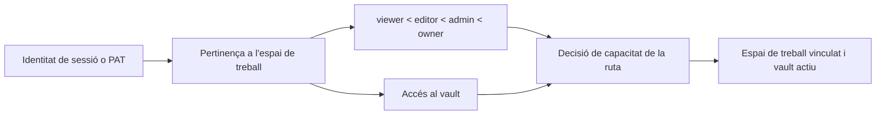

# Autenticació, espais de treball i compartició

## Modes operatius

El mode `personal` és l'experiència local predeterminada d'un sol usuari.
S'omet l'autenticació tret que la política efectiva l'exigeixi. El mode `org`
requereix identitat i pertinença a un espai de treball. Els desplegaments
exposats poden exigir autenticació independentment de l'etiqueta del mode.

El control del frontend selecciona l'inici de sessió o la interfície de
l'aplicació, però tota l'autorització s'aplica a les dependències i serveis
del backend.

L'estructura principal importa el formulari d'accés per l'entrada pública de
`features/auth`. La validació d'accés i registre, les sessions i el control de
política del backend mantenen el comportament existent. La configuració de compte
i espai de treball és independent d'aquest formulari; traslladar-ne l'entrada
no autoritza l'accés a cap espai de treball.

La funcionalitat de compartició exposa la pàgina de només lectura per una
entrada pública diferida. La ruta `/s/:token` continua fora del control
d'autenticació i de l'estructura de l'aplicació. Traslladar-la no amplia l'accés:
el backend resol el token i els enllaços caducats o invàlids mantenen l'error existent.

La resolució d'espai de treball valida les arrels configurades del projecte i
del vault abans d'inicialitzar res o seleccionar rutes. La inicialització
personal és segura davant de concurrència i confirma la pertinença guanyadora
després d'un conflicte d'unicitat. El mode d'organització concreta els rols i
les capacitats JSON abans de construir el context de petició. Si falten muntatges,
només s'utilitzen alternatives on la compatibilitat personal ho permet
explícitament; mai no s'inventa un vault d'organització.

## Autenticació amb sessions i tokens

L'accés amb correu i contrasenya verifica el hash de la contrasenya i emet un
JWT signat en una galeta HttpOnly amb SameSite=Lax. Els clients API admesos
també poden enviar un token bearer a `Authorization`. Els Personal Access
Tokens utilitzen un format opac separat; només se'n desa un hash SHA-256 i
el prefix visible.

El secret de signatura ha de ser robust en desplegaments exposats. El backend
rebutja l'arrencada amb el valor públic de desenvolupament quan la política
efectiva del desplegament exigeix protecció.

La frontera de rutes d'autenticació està estrictament tipada i conserva els
esquemes de resposta congelats. Els models de gestió comparteixen una
`DeclarativeBase` tipada de SQLAlchemy; els descriptors de columna només es
concreten a la frontera ORM. La reclamació de comptes, la rotació de contrasenyes,
les actualitzacions de perfil i les galetes de sessió mantenen la validació i
les transaccions. Els objectes Pydantic de permisos conserven els valors
predeterminats històrics i la representació OpenAPI exacta.

El servei d'autenticació tipa als seus límits les sessions de gestió, els
generadors de memòria cau de polítiques, la identitat HTTP/WebSocket, la consulta
de PAT i la descodificació del subjecte JWT. Els stubs de `python-jose` estan
fixats al grup de dependències de desenvolupament. La mutació antiga de marques
temporals ORM que queda s'aïlla amb `setattr` fins que les declaracions de
columna passin completament a `Mapped[]`.

El WebSocket de col·laboració importa el mateix servei tipat d'identitat que
HTTP. La política d'autenticació, i no la disponibilitat de mòduls opcionals,
determina si cal una credencial: el mode personal continua sense obstacles i
el mode d'organització i els clients PAT comparteixen resolutor. Tancar abans
de l'acceptació continua indicant una infracció de política, i les claus de
sala conserven l'espai de noms del vault.

## Model d'autorització

Els rols proporcionen capacitats bàsiques ordenades. VaultAccess restringeix o
concedeix accés a un vault registrat. Mai no es confia en un identificador
d'espai de treball, usuari o vault aportat per una petició sense resoldre la
identitat autenticada i les pertinences.

La inicialització d'espais de treball és segura davant de concurrència: les
primeres peticions simultànies no creen espais, usuaris ni pertinences
predeterminats duplicats. Els comptes provisionals i creats automàticament
es marquen explícitament; el registre no pot reclamar-los utilitzant el correu
electrònic com a prova feble d'identitat.

La resolució del context de l'espai de treball manté estable la dependència
pública de FastAPI, mentre que funcions separades gestionen la pertinença, el
filtratge de vaults accessibles, la ruta d'emmagatzematge i les capacitats. Això
fa explícites les decisions d'autorització sense canviar capçaleres, codis
d'estat ni el comportament del vault actiu.

La identitat del vault, el slug, la ruta antiga opcional i la data de creació
utilitzen mapatges tipats SQLAlchemy, preservant les columnes i migracions
existents. El middleware canònic concreta l'identificador o slug com a cadena
abans de publicar el context. L'exportació de plantilles revalida la ruta antiga
anul·lable al límit del sistema de fitxers i retorna la resposta establerta de
recurs no trobat en lloc de construir un `Path` a partir de configuració absent.

L'API d'administració d'espais de treball converteix rols de pertinença antics
i descriptors de permisos JSON en valors concrets a la frontera ORM. Les
mutacions de rol i accés al vault utilitzen assignacions acotades segures per
als descriptors, preservant les pertinences, la normalització d'invitacions
i els esquemes de payload existents.

## Compartició pública

Un enllaç compartit és una fila opaca que vincula pàgina, espai de treball,
vault, creador, permís, caducitat i revocació. `/s/:token` queda expressament
fora de l'estructura autenticada del frontend. El resolutor públic del backend
utilitza la identitat desada del vault perquè una petició anònima no té galeta
ni capçalera de vault actiu.

La revocació és lògica per conservar el registre d'auditoria. Els enllaços
caducats o revocats no revelen contingut de pàgina. La resolució pública de
recursos hereta el mateix àmbit de compartició i no accepta rutes arbitràries.

El límit de rutes de compartició tipa la serialització, la resolució de rutes
de vault, les mutacions ORM i totes les respostes. Models Pydantic amb nom
validen els mapatges de crides directes abans de serialitzar-los; els registres
de compatibilitat desactiven explícitament la publicació de models de resposta
per preservar OpenAPI. Els identificadors de múltiples vaults es resolen en
rutes concretes abans d'activar el context de pàgina; la configuració absent
manté l'alternativa recuperable i la resposta de servei no disponible existents.

La configuració d'identitat de cada vault utilitza models Pydantic separats
per a peticions i lectures antigues. Els camps històrics desconeguts sobreviuen
a les lectures, les escriptures atòmiques conserven el perfil i les respostes
d'èxit es validen abans de retornar el mapatge directament indexable.

El llistat, la creació, el canvi de nom i l'eliminació de múltiples vaults
personals construeixen models de resposta Pydantic imbricats explícits. Els
slugs, els valors antics anul·lables, la selecció activa i els justificants
d'eliminació conserven la forma original de diccionari. El confinament de rutes,
la protecció del vault principal i la neteja d'artefactes no canvien.

## API pública

Les rutes autenticades amb PAT apliquen els àmbits del token i l'autorització
normal d'espai de treball i vault. El text en clar del token només es mostra
en crear-lo. Revocar-lo impedeix usos futurs sense eliminar la fila d'auditoria.
La façana pública tipada actualitza marques temporals ORM a través del límit
dels descriptors, confina les escriptures Markdown antigues al vault actiu i
encamina els registres configurats de Web Clipper pel flux normal de creació
de pàgines. Els resultats de token, ping, pàgina, configuració del clipper i
captura passen per models Pydantic amb nom i conserven la forma històrica de
diccionari o llista. El registre explícit `response_model=None` manté els
esquemes FastAPI idèntics byte a byte fins a la PR coordinada de contractes
OpenAPI i client.

## Invariants

- La identitat, la pertinença a l'espai de treball, el rol, l'accés al vault i
  l'operació demanada participen en l'autorització.
- Les galetes són HttpOnly; el frontend no necessita llegir el JWT.
- Els hashes de contrasenyes i tokens són unidireccionals.
- Un `X-User-ID` aportat pel client no pot esdevenir una via de creació de
  comptes ni d'escalada de privilegis.
- El contingut compartit públicament queda limitat a la pàgina i el vault desats.
- La comoditat del mode personal no pot debilitar un desplegament multiusuari exposat.

## Aspectes que cal verificar

Executeu proves de control central, indicador d'autenticació obligatòria,
comptes, comptes provisionals, majúscules del correu, contrasenyes, PAT,
superfície pública, respostes tipades directes, concurrència d'espais de treball,
pertinences i compartició. La QA al navegador comprova l'accés i la sortida,
les actualitzacions de compte, el canvi d'espai de treball i l'accés anònim
als enllaços compartits en una sessió neta.
